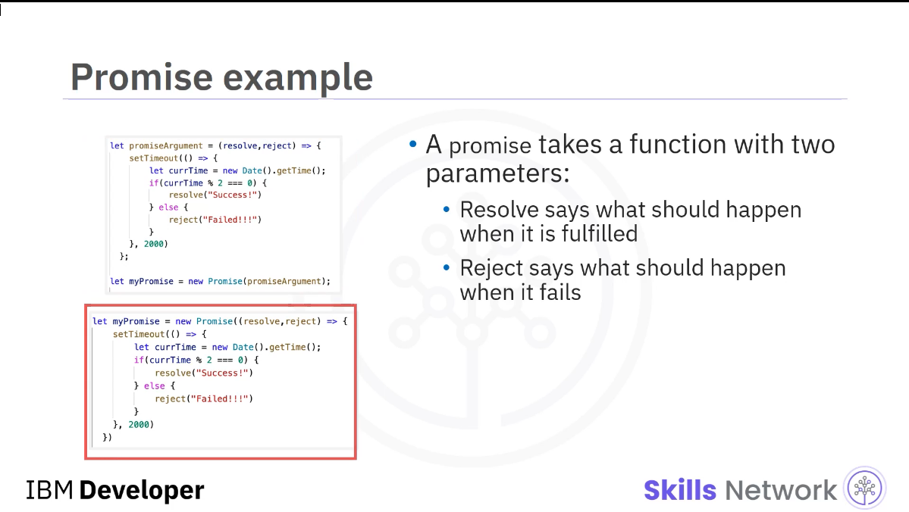
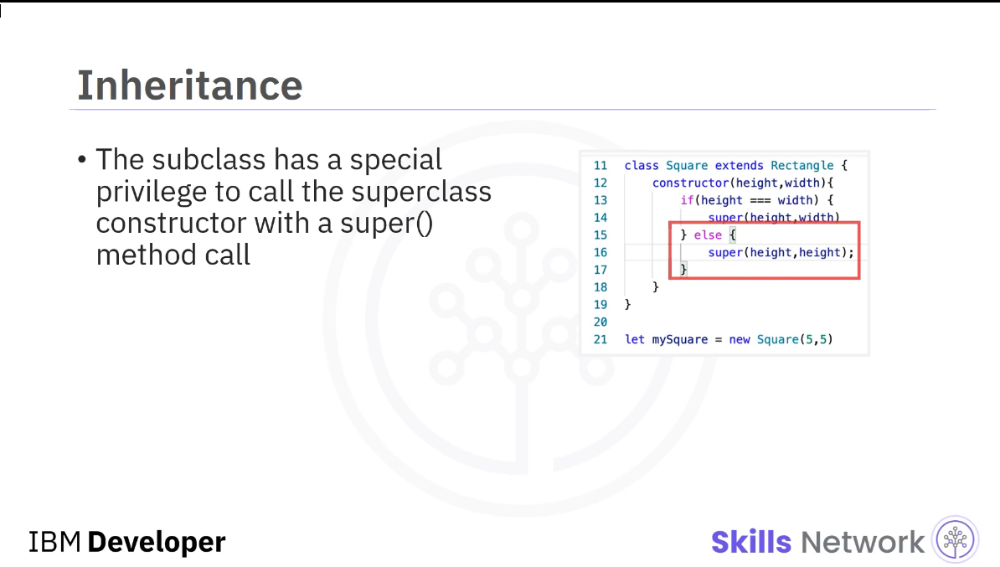
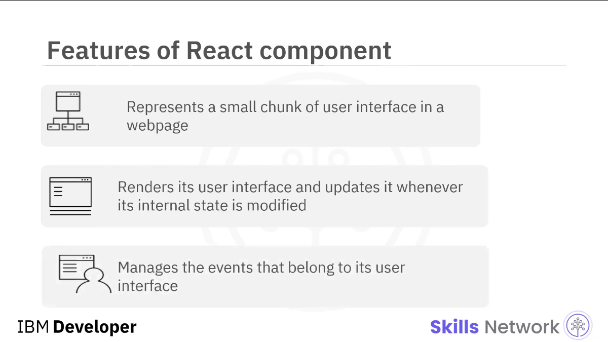
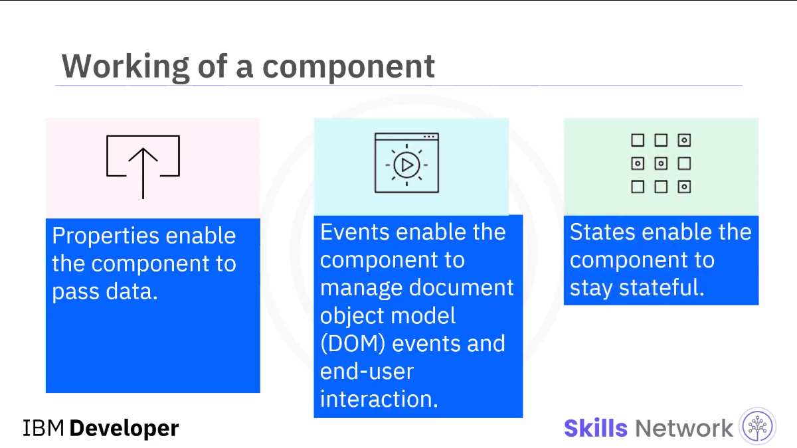
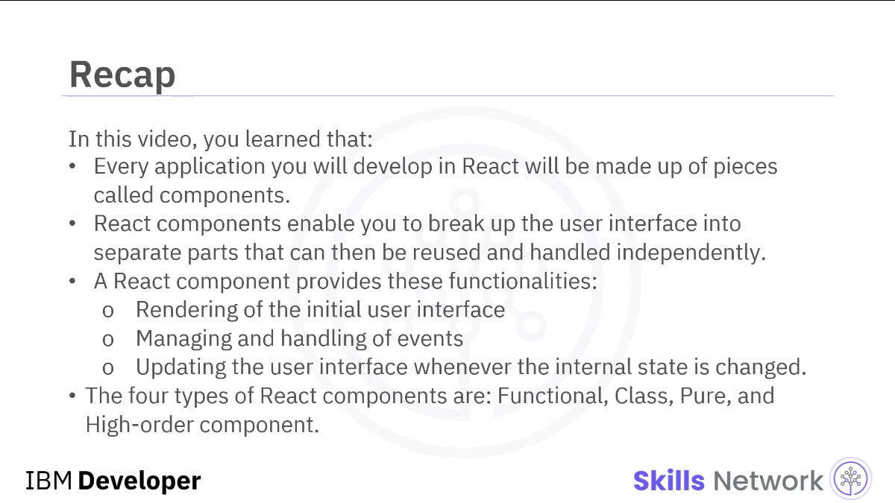

<h2 align="center">CAD0210en</h2>
<!--~~~~~~~~~~~~~~~~~~~~~~~~~~~~~~~~~~~~~~~~~~~~~~~~~~~~~~~~~~~~~~~~~~~~~~~~~~~~~~~~~~~~~~~~~~~~-->
<!--~~~~~~~~~~~~~~~~~~~~ cad0210en - ibm/edx.org f-e appl'n dev with react ~~~~~~~~~~~~~~~~~~~~~-->
<!--~~~~~~~~~~~~~~~~~~~~~~~~~~~~~~~~~~~~~~~~~~~~~~~~~~~~~~~~~~~~~~~~~~~~~~~~~~~~~~~~~~~~~~~~~~~~-->
<h2 align="center">Front-End Application Development with React - ibm and edx.org</h2>
<!--
<a href="https://learning.edx.org/course/course-v1:IBM+CAD0210EN+3T2022/block-v1:IBM+CAD0210EN+3T2022+type@sequential+block@86a76b2ee03e41c9b4ab237824de84e3/block-v1:IBM+CAD0210EN+3T2022+type@vertical+block@1651a0e258694b6eb43c58d6a413d12c">EDx/IBM CAD0210en Front-End Application Development with React</a>
-->
<h2 align="center">edX &amp; IBM CAD0210en Front-End Application Development with React</h2>
<!--~~~~~~~~~~~~~~~~~~~~~~~~~~~~~~~~~~~~~~~~~~~~~~~~~~~~~~~~~~~~~~~~~~~~~~~~~~~~~~~~~~~~~~~~~~~~-->
<!--~~~~~~~~~~~~~~~~~~~~~~~~~~~~ 01. ibm skills network logo (01) ~~~~~~~~~~~~~~~~~~~~~~~~~~~~~~-->
<!--~~~~~~~~~~~~~~~~~~~~~~~~~~~~~~~~~~~~~~~~~~~~~~~~~~~~~~~~~~~~~~~~~~~~~~~~~~~~~~~~~~~~~~~~~~~~-->
<p align="center" width="100%">

</p>
<!-- width="3.0in" height="1.6875in"} -->
&nbsp;

<h2>Welcome to Front-End Application Development with React</h2>

In this course, you will focus on client-side JavaScript and frameworks
development with React. 

In Week 1, you will explore how to access the React web framework user
interface (UI) library and run a simple React application. You will
investigate ways to use React components and change their properties and
states in a dynamic UI. 

In Week 2, you will learn more about state and props in React and how
they manage data in an application. In this week, you will also get an
insight into the three phases of a component lifecycle, practice
connecting to an external server from a React page, and learn the
different approaches to testing a component. 

In Week 3, delve into new features like Hooks and Redux to write
advanced components. You will also perform a hands-on exercise on how
Hooks handle events and logics in functional components without using
classes. 

In Week 4, you will create a React Budget Allocation app in the final
project. You will explore actions, reducers, and the dispatch function.
Finally, you will create a code file, save it, and edit it to make
changes.  

This course is designed to help you achieve success in this fast-growing
cloud computing area. You may be in IT looking to step up in your
career, a new graduate seeking to further establish your client-side
skills, an IT decision-maker who needs to manage more cloud-centric
projects, or someone in another field who wants to be able to talk about
server-side computing more knowledgeably.   

To avail the maximum benefit from the course, you can practice how to
access the React web framework user interface (UI) library and run React
applications in the labs. In case of any issues, you can contact your
peer group through discussion forums. 

<h2>About the Course</h2>

<h3>Course Overview</h3>

React is one of the most popular frameworks in the Web and Front-end
application Development category.  

In this course, you will;

-   build rich Front-End applications with React and ES6.

-   connect React components using data and state.

-   write rich React components with advanced features like Hooks and Redux.

In addition, you will explore how to access the React web framework user
interface (UI) library and run rich React applications. You will find
ways to use React components and change their properties and states in a
dynamic user interface. You will learn to connect to an external server
from a React page. The course introduces different testing tools that
you can use to test the component without manual verification. 

Throughout the course, you will complete numerous hands-on labs to gain
practical experience. At the end of the course, you will demonstrate
your React skills with a final project to add to your portfolio.   

This course will help you succeed as a front-end or full-stack
developer. It suits those in IT looking to step up in their careers or
new graduates seeking to establish their client-side skills.  

Note: This course requires knowledge of HTML, CSS, JavaScript and
Git/GitHub

In every module in the course, you will complete hands-on labs to
practice and apply what you have learned. In the final project of the
course, you will develop a budgeting application.  

This course requires prior basic knowledge of HTML5, CSS, JavaScript,
Git, and fundamental concepts in Cloud programming. It is highly
recommended that you complete the Introduction to Web Development with
HTML, CSS, and JavaScript course before starting this course.

<h3>Pre-requisites</h3>

-   Computer and IT literacy. 

## [Table of Contents](#table-of-contents)

## 1. [**Module 1: Building Rich Front-End Applications with React and ES6**](#ch1)
>### 1.1 [**Module 1 Introduction & Learning Objectives**](#ch1-1)
>### 1.2 [**Introduction to Frontend Frameworks and React JS**](#ch1-2)
>### 1.3 [**Insiders Viewpoints: Front-end and React JS**](#ch1-3)
>### 1.5 [**Introduction to JSX**](#ch1-5)
>### 1.6 [**Hands-on Lab: Hello World with React**](#ch1-6)
>### 1.7 [**Introduction to Components**](#ch1-7)
>### 1.8 [**Working with React Components**](#ch1-8)
>### 1.9 [**Glossary - Building a Rich Front-End Application using React and ES6**](#ch1-9)
>### 1.10 [**Cheatsheet - Building a Rich Front-End Application using React and ES6**](#ch1-10)
>### 1.11 [**Module 1 Summary**](#ch1-11)

## 2. [**Module 2: React Components**](#ch2)
>### 2.1 [**Module 2 Introduction & Learning Objectives**](#ch2-1)
>### 2.2 [**Introduction to States**](#ch2-2)
>### 2.3 [**Passing Data and States Between Components**](#ch2-3)
>### 2.4 [**Components Lifecycle**](#ch2-4)
>### 2.5 [**Connecting React to External Services**](#ch2-5)
>### 2.6 [**Testing React Components**](#ch2-6)
>### 2.7 [**Hands-on Lab: React Todo List Application**](#ch2-7)
>### 2.8 [**Reading Module 2 Summary**](#ch2-8)
>### 2.9 [**Glossary: React Components**](#ch2-9)
>### 2.10 [**Cheatsheet: React Components**](#ch2-10)

## 3. [**Module 3: Advanced React**](#ch3)
>### 3.1 [**Module 3 Introduction & Learning Objectives**](#ch3-1)
>### 3.2 [**Hooks**](#ch3-2)
>### 3.3 [**Implementing Forms**](#ch3-3)
>### 3.4 [**Introduction to Redux**](#ch3-4)
>### 3.5 [**Essential Concepts of Redux - Stores, Procedures and Actions**](#ch3-5)
>### 3.6 [**Async with Redux**](#ch3-6)
>### 3.7 [**Binding Redux and Flow**](#ch3-7)
>### 3.8 [**Hands-on Lab: React Redux**](#ch3-8)
>### 3.9 [**Reading Module 3 Summary**](#ch3-9)
>### 3.10 [**Glossary: Advanced React**](#ch3-10)
>### 3.11 [**Cheatsheet: Advanved React**](#ch3-11)

## 4. [**Module 4: Final Project**](#ch4)
>### 4.1 [**Module 4 Introduction & Learning Objectives**](#ch4-1)
>### 4.2 [**Hands-on Lab: Friends List Application Using Express Server with JNT**](#ch4-2)
>### 4.3 [**Project Overview: Scenario and Review Criteria**](#ch4-3)
>### 4.4 [**Project Breakdown**](#ch4-4)
>### 4.5 [**Hands-on Lab: Book Review Application**](#ch4-5)
>### 4.6 [**Module 4 Summary**](#ch4-6)

## 5. [**Course Wrap-Up**](ch5)
>### 5.1 [**Congratulations & Next Steps**](#ch5-1)
>### 5.2 [**Thanks, from the Coursera Team**](#ch5-2)

<h3>Module 1: Learning Objectives</h3>

-   Develop interactive user interfaces (UIs) and web applications using
    React, JSX, and ES6.

-   Build dynamic websites and front-end applications quickly and easily
    with reusable React components.

-   Communicate and exchange data with external services using GET,
    POST, UPDATE, and DELETE requests.

-   Employ and work with various React concepts and features including
    props, states, hooks, forms, and Redux.

<h2 id="ch1-1">1.1. Module Introduction</h2>

As you become more proficient with JavaScript, you will find that it is
a very dynamic language and looks different from the typical
object-oriented languages. Now you will discover new features that make
developing simpler and faster than older JavaScript capabilities.
Explore how to access the React web framework user interface (UI)
library and run a simple React application. Find ways to use React
components and change their properties and states in a dynamic UI.  

### Learning Objectives

-   Explain how React makes it easier to develop JavaScript applications

-   Describe how to use new features that have been added to JavaScript
    as a part of ES6

-   Describe the benefits of using JSX

-   Describe the features of React components

-   Describe how to set and access properties in functional and class
    components

<h2 id="ch1-2">1.2.Introduction to Frontend Frameworks and React (6:42)</h2>
<!--~~~~~~~~~~~~~~~~~~~~~~~~~~~~~~~~~~~~~~~~~~~~~~~~~~~~~~~~~~~~~~~~~~~~~~~~~~~~~~~~~~~~~~~~~~~~-->
<!--~~~~~~~~~~~~~~~~~~~~~ 02. intro to front-end frameworks & react (05) ~~~~~~~~~~~~~~~~~~~~~~~-->
<!--~~~~~~~~~~~~~~~~~~~~~~~~~~~~~~~~~~~~~~~~~~~~~~~~~~~~~~~~~~~~~~~~~~~~~~~~~~~~~~~~~~~~~~~~~~~~-->
<p align="center" width="100%">

</p>
<!-- {width="5.0in" height="2.75in"} -->

<h2>Welcome to Introduction to Front-End Frameworks and React</h2>

<!--~~~~~~~~~~~~~~~~~~~~~~~~~~~~~~~~~~~~~~~~~~~~~~~~~~~~~~~~~~~~~~~~~~~~~~~~~~~~~~~~~~~~~~~~~~~~-->
<!--~~~~~~~~~~~~~~~~~~~~~~~~~~~~~~ 03. what you will learn (05) ~~~~~~~~~~~~~~~~~~~~~~~~~~~~~~~~-->
<!--~~~~~~~~~~~~~~~~~~~~~~~~~~~~~~~~~~~~~~~~~~~~~~~~~~~~~~~~~~~~~~~~~~~~~~~~~~~~~~~~~~~~~~~~~~~~-->
<p align="center" width="100%">

</p>
<!-- {width="5.0in" height="2.75in"} -->

After reading this section, you will be able to understand the different
Front-end frameworks, define React, explain how React makes it easier to
develop JavaScript applications, describe how to create a React
component, and run a simple React application.

Front-end frameworks are used to create a dynamic client that can
connect to the server.

These frameworks are made available through open-source libraries which
can be used as a part of the hypertext markup language (HTML),
JavaScript, and cascading style sheets (CSS) in the browser.

<!--~~~~~~~~~~~~~~~~~~~~~~~~~~~~~~~~~~~~~~~~~~~~~~~~~~~~~~~~~~~~~~~~~~~~~~~~~~~~~~~~~~~~~~~~~~~~-->
<!--~~~~~~~~~~~~~~~~~~~~~~~~~~~~~ 04. front-end frameworks (06) ~~~~~~~~~~~~~~~~~~~~~~~~~~~~~~~~-->
<!--~~~~~~~~~~~~~~~~~~~~~~~~~~~~~~~~~~~~~~~~~~~~~~~~~~~~~~~~~~~~~~~~~~~~~~~~~~~~~~~~~~~~~~~~~~~~-->
<p align="center" width="100%">

</p>
<!-- {width="5.0in" height="2.75in"} -->

Angular, Vue, and React are some of the most-used Front-end frameworks.

Angular is an open-source framework from Google that can be used in any
HTML by including the library.

It is based on HTML and JavaScript, and it is easy to implement.

To make HTML dynamic, Angular uses directives.

All the directives are available to the HTML where the library is
included.

<!--~~~~~~~~~~~~~~~~~~~~~~~~~~~~~~~~~~~~~~~~~~~~~~~~~~~~~~~~~~~~~~~~~~~~~~~~~~~~~~~~~~~~~~~~~~~~-->
<!--~~~~~~~~~~~~~~~~~~~~~~~~ 05. angular open-source from google (08) ~~~~~~~~~~~~~~~~~~~~~~~~~~-->
<!--~~~~~~~~~~~~~~~~~~~~~~~~~~~~~~~~~~~~~~~~~~~~~~~~~~~~~~~~~~~~~~~~~~~~~~~~~~~~~~~~~~~~~~~~~~~~-->
<p align="center" width="100%">

</p>
<!-- {width="5.0in" height="2.9123173665791775in"} -->

Here, you see HTML using Angular with model-bind directives.

The input component is used as a model to which the label component is
bound.

Vue is also an open-source Front-end framework.

It uses a virtual document object model (DOM).

The HTML is considered as an entire object.

As it is very lightweight, it renders fast.
<!--~~~~~~~~~~~~~~~~~~~~~~~~~~~~~~~~~~~~~~~~~~~~~~~~~~~~~~~~~~~~~~~~~~~~~~~~~~~~~~~~~~~~~~~~~~~~-->
<!--~~~~~~~~~~~~~~~~~~~~~~~~~~~~~~~~~~~~~~ 06. vue (08) ~~~~~~~~~~~~~~~~~~~~~~~~~~~~~~~~~~~~~~~~-->
<!--~~~~~~~~~~~~~~~~~~~~~~~~~~~~~~~~~~~~~~~~~~~~~~~~~~~~~~~~~~~~~~~~~~~~~~~~~~~~~~~~~~~~~~~~~~~~-->
<p align="center" width="100%">

</p>
<!-- {width="4.989583333333333in" height="2.90625in"} -->

Here, you see a simple Vue page which is rendered as HTML.

The attributes of the Vue object are similar to those of Angular, and
binding is available.

React is a framework for building client-side dynamic web applications.

React uses dynamic data binding and a virtual DOM to extend HTML syntax
and to eliminate the need for code that keeps the user interface (UI)
elements synchronized with the application state.
<!--~~~~~~~~~~~~~~~~~~~~~~~~~~~~~~~~~~~~~~~~~~~~~~~~~~~~~~~~~~~~~~~~~~~~~~~~~~~~~~~~~~~~~~~~~~~~-->
<!--~~~~~~~~~~~~~~~~~~~~~~~~~~~~~~~~~~~ 07. html dom (09) ~~~~~~~~~~~~~~~~~~~~~~~~~~~~~~~~~~~~~~-->
<!--~~~~~~~~~~~~~~~~~~~~~~~~~~~~~~~~~~~~~~~~~~~~~~~~~~~~~~~~~~~~~~~~~~~~~~~~~~~~~~~~~~~~~~~~~~~~-->
<p align="center" width="100%">

</p>
<!-- {width="8.0in" height="4.651890857392826in"} -->

This image shows HTML as a DOM.

This includes the document, which is the entire HTML page, root element
HTML, and a body element.

Inside the body we have h1 with a text element inside, p with a text
element inside, and a form element with two input elements.

The document will be rendered as a page.

In React, some of these elements will be rendered as a React component.

<!--~~~~~~~~~~~~~~~~~~~~~~~~~~~~~~~~~~~~~~~~~~~~~~~~~~~~~~~~~~~~~~~~~~~~~~~~~~~~~~~~~~~~~~~~~~~~-->
<!--~~~~~~~~~~~~~~~~~~~~~~~~~~~~~~~~ 08. javascript xml (10) ~~~~~~~~~~~~~~~~~~~~~~~~~~~~~~~~~~~-->
<!--~~~~~~~~~~~~~~~~~~~~~~~~~~~~~~~~~~~~~~~~~~~~~~~~~~~~~~~~~~~~~~~~~~~~~~~~~~~~~~~~~~~~~~~~~~~~-->
<p align="center" width="100%">

</p>
<!-- {width="4.989583333333333in" height="2.90625in"} -->

React uses a special markup language called JavaScript XML (JSX) which
resembles HTML.

JSX can be compiled and interpreted as JavaScript by Babel, a special
in-memory tool.

JSX is embedded inside special script tags where the type attribute
specifies the content that requires Babel.
<!--~~~~~~~~~~~~~~~~~~~~~~~~~~~~~~~~~~~~~~~~~~~~~~~~~~~~~~~~~~~~~~~~~~~~~~~~~~~~~~~~~~~~~~~~~~~~-->
<!--~~~~~~~~~~~~~~~~~~~~~~~~~~~~~~~~~~~ 09. packages (10) ~~~~~~~~~~~~~~~~~~~~~~~~~~~~~~~~~~~~~~-->
<!--~~~~~~~~~~~~~~~~~~~~~~~~~~~~~~~~~~~~~~~~~~~~~~~~~~~~~~~~~~~~~~~~~~~~~~~~~~~~~~~~~~~~~~~~~~~~-->
<p align="center" width="100%">

</p>
<!-- {width="4.989583333333333in" height="2.90625in"} -->

Three important packages that you use to build React applications are;

1.  React package,

 The React package holds the React source for components and their
 states and properties.

2.  ReactDOM package, and

The ReactDOM package is the glue between React and the DOM.

3.  Babel package.

And Babel is the module which is available in most modern browsers.
It is used to compile and interpret the JSX.
<!--~~~~~~~~~~~~~~~~~~~~~~~~~~~~~~~~~~~~~~~~~~~~~~~~~~~~~~~~~~~~~~~~~~~~~~~~~~~~~~~~~~~~~~~~~~~~-->
<!--~~~~~~~~~~~~~~~~~~~~~~~~~~~~~~ 10. a simple react page (12) ~~~~~~~~~~~~~~~~~~~~~~~~~~~~~~~~-->
<!--~~~~~~~~~~~~~~~~~~~~~~~~~~~~~~~~~~~~~~~~~~~~~~~~~~~~~~~~~~~~~~~~~~~~~~~~~~~~~~~~~~~~~~~~~~~~-->
<p align="center" width="100%">

</p>
<!-- {width="4.989583333333333in" height="2.90625in"} -->

A normal HTML page can be changed to render a React component.

Most modern browsers support Babel scripts.

You must include react.production.min.js, react-dom.production.min.js,
and babel.min.js in the HTML.

Then the browser will handle the rest.

The React component is defined inside a script tag which is of type
text/babel.

<!--~~~~~~~~~~~~~~~~~~~~~~~~~~~~~~~~~~~~~~~~~~~~~~~~~~~~~~~~~~~~~~~~~~~~~~~~~~~~~~~~~~~~~~~~~~~~-->
<!--~~~~~~~~~~~~~~~~~~~~~~~~~~~~~~ 11. a simple react page (11) ~~~~~~~~~~~~~~~~~~~~~~~~~~~~~~~~-->
<!--~~~~~~~~~~~~~~~~~~~~~~~~~~~~~~~~~~~~~~~~~~~~~~~~~~~~~~~~~~~~~~~~~~~~~~~~~~~~~~~~~~~~~~~~~~~~-->
<p align="center" width="100%">

</p>
<!-- {width="6.5in" height="3.78125in"} -->

Here, the defined component is MyComp, which inherits from
React.Component.

You may recall inheritance from what you have learned about classes.

All React components must implement the render() method.

You can then render the component using the ReactDOM.render method
specifying the component name like a HTML tag and any attribute that you
want to set, in this case the name attribute.

Then specify where in the HTML the component should be rendered.

<!--~~~~~~~~~~~~~~~~~~~~~~~~~~~~~~~~~~~~~~~~~~~~~~~~~~~~~~~~~~~~~~~~~~~~~~~~~~~~~~~~~~~~~~~~~~~~-->
<!--~~~~~~~~~~~~~~~~~~~~~~~~~~~~~~ 12. a simple react page (13) ~~~~~~~~~~~~~~~~~~~~~~~~~~~~~~~~-->
<!--~~~~~~~~~~~~~~~~~~~~~~~~~~~~~~~~~~~~~~~~~~~~~~~~~~~~~~~~~~~~~~~~~~~~~~~~~~~~~~~~~~~~~~~~~~~~-->
<p align="center" width="100%">

</p>
<!-- {width="6.5in" height="3.78125in"} -->

In this example, it is rendered in comp1.

When you open the HTML, you will see the page with the HTML component

Facebook has provided a utility called Create React App, which
simplifies the process of creating React applications.

<!--~~~~~~~~~~~~~~~~~~~~~~~~~~~~~~~~~~~~~~~~~~~~~~~~~~~~~~~~~~~~~~~~~~~~~~~~~~~~~~~~~~~~~~~~~~~~-->
<!--~~~~~~~~~~~~~~~~~~~~~~~~~~~~~~ 13. creating a react app (13) ~~~~~~~~~~~~~~~~~~~~~~~~~~~~~~~~-->
<!--~~~~~~~~~~~~~~~~~~~~~~~~~~~~~~~~~~~~~~~~~~~~~~~~~~~~~~~~~~~~~~~~~~~~~~~~~~~~~~~~~~~~~~~~~~~~-->
<p align="center" width="100%">

</p>
<!-- {width="4.989583333333333in" height="2.90625in"} -->

If you have Node.js installed, you should be able to run npx
create-react-app with the name of the application you want to create.

<!--~~~~~~~~~~~~~~~~~~~~~~~~~~~~~~~~~~~~~~~~~~~~~~~~~~~~~~~~~~~~~~~~~~~~~~~~~~~~~~~~~~~~~~~~~~~~-->
<!--~~~~~~~~~~~~~~~~~~~~~~~~~~~~~~ 14. npm create-react-app (14) ~~~~~~~~~~~~~~~~~~~~~~~~~~~~~~~-->
<!--~~~~~~~~~~~~~~~~~~~~~~~~~~~~~~~~~~~~~~~~~~~~~~~~~~~~~~~~~~~~~~~~~~~~~~~~~~~~~~~~~~~~~~~~~~~~-->
<p align="center" width="100%">

</p>
<!-- {width="4.989583333333333in" height="2.90625in"} -->

Here, the name of the application is todoapp.

When you run the npx create-react-app command, a directory structure
with all the necessary files is created.

<!--~~~~~~~~~~~~~~~~~~~~~~~~~~~~~~~~~~~~~~~~~~~~~~~~~~~~~~~~~~~~~~~~~~~~~~~~~~~~~~~~~~~~~~~~~~~~-->
<!--~~~~~~~~~~~~~~~~~~~~~~~~~~ 15. creating a react application (14) ~~~~~~~~~~~~~~~~~~~~~~~~~~~-->
<!--~~~~~~~~~~~~~~~~~~~~~~~~~~~~~~~~~~~~~~~~~~~~~~~~~~~~~~~~~~~~~~~~~~~~~~~~~~~~~~~~~~~~~~~~~~~~-->
<p align="center" width="100%">

</p>
<!-- {width="4.989583333333333in" height="2.90625in"} -->

The directory structure contains all the resources required to create
and run a React application.

The main folder in which you will make changes is the src folder.

The src folder contains App.js and index.js.

App.js contains App, which is the root React component that you will add
into your HTML page, and index.js is where you will add App to the HTML.

To run the React application, you go into the application directory and
run npm start, which starts the server, mostly on port 3000.

<!--~~~~~~~~~~~~~~~~~~~~~~~~~~~~~~~~~~~~~~~~~~~~~~~~~~~~~~~~~~~~~~~~~~~~~~~~~~~~~~~~~~~~~~~~~~~~-->
<!--~~~~~~~~~~~~~~~~~~~~~~~~~ 16. running the react application (15) ~~~~~~~~~~~~~~~~~~~~~~~~~~~-->
<!--~~~~~~~~~~~~~~~~~~~~~~~~~~~~~~~~~~~~~~~~~~~~~~~~~~~~~~~~~~~~~~~~~~~~~~~~~~~~~~~~~~~~~~~~~~~~-->
<p align="center" width="100%">

</p>
<!-- {width="4.989583333333333in" height="2.90625in"} -->

You can see the React component when you connect to the application from
the browser.

The page that you see is the default React application that has been
created.

You can make changes and add more nested components to make it a
full-fledged React front-end application.

In this section, you learned that:

-   React is an efficient, flexible JavaScript library for building user
    interfaces.

-   React uses a special markup language called JSX.

-   A React application is a tree of components and an extension of the
    HTML DOM.

-   With Create React App, you can easily create a React application.

<h2 id="ch1-3">1.3. Insiders Viewpoints: Front-end Frameworks (3:09)</h2>

Welcome to Expert Viewpoints: Using Front-end JavaScript Frameworks.

In this section, we will listen to several application-development
professionals discuss working with front-end JavaScript frameworks.

So, which front-end JavaScript framework(s) do you use?

And why you do prefer those over other options?

My favorite front-end JavaScript framework would be React.js. I love the
whole component-driven design and architecture that you have to follow
when you create a React.js-based application.

I also like the idea of props and states to hold the state of your
application.

Believe it or not, I also like the concept of having all of my style, my
HTML, or JSX for a component in the same file.

It makes it really easy to work with components by themselves and then
at the end plug these different components together to create my
application.

We use React JavaScript framework. It is better than Angular in terms of
speed and efficiency.

React is easier to learn than other JavaScript frameworks, which makes
its adoption in the team easy.

It also resolves the problems related to cross-browser issues.

Another great feature of React is the use of JSX.

JSX is helpful when working with UI inside the JavaScript code.

It helps React to show more useful error and warning messages.

So, among the front-end JavaScript frameworks, I prefer Vue.

I just find it friendlier. I like the documentation.

However, React has a big community. And the documentation is very
extensive. And it makes sense.

And another benefit of React is that there\'s React Native.

So, if you\'re really comfortable with writing React, you can repurpose
that code to be a mobile application that\'s cross-platform compatible,
which is a huge benefit.

And if you\'re writing your application in Vue, then there are some ways
to make that a web application, like by using a progressive web app.

But, React Native, out of those three, (Angular, React and Vue), is by
far is the easiest crossover to get into native app development.

Angular, it just seems more verbose. I never really got into it, except
for some student projects.

And fortunately, I\'ve never had to go into it any deeper than just
editing existing code.

<h2 id="ch1-4">1.4.Introduction to ES6 (6:46)</h2>

Welcome to Introduction to ES6.

After reading this module, you will be able to:

-   Define ECMAScript 6 (ES6)​ and

-   Describe how to use new features that have been added to JavaScript
    as a part of ES6.

ES is short for EcmaScript.

Ecma is a standards organization that creates a wide range of global
information and communications technology standards.

JavaScript adheres to Ecma's specification ES6, which came out in 2015.

The newer versions of ES are named after the year of release.

The most recent is EcmaScript 2020. ES.Next is a dynamic name used to
refer to the forthcoming version of EcmaScript.

ES6 is a version with changes that had a major impact.

In JavaScript, the main changes are let, const, arrow functions,
promises, and class.

You are familiar with using variables (vars). A var has global scope.
Once declared, a var can be used or referred from anywhere in the code.

This is challenging, especially with huge projects where you have many
variables to maintain.

In ES6, you use let and const in addition to var. let allows you to
restrict the scope of variables within the block where they are
declared.

This limited scope is called \"local scope.\"
<!--~~~~~~~~~~~~~~~~~~~~~~~~~~~~~~~~~~~~~~~~~~~~~~~~~~~~~~~~~~~~~~~~~~~~~~~~~~~~~~~~~~~~~~~~~~~~-->
<!--~~~~~~~~~~~~~~~~~~~~~~~~~~~~~~~~~ 17. let and const (18) ~~~~~~~~~~~~~~~~~~~~~~~~~~~~~~~~~~~-->
<!--~~~~~~~~~~~~~~~~~~~~~~~~~~~~~~~~~~~~~~~~~~~~~~~~~~~~~~~~~~~~~~~~~~~~~~~~~~~~~~~~~~~~~~~~~~~~-->
<p align="center" width="100%">

</p>
<!-- {width="5.0in" height="3.2083333333333335in"} -->

In this example, num has scope just within that block.

Line 7 will throw an error as num is out of scope. const allows you to
declare constants whose values cannot be changed.

Line 3 throws an error because num is defined as a constant whose value
is 5.

You use both let and const in React programming.

<!--~~~~~~~~~~~~~~~~~~~~~~~~~~~~~~~~~~~~~~~~~~~~~~~~~~~~~~~~~~~~~~~~~~~~~~~~~~~~~~~~~~~~~~~~~~~~-->
<!--~~~~~~~~~~~~~~~~~~~~~~~~~~~~~~~~ 18. arrow functions (19) ~~~~~~~~~~~~~~~~~~~~~~~~~~~~~~~~~~-->
<!--~~~~~~~~~~~~~~~~~~~~~~~~~~~~~~~~~~~~~~~~~~~~~~~~~~~~~~~~~~~~~~~~~~~~~~~~~~~~~~~~~~~~~~~~~~~~-->
<p align="center" width="100%">

</p>
<!-- {width="5.0in" height="3.2125in"} -->

Arrow functions allow you to declare functions the same way that you
declare variables.

Using this syntax is a shorter and cleaner way to work with functions.

What you see here is how a function was written in the older ES5
JavaScript.

Below you can see how it is written in ES6.
<!--~~~~~~~~~~~~~~~~~~~~~~~~~~~~~~~~~~~~~~~~~~~~~~~~~~~~~~~~~~~~~~~~~~~~~~~~~~~~~~~~~~~~~~~~~~~~-->
<!--~~~~~~~~~~~~~~~~~~~~~~~~~~~~ 19. arrow functions (20) ~~~~~~~~~~~~~~~~~~~~~~~~~~~~~~-->
<!--~~~~~~~~~~~~~~~~~~~~~~~~~~~~~~~~~~~~~~~~~~~~~~~~~~~~~~~~~~~~~~~~~~~~~~~~~~~~~~~~~~~~~~~~~~~~-->
<p align="center" width="100%">

</p>
<!-- {width="5.0in" height="3.2125in"} -->

A function can also be declared with <b>let</b> and <b>const</b> just like a
variable.

This function doesn\'t take any parameters and has only one statement.
<!--~~~~~~~~~~~~~~~~~~~~~~~~~~~~~~~~~~~~~~~~~~~~~~~~~~~~~~~~~~~~~~~~~~~~~~~~~~~~~~~~~~~~~~~~~~~~-->
<!--~~~~~~~~~~~~~~~~~~~~~~~~~~~~ 20. arrow functions (20) ~~~~~~~~~~~~~~~~~~~~~~~~~~~~~~-->
<!--~~~~~~~~~~~~~~~~~~~~~~~~~~~~~~~~~~~~~~~~~~~~~~~~~~~~~~~~~~~~~~~~~~~~~~~~~~~~~~~~~~~~~~~~~~~~-->
<p align="center" width="100%">

</p>
<!-- {width="5.0in" height="2.81875in"} -->

Notice that there are no curly brackets '{ }'.

Arrow functions are called like normal functions.

They can also be passed as parameters for callbacks.

1.  const sayHello = ()=\>console.log("Hello World!");

2.  setTimeout(sayHello,1000);

Here, the arrow function, sayHello, is passed as a callback parameter to
setTimeout.

Arrow functions also take parameters like normal functions.

They can return a data type or an object.
<!--~~~~~~~~~~~~~~~~~~~~~~~~~~~~~~~~~~~~~~~~~~~~~~~~~~~~~~~~~~~~~~~~~~~~~~~~~~~~~~~~~~~~~~~~~~~~-->
<!--~~~~~~~~~~~~~~~~~~~~~~~~~ 21. arrow function with parameters (21) ~~~~~~~~~~~~~~~~~~~~~~~~~~-->
<!--~~~~~~~~~~~~~~~~~~~~~~~~~~~~~~~~~~~~~~~~~~~~~~~~~~~~~~~~~~~~~~~~~~~~~~~~~~~~~~~~~~~~~~~~~~~~-->
<p align="center" width="100%">

</p>
<!-- {width="5.0in" height="2.81875in"} -->

1: const oneParamArrowFunc = name =\> {return "hello "+name};

2: const twoParamsArrowFuncWithoutReturn = (first, last) =\>

console.log("hello+first+" "+last);

3: const twoParamsArrowFuncWithReturn = (first, last) =\> {

return "hello "+first+" "+last};

4: const twoParamsTwoLinesArrowFunc = (first, last) =\> {

const greetings = "hello ";

return greetings+" "+first+" "+last};

Here, you can see #1 function that takes one parameter.

The function brackets are not mandatory.

There is also only one line of code.

But because the code <b>returns a value</b>, it <b>must be in curly
brackets</b>.

This #2 is a function that takes two parameters.

The function brackets must be put around the parameters list. This
function also has just one line of code and returns nothing.

So, it doesn't need curly brackets.

#3 is a function that takes two parameters and returns one value.

#4 is a function that takes two parameters and has two lines of code.
<!--~~~~~~~~~~~~~~~~~~~~~~~~~~~~~~~~~~~~~~~~~~~~~~~~~~~~~~~~~~~~~~~~~~~~~~~~~~~~~~~~~~~~~~~~~~~~-->
<!--~~~~~~~~~~~~~~~~~~~~~~~~~~~~~~~~ 22. promise object (22) ~~~~~~~~~~~~~~~~~~~~~~~~~~~~~~~~~~~-->
<!--~~~~~~~~~~~~~~~~~~~~~~~~~~~~~~~~~~~~~~~~~~~~~~~~~~~~~~~~~~~~~~~~~~~~~~~~~~~~~~~~~~~~~~~~~~~~-->
<p align="center" width="100%">

</p>
<!-- {width="5.0in" height="2.8125in"} -->

The promise object represents the eventual completion of an asynchronous
operation and its return value.

When you invoke an asynchronous operation, a promise is in a pending
state.

When the operation executes successfully, the promise is said to be
fulfilled.

When the operation fails, the promise is said to be rejected.
<!--~~~~~~~~~~~~~~~~~~~~~~~~~~~~~~~~~~~~~~~~~~~~~~~~~~~~~~~~~~~~~~~~~~~~~~~~~~~~~~~~~~~~~~~~~~~~-->
<!--~~~~~~~~~~~~~~~~~~~~~~~~~~~~ 23. promise example (23) ~~~~~~~~~~~~~~~~~~~~~~~~~~~~~~-->
<!--~~~~~~~~~~~~~~~~~~~~~~~~~~~~~~~~~~~~~~~~~~~~~~~~~~~~~~~~~~~~~~~~~~~~~~~~~~~~~~~~~~~~~~~~~~~~-->
<p align="center" width="100%">

</p>
<!-- {width="5.0in" height="2.8125in"} -->

In the first example, you have an arrow function, promiseArgument, which
takes two parameters (resolve and reject).

If the current time in milliseconds is divisible by 2, this arrow
function invokes resolve with \"Success\" as a parameter; if not, it
invokes reject with \"Failed\" as a parameter.

This function is passed to the constructor of the promise object.
<!--~~~~~~~~~~~~~~~~~~~~~~~~~~~~~~~~~~~~~~~~~~~~~~~~~~~~~~~~~~~~~~~~~~~~~~~~~~~~~~~~~~~~~~~~~~~~-->
<!--~~~~~~~~~~~~~~~~~~~~~~~~~~~~~~ 24. promise example, #2 (23) ~~~~~~~~~~~~~~~~~~~~~~~~~~~~~~~~-->
<!--~~~~~~~~~~~~~~~~~~~~~~~~~~~~~~~~~~~~~~~~~~~~~~~~~~~~~~~~~~~~~~~~~~~~~~~~~~~~~~~~~~~~~~~~~~~~-->
<p align="center" width="100%">

</p>
<!-- {width="5.0in" height="2.8125in"} -->

In the second example, instead of creating promiseArgument, you are
directly creating the function in time with the promise constructor. The
behavior in both cases is identical.
<!--~~~~~~~~~~~~~~~~~~~~~~~~~~~~~~~~~~~~~~~~~~~~~~~~~~~~~~~~~~~~~~~~~~~~~~~~~~~~~~~~~~~~~~~~~~~~-->
<!--~~~~~~~~~~~~~~~~~~~~~~~~~~~~~~~~~~~ 25. class #1 (24) ~~~~~~~~~~~~~~~~~~~~~~~~~~~~~~~~~~~~~~-->
<!--~~~~~~~~~~~~~~~~~~~~~~~~~~~~~~~~~~~~~~~~~~~~~~~~~~~~~~~~~~~~~~~~~~~~~~~~~~~~~~~~~~~~~~~~~~~~-->
<p align="center" width="100%">

</p>
<!-- {width="5.0in" height="2.8125in"} -->

Object-oriented programming was made feasible in JavaScript with the
introduction of class.
<!--~~~~~~~~~~~~~~~~~~~~~~~~~~~~~~~~~~~~~~~~~~~~~~~~~~~~~~~~~~~~~~~~~~~~~~~~~~~~~~~~~~~~~~~~~~~~-->
<!--~~~~~~~~~~~~~~~~~~~~~~~~~~~~~~~~~~~ 26. class #2 (24) ~~~~~~~~~~~~~~~~~~~~~~~~~~~~~~~~~~~~~-->
<!--~~~~~~~~~~~~~~~~~~~~~~~~~~~~~~~~~~~~~~~~~~~~~~~~~~~~~~~~~~~~~~~~~~~~~~~~~~~~~~~~~~~~~~~~~~~~-->
<p align="center" width="100%">

</p>
<!-- {width="5.0in" height="2.8125in"} -->

Class is a template or blueprint for creating objects.

Classes in JavaScript are built on prototypes. Prototype is a property
of all JavaScript objects, including functions. A function can be used
to create an object instance.

Here, \"this\" refers to the current object. But not all object-oriented
programming concepts are available with function prototypes.

The concept of class was built on the premise of function prototype to
extend object-oriented programming to JavaScript.
<!--~~~~~~~~~~~~~~~~~~~~~~~~~~~~~~~~~~~~~~~~~~~~~~~~~~~~~~~~~~~~~~~~~~~~~~~~~~~~~~~~~~~~~~~~~~~~-->
<!--~~~~~~~~~~~~~~~~~~~~~~~~~~~~ 27.  (01) ~~~~~~~~~~~~~~~~~~~~~~~~~~~~~~-->
<!--~~~~~~~~~~~~~~~~~~~~~~~~~~~~~~~~~~~~~~~~~~~~~~~~~~~~~~~~~~~~~~~~~~~~~~~~~~~~~~~~~~~~~~~~~~~~-->
<p align="center" width="100%">

</p>
<!-- {width="5.0in" height="2.8125in"} -->

Here, the first console log will print the entire prototype of the
person1 object.

The second console log will print the name. And the third console log
will print the age.
<!--~~~~~~~~~~~~~~~~~~~~~~~~~~~~~~~~~~~~~~~~~~~~~~~~~~~~~~~~~~~~~~~~~~~~~~~~~~~~~~~~~~~~~~~~~~~~-->
<!--~~~~~~~~~~~~~~~~~~~~~~~~~~~~ 28.  (01) ~~~~~~~~~~~~~~~~~~~~~~~~~~~~~~-->
<!--~~~~~~~~~~~~~~~~~~~~~~~~~~~~~~~~~~~~~~~~~~~~~~~~~~~~~~~~~~~~~~~~~~~~~~~~~~~~~~~~~~~~~~~~~~~~-->
<p align="center" width="100%">

</p>
<!-- {width="5.0in" height="2.8125in"} -->

Class can have a constructor, which is a method that is called when you
want to create an object of class.
<!--~~~~~~~~~~~~~~~~~~~~~~~~~~~~~~~~~~~~~~~~~~~~~~~~~~~~~~~~~~~~~~~~~~~~~~~~~~~~~~~~~~~~~~~~~~~~-->
<!--~~~~~~~~~~~~~~~~~~~~~~~~~~~~ 29.  (01) ~~~~~~~~~~~~~~~~~~~~~~~~~~~~~~-->
<!--~~~~~~~~~~~~~~~~~~~~~~~~~~~~~~~~~~~~~~~~~~~~~~~~~~~~~~~~~~~~~~~~~~~~~~~~~~~~~~~~~~~~~~~~~~~~-->
<p align="center" width="100%">

</p>
<!-- {width="5.0in" height="2.8125in"} -->

The body of the class is the part that is in curly brackets.
<!--~~~~~~~~~~~~~~~~~~~~~~~~~~~~~~~~~~~~~~~~~~~~~~~~~~~~~~~~~~~~~~~~~~~~~~~~~~~~~~~~~~~~~~~~~~~~-->
<!--~~~~~~~~~~~~~~~~~~~~~~~~~~~~ 30.  (01) ~~~~~~~~~~~~~~~~~~~~~~~~~~~~~~-->
<!--~~~~~~~~~~~~~~~~~~~~~~~~~~~~~~~~~~~~~~~~~~~~~~~~~~~~~~~~~~~~~~~~~~~~~~~~~~~~~~~~~~~~~~~~~~~~-->
<p align="center" width="100%">

</p>
<!-- {width="5.0in" height="2.8125in"} -->

Here, rectangle is the general class.

All rectangles have some height and width, which are the properties.

When you create a rectangle object, you pass the height and width as
parameters to the constructor.

MyRectangle is an object constructed with the Rectangle class.
<!--~~~~~~~~~~~~~~~~~~~~~~~~~~~~~~~~~~~~~~~~~~~~~~~~~~~~~~~~~~~~~~~~~~~~~~~~~~~~~~~~~~~~~~~~~~~~-->
<!--~~~~~~~~~~~~~~~~~~~~~~~~~~~~ 31.  (01) ~~~~~~~~~~~~~~~~~~~~~~~~~~~~~~-->
<!--~~~~~~~~~~~~~~~~~~~~~~~~~~~~~~~~~~~~~~~~~~~~~~~~~~~~~~~~~~~~~~~~~~~~~~~~~~~~~~~~~~~~~~~~~~~~-->
<p align="center" width="100%">

</p>
<!-- {width="5.0in" height="2.8125in"} -->

In this example, an object of the class can be created using the new
keyword.

The properties are set to the current object that is being created,
using \"this\" as the keyword.

Rectangle is the blueprint. The keyword helps to set the properties for
the myRectangle object.
<!--~~~~~~~~~~~~~~~~~~~~~~~~~~~~~~~~~~~~~~~~~~~~~~~~~~~~~~~~~~~~~~~~~~~~~~~~~~~~~~~~~~~~~~~~~~~~-->
<!--~~~~~~~~~~~~~~~~~~~~~~~~~~~~ 32.  (01) ~~~~~~~~~~~~~~~~~~~~~~~~~~~~~~-->
<!--~~~~~~~~~~~~~~~~~~~~~~~~~~~~~~~~~~~~~~~~~~~~~~~~~~~~~~~~~~~~~~~~~~~~~~~~~~~~~~~~~~~~~~~~~~~~-->
<p align="center" width="100%">

</p>
<!-- {width="5.0in" height="2.8333333333333335in"} -->

In JavaScript ES6, a class can inherit from another class.

The class that is inheriting one other class is called the subclass.

The superclass is the class being inherited by the subclass.

The subclass inherits all the attributes and methods of the superclass.
<!--~~~~~~~~~~~~~~~~~~~~~~~~~~~~~~~~~~~~~~~~~~~~~~~~~~~~~~~~~~~~~~~~~~~~~~~~~~~~~~~~~~~~~~~~~~~~-->
<!--~~~~~~~~~~~~~~~~~~~~~~~ 33. inheritance - to build components (33) ~~~~~~~~~~~~~~~~~~~~~~~~~-->
<!--~~~~~~~~~~~~~~~~~~~~~~~~~~~~~~~~~~~~~~~~~~~~~~~~~~~~~~~~~~~~~~~~~~~~~~~~~~~~~~~~~~~~~~~~~~~~-->
<p align="center" width="100%">

</p>
<!-- {width="6.5in" height="3.6875in"} -->

React components use inheritance to build user-defined components.

The subclass has a special privilege to call the superclass constructor
with the super() method call.

A square is a rectangle with the same value for width and height.
<!--~~~~~~~~~~~~~~~~~~~~~~~~~~~~~~~~~~~~~~~~~~~~~~~~~~~~~~~~~~~~~~~~~~~~~~~~~~~~~~~~~~~~~~~~~~~~-->
<!--~~~~~~~~~~~~~~~~~~~~~~~~~~ 34. inheritance object-oriented (34) ~~~~~~~~~~~~~~~~~~~~~~~~~~~~-->
<!--~~~~~~~~~~~~~~~~~~~~~~~~~~~~~~~~~~~~~~~~~~~~~~~~~~~~~~~~~~~~~~~~~~~~~~~~~~~~~~~~~~~~~~~~~~~~-->
<p align="center" width="100%">

</p>
<!-- {width="6.5in" height="3.6875in"} -->

Here, if the height is not the same as the width specified, the width
will become equal to the height.

In this section, you learned that:

-   New features that were introduced in JavaScript as a part of ES6 are
    let, const, arrow functions, promise, and class.

-   You can create different types of arrow functions depending on the
    parameters, return values, and lines of code.

-   Object-oriented programming was made feasible in JavaScript with the
    introduction of class.
<!--~~~~~~~~~~~~~~~~~~~~~~~~~~~~~~~~~~~~~~~~~~~~~~~~~~~~~~~~~~~~~~~~~~~~~~~~~~~~~~~~~~~~~~~~~~~~-->
<!--~~~~~~~~~~~~~~~~~~~~~~~~~~~~~~ 35. what you will learn (35) ~~~~~~~~~~~~~~~~~~~~~~~~~~~~~~~~-->
<!--~~~~~~~~~~~~~~~~~~~~~~~~~~~~~~~~~~~~~~~~~~~~~~~~~~~~~~~~~~~~~~~~~~~~~~~~~~~~~~~~~~~~~~~~~~~~-->
<p align="center" width="100%">

</p>
<!-- {width="3.0in" height="1.6979166666666667in"} -->

<h2 id="ch1-5">1.5.Introduction to JSX (5:13)</h2>

Welcome to introduction to JSX

After reading this section, you will be able to

-   Explain what JSX is,

-   Describe the JSX syntax and how it is compiled,

-   Describe the benefits of using JSX, and

-   Explain how to create a React component using JSX.
<!--~~~~~~~~~~~~~~~~~~~~~~~~~~~~~~~~~~~~~~~~~~~~~~~~~~~~~~~~~~~~~~~~~~~~~~~~~~~~~~~~~~~~~~~~~~~~-->
<!--~~~~~~~~~~~~~~~~~~~ 36. what is jsx (javascript syntax extension)? (35) ~~~~~~~~~~~~~~~~~~~~-->
<!--~~~~~~~~~~~~~~~~~~~~~~~~~~~~~~~~~~~~~~~~~~~~~~~~~~~~~~~~~~~~~~~~~~~~~~~~~~~~~~~~~~~~~~~~~~~~-->
<p align="center" width="100%">

</p>
<!-- {width="5.0in" height="2.8125in"} -->

JSX or JavaScript Syntax Extension or JavaScript XML is an extension to
JavaScript.

It provides an easier way to create user interface or UI components in
React.

JSX produces React "elements" that can be used to render the component
to Document Object Model or DOM.
<!--~~~~~~~~~~~~~~~~~~~~~~~~~~~~~~~~~~~~~~~~~~~~~~~~~~~~~~~~~~~~~~~~~~~~~~~~~~~~~~~~~~~~~~~~~~~~-->
<!--~~~~~~~~~~~~~~~~~~~~~~~~~~~~~~~~~~~ 37. jsx syntax (36) ~~~~~~~~~~~~~~~~~~~~~~~~~~~~~~~~~~~~-->
<!--~~~~~~~~~~~~~~~~~~~~~~~~~~~~~~~~~~~~~~~~~~~~~~~~~~~~~~~~~~~~~~~~~~~~~~~~~~~~~~~~~~~~~~~~~~~~-->
<p align="center" width="100%">

</p>
<!-- {width="6.5in" height="3.65625in"} -->

The JSX syntax is like an XML or HTML-like syntax used by React that
extends ECMAScript that is a standard used for client-side scripting.

This allows XML or HTML-like text to co-exist with JavaScript or React
code.

The JSX syntax is intended to be used by preprocessors, for example,
transpilers or compilers like Babel, to transform HTML-like text found
in JavaScript files into standard JavaScript objects.

These objects can then be parsed by a JavaScript engine.
<!--~~~~~~~~~~~~~~~~~~~~~~~~~~~~~~~~~~~~~~~~~~~~~~~~~~~~~~~~~~~~~~~~~~~~~~~~~~~~~~~~~~~~~~~~~~~~-->
<!--~~~~~~~~~~~~~~~~~~~~~~~~~~~~~~~~ 38. jsx code snippet (37) ~~~~~~~~~~~~~~~~~~~~~~~~~~~~~~~~~-->
<!--~~~~~~~~~~~~~~~~~~~~~~~~~~~~~~~~~~~~~~~~~~~~~~~~~~~~~~~~~~~~~~~~~~~~~~~~~~~~~~~~~~~~~~~~~~~~-->
<p align="center" width="100%">

</p>
<!-- {width="6.5in" height="3.65625in"} -->

Let us see a sample JSX code.

The code shows a construct 'el1' that displays the heading 'This is a
sample JSX code snippet'.
<!--~~~~~~~~~~~~~~~~~~~~~~~~~~~~~~~~~~~~~~~~~~~~~~~~~~~~~~~~~~~~~~~~~~~~~~~~~~~~~~~~~~~~~~~~~~~~-->
<!--~~~~~~~~~~~~~~~~~~~~~~~~~~~~~~ 39. jsx code snippet, #2 (37) ~~~~~~~~~~~~~~~~~~~~~~~~~~~~~~~-->
<!--~~~~~~~~~~~~~~~~~~~~~~~~~~~~~~~~~~~~~~~~~~~~~~~~~~~~~~~~~~~~~~~~~~~~~~~~~~~~~~~~~~~~~~~~~~~~-->
<p align="center" width="100%">

</p>
<!-- {width="6.5in" height="3.65625in"} -->

The code snippet looks like HTML, but also uses a JavaScript-like
variable that is neither HTML nor JavaScript, it is JSX.

JSX is basically a syntax extension of regular JavaScript and is used to
create React elements.
<!--~~~~~~~~~~~~~~~~~~~~~~~~~~~~~~~~~~~~~~~~~~~~~~~~~~~~~~~~~~~~~~~~~~~~~~~~~~~~~~~~~~~~~~~~~~~~-->
<!--~~~~~~~~~~~~~~~~~~~~~~~~~~~~~~~~ 40. jsx snippet, #3 (38) ~~~~~~~~~~~~~~~~~~~~~~~~~~~~~~~~~~-->
<!--~~~~~~~~~~~~~~~~~~~~~~~~~~~~~~~~~~~~~~~~~~~~~~~~~~~~~~~~~~~~~~~~~~~~~~~~~~~~~~~~~~~~~~~~~~~~-->
<p align="center" width="100%">

</p>
<!-- {width="6.5in" height="3.65625in"} -->

These elements are then rendered to the React Document Object Model or
DOM.
<!--~~~~~~~~~~~~~~~~~~~~~~~~~~~~~~~~~~~~~~~~~~~~~~~~~~~~~~~~~~~~~~~~~~~~~~~~~~~~~~~~~~~~~~~~~~~~-->
<!--~~~~~~~~~~~~~~~~~~~~~~~~ 41. jsx declarative language JS+HTML (38) ~~~~~~~~~~~~~~~~~~~~~~~~~-->
<!--~~~~~~~~~~~~~~~~~~~~~~~~~~~~~~~~~~~~~~~~~~~~~~~~~~~~~~~~~~~~~~~~~~~~~~~~~~~~~~~~~~~~~~~~~~~~-->
<p align="center" width="100%">

</p>
<!-- {width="6.5in" height="3.65625in"} -->

JSX is a declarative language that combines JavaScript with HTML.

JSX makes React code much easier to read, write, and understand.

For this reason, almost all React development teams use JSX.

Browsers don\'t understand JSX, so you need to use Babel to compile your
JSX code.

Fortunately, create-react-app command will take care of this compilation
and you don\'t need to worry about it.
<!--~~~~~~~~~~~~~~~~~~~~~~~~~~~~~~~~~~~~~~~~~~~~~~~~~~~~~~~~~~~~~~~~~~~~~~~~~~~~~~~~~~~~~~~~~~~~-->
<!--~~~~~~~~~~~~~~~~~~~~~~~~~~~~~ 42. benefits of using jsx (39) ~~~~~~~~~~~~~~~~~~~~~~~~~~~~~~~-->
<!--~~~~~~~~~~~~~~~~~~~~~~~~~~~~~~~~~~~~~~~~~~~~~~~~~~~~~~~~~~~~~~~~~~~~~~~~~~~~~~~~~~~~~~~~~~~~-->
<p align="center" width="100%">

</p>
<!-- {width="6.5in" height="3.65625in"} -->

Let's discuss some benefits of using JSX.

To start with less technical people can understand and modify the
required parts.

CSS developers and designers will find JSX more familiar than JavaScript
alone.

You can also leverage the full power of JavaScript in HTML and avoid
learning or using a templating language.

In addition, by adding a JSX transformation step you\'ll find errors in
your HTML you might otherwise miss.

JSX promotes the idea of inline styles.

When writing large pieces of code, JSX helps you in keeping your code
simple and elegant.

According to the React docs, most people find it helpful as a visual aid
when working with UI inside the JavaScript code.

Also, JSX is faster than normal JavaScript as it performs optimizations
while translating to regular JavaScript.

Finally, JSX takes care of the usual output sanitization issues to
prevent attacks such as cross-site scripting.

Let's make a React component using JSX and see how it translates to
regular JavaScript function calls.
<!--~~~~~~~~~~~~~~~~~~~~~~~~~~~~~~~~~~~~~~~~~~~~~~~~~~~~~~~~~~~~~~~~~~~~~~~~~~~~~~~~~~~~~~~~~~~~-->
<!--~~~~~~~~~~~~~~~~~~~~~~~~~~~~ 43.  (01) ~~~~~~~~~~~~~~~~~~~~~~~~~~~~~~-->
<!--~~~~~~~~~~~~~~~~~~~~~~~~~~~~~~~~~~~~~~~~~~~~~~~~~~~~~~~~~~~~~~~~~~~~~~~~~~~~~~~~~~~~~~~~~~~~-->
<p align="center" width="100%">

</p>
<!-- {width="6.5in" height="3.65625in"} -->

To start with, this code example demonstrates an app that creates a div
element with a list of two items that displays Items number 1 and 2.

The App function contains code which looks extremely similar to plain
HTML and uses the same XML-based syntax.
<!--~~~~~~~~~~~~~~~~~~~~~~~~~~~~~~~~~~~~~~~~~~~~~~~~~~~~~~~~~~~~~~~~~~~~~~~~~~~~~~~~~~~~~~~~~~~~-->
<!--~~~~~~~~~~~~~~~~~~~~~~~~~~~~ 44.  (01) ~~~~~~~~~~~~~~~~~~~~~~~~~~~~~~-->
<!--~~~~~~~~~~~~~~~~~~~~~~~~~~~~~~~~~~~~~~~~~~~~~~~~~~~~~~~~~~~~~~~~~~~~~~~~~~~~~~~~~~~~~~~~~~~~-->
<p align="center" width="100%">

</p>
<!-- {width="6.5in" height="3.65625in"} -->

This is how the compiled code in regular Javascript function calls looks
like.

Without JSX, React code would have to be written with lots of nesting
which makes the code unreadable, ugly and difficult to maintain.

JSX combines the beauty of HTML and the power of Javascript.

In this section you learned that:

-   JSX or JavaScript Syntax Extension or JavaScript XML is an extension
    to JavaScript.

-   The JSX syntax is intended to be used by preprocessors, for example,
    transpilers or compilers like Babel, to transform HTML-like text
    found in JavaScript files into standard JavaScript objects.

-   The main benefits of using JSX are that you can leverage the full
    power of JavaScript in HTML and avoid learning or using a templating
    language, and it allows React to show useful error and warning
    messages.

# Introduction to Components (6:36)
<!--~~~~~~~~~~~~~~~~~~~~~~~~~~~~~~~~~~~~~~~~~~~~~~~~~~~~~~~~~~~~~~~~~~~~~~~~~~~~~~~~~~~~~~~~~~~~-->
<!--~~~~~~~~~~~~~~~~~~~~~~~~~~~~ 45.  (01) ~~~~~~~~~~~~~~~~~~~~~~~~~~~~~~-->
<!--~~~~~~~~~~~~~~~~~~~~~~~~~~~~~~~~~~~~~~~~~~~~~~~~~~~~~~~~~~~~~~~~~~~~~~~~~~~~~~~~~~~~~~~~~~~~-->
<p align="center" width="100%">

</p>
<!-- {width="6.5in" height="3.65625in"} -->

Welcome to Introduction to Components.

After reading this section, you will be able to

-   Explain what React components are,

-   Describe the features of React components,

-   Compare and contrast the four types of components, and

-   Create a Hello World React component.
<!--~~~~~~~~~~~~~~~~~~~~~~~~~~~~~~~~~~~~~~~~~~~~~~~~~~~~~~~~~~~~~~~~~~~~~~~~~~~~~~~~~~~~~~~~~~~~-->
<!--~~~~~~~~~~~~~~~~~~~~~~~~~~~~ 46.  (01) ~~~~~~~~~~~~~~~~~~~~~~~~~~~~~~-->
<!--~~~~~~~~~~~~~~~~~~~~~~~~~~~~~~~~~~~~~~~~~~~~~~~~~~~~~~~~~~~~~~~~~~~~~~~~~~~~~~~~~~~~~~~~~~~~-->
<p align="center" width="100%">

</p>
<!-- {width="5.0in" height="2.8125in"} -->

A component is one of the core building blocks of React.

In other words, every application you develop in React will be made up
of pieces called components.

Components make the task of building user interface easier.
<!--~~~~~~~~~~~~~~~~~~~~~~~~~~~~~~~~~~~~~~~~~~~~~~~~~~~~~~~~~~~~~~~~~~~~~~~~~~~~~~~~~~~~~~~~~~~~-->
<!--~~~~~~~~~~~~~~~~~~~~~~~~~~~~ 47.  (01) ~~~~~~~~~~~~~~~~~~~~~~~~~~~~~~-->
<!--~~~~~~~~~~~~~~~~~~~~~~~~~~~~~~~~~~~~~~~~~~~~~~~~~~~~~~~~~~~~~~~~~~~~~~~~~~~~~~~~~~~~~~~~~~~~-->
<p align="center" width="100%">

</p>
<!-- {width="5.0in" height="2.8125in"} -->

You can break down the UI into multiple individual pieces called
components and merge them all into a parent component that forms the
final UI.

React components enable you to break up the user interface into separate
elements.

These can then be reused and handled independently.

A React component takes an optional input and returns a React
object which is rendered on the screen.
<!--~~~~~~~~~~~~~~~~~~~~~~~~~~~~~~~~~~~~~~~~~~~~~~~~~~~~~~~~~~~~~~~~~~~~~~~~~~~~~~~~~~~~~~~~~~~~-->
<!--~~~~~~~~~~~~~~~~~~~~~~~~~~~~ 48. features of react component (40) ~~~~~~~~~~~~~~~~~~~~~~~~~~~~~~-->
<!--~~~~~~~~~~~~~~~~~~~~~~~~~~~~~~~~~~~~~~~~~~~~~~~~~~~~~~~~~~~~~~~~~~~~~~~~~~~~~~~~~~~~~~~~~~~~-->
<p align="center" width="100%">

</p>
<!-- {width="5.0in" height="2.8125in"} -->

A React component represents a small chunk of user interface in a
webpage.

The primary function of a React component is to render its user
interface and update it whenever its internal state is modified.

In addition to rendering the UI, it manages the events that belong to
its user interface, such as a button component which has a click event.
<!--~~~~~~~~~~~~~~~~~~~~~~~~~~~~~~~~~~~~~~~~~~~~~~~~~~~~~~~~~~~~~~~~~~~~~~~~~~~~~~~~~~~~~~~~~~~~-->
<!--~~~~~~~~~~~~~~~~~~~~~~~~~~~~ 49.  (01) ~~~~~~~~~~~~~~~~~~~~~~~~~~~~~~-->
<!--~~~~~~~~~~~~~~~~~~~~~~~~~~~~~~~~~~~~~~~~~~~~~~~~~~~~~~~~~~~~~~~~~~~~~~~~~~~~~~~~~~~~~~~~~~~~-->
<p align="center" width="100%">

</p>
<!-- {width="5.0in" height="2.8125in"} -->

State is an object that describes how the component will behave and
render currently.

A React component can be either "stateful" or "stateless."

A stateful component updates its UI with respect to its state.

"Stateful" components are of the class type, while "stateless"
components are of the function type.
<!--~~~~~~~~~~~~~~~~~~~~~~~~~~~~~~~~~~~~~~~~~~~~~~~~~~~~~~~~~~~~~~~~~~~~~~~~~~~~~~~~~~~~~~~~~~~~-->
<!--~~~~~~~~~~~~~~~~~~~~~~~~~~~~ 50.  (01) ~~~~~~~~~~~~~~~~~~~~~~~~~~~~~~-->
<!--~~~~~~~~~~~~~~~~~~~~~~~~~~~~~~~~~~~~~~~~~~~~~~~~~~~~~~~~~~~~~~~~~~~~~~~~~~~~~~~~~~~~~~~~~~~~-->
<p align="center" width="100%">

</p>
<!-- {width="5.0in" height="2.8125in"} -->

React components accomplish these features using three concepts,
properties, events, and states.

Properties are used to pass data from a parent component to a child
component.

Events enable the component to manage document object model

(DOM) events and actions as a result of user interaction on the system.

States enable the component to stay stateful and update the UI with
respect to the current state of the component.

<!--~~~~~~~~~~~~~~~~~~~~~~~~~~~~~~~~~~~~~~~~~~~~~~~~~~~~~~~~~~~~~~~~~~~~~~~~~~~~~~~~~~~~~~~~~~~~-->
<!--~~~~~~~~~~~~~~~~~~~~~~~~~~~~ 51.  (01) ~~~~~~~~~~~~~~~~~~~~~~~~~~~~~~-->
<!--~~~~~~~~~~~~~~~~~~~~~~~~~~~~~~~~~~~~~~~~~~~~~~~~~~~~~~~~~~~~~~~~~~~~~~~~~~~~~~~~~~~~~~~~~~~~-->
<p align="center" width="100%">

</p>
<!-- {width="5.0in" height="2.8125in"} -->

In React, there are mainly Functional, Class, Pure, and High-order
components.

<!--~~~~~~~~~~~~~~~~~~~~~~~~~~~~~~~~~~~~~~~~~~~~~~~~~~~~~~~~~~~~~~~~~~~~~~~~~~~~~~~~~~~~~~~~~~~~-->
<!--~~~~~~~~~~~~~~~~~~~~~~~~~~~~ 52.  (01) ~~~~~~~~~~~~~~~~~~~~~~~~~~~~~~-->
<!--~~~~~~~~~~~~~~~~~~~~~~~~~~~~~~~~~~~~~~~~~~~~~~~~~~~~~~~~~~~~~~~~~~~~~~~~~~~~~~~~~~~~~~~~~~~~-->
<p align="center" width="100%">

</p>
<!-- {width="5.0in" height="2.8125in"} -->

Functional components can be created by writing a JavaScript function.

These functions may or may not receive data as parameters.

Functional components are functions that take in props and return JSX.

They do not natively have state or lifecycle methods, but this
functionality can be added by implementing

React Hooks that is a new feature in React.

It enables you to use React features without writing the class.

Lifecycle methods are inbuilt React methods that operate on components
throughout their duration in the DOM.

Functional components are usually used to display information.

They are easy to read, debug, and test.

Functional components are stateless.
<!--~~~~~~~~~~~~~~~~~~~~~~~~~~~~~~~~~~~~~~~~~~~~~~~~~~~~~~~~~~~~~~~~~~~~~~~~~~~~~~~~~~~~~~~~~~~~-->
<!--~~~~~~~~~~~~~~~~~~~~~~~~~~~~ 53.  (01) ~~~~~~~~~~~~~~~~~~~~~~~~~~~~~~-->
<!--~~~~~~~~~~~~~~~~~~~~~~~~~~~~~~~~~~~~~~~~~~~~~~~~~~~~~~~~~~~~~~~~~~~~~~~~~~~~~~~~~~~~~~~~~~~~-->
<p align="center" width="100%">

</p>
<!-- {width="5.0in" height="2.8125in"} -->

And this means that a functional component does not have a state and is
a plain JavaScript function.

This code example shows a valid functional component in React.

In the code, the function Democomponent returns 'Welcome Message'.
<!--~~~~~~~~~~~~~~~~~~~~~~~~~~~~~~~~~~~~~~~~~~~~~~~~~~~~~~~~~~~~~~~~~~~~~~~~~~~~~~~~~~~~~~~~~~~~-->
<!--~~~~~~~~~~~~~~~~~~~~~~~~~~~~ 54.  (01) ~~~~~~~~~~~~~~~~~~~~~~~~~~~~~~-->
<!--~~~~~~~~~~~~~~~~~~~~~~~~~~~~~~~~~~~~~~~~~~~~~~~~~~~~~~~~~~~~~~~~~~~~~~~~~~~~~~~~~~~~~~~~~~~~-->
<p align="center" width="100%">

</p>
<!-- {width="5.0in" height="2.8125in"} -->

Class Components are a little more complex than functional components.

You can pass data from one class component to other class components.

You can use JavaScript ES6 classes to create class-based components in
React.

Class components are used more frequently than other component types.

This is because class components have some additional functions compared
to other components.

They can use the main React functions like state, props, and lifecycle
methods.

Class components are stateful. This means they have a state that can be
re-rendered.
<!--~~~~~~~~~~~~~~~~~~~~~~~~~~~~~~~~~~~~~~~~~~~~~~~~~~~~~~~~~~~~~~~~~~~~~~~~~~~~~~~~~~~~~~~~~~~~-->
<!--~~~~~~~~~~~~~~~~~~~~~~~~~~~~ 55.  (01) ~~~~~~~~~~~~~~~~~~~~~~~~~~~~~~-->
<!--~~~~~~~~~~~~~~~~~~~~~~~~~~~~~~~~~~~~~~~~~~~~~~~~~~~~~~~~~~~~~~~~~~~~~~~~~~~~~~~~~~~~~~~~~~~~-->
<p align="center" width="100%">

</p>
<!-- {width="5.0in" height="2.8125in"} -->

This example code shows a valid class-based component in React.

In the code, the class Democomponent extends React Component, and within
the class, the render function returns 'Welcome Message'.
<!--~~~~~~~~~~~~~~~~~~~~~~~~~~~~~~~~~~~~~~~~~~~~~~~~~~~~~~~~~~~~~~~~~~~~~~~~~~~~~~~~~~~~~~~~~~~~-->
<!--~~~~~~~~~~~~~~~~~~~~~~~~~~~~ 56.  (01) ~~~~~~~~~~~~~~~~~~~~~~~~~~~~~~-->
<!--~~~~~~~~~~~~~~~~~~~~~~~~~~~~~~~~~~~~~~~~~~~~~~~~~~~~~~~~~~~~~~~~~~~~~~~~~~~~~~~~~~~~~~~~~~~~-->
<p align="center" width="100%">

</p>
<!-- {width="5.0in" height="2.8125in"} -->

Pure Components are better than functional components.

Pure components are primarily used to provide optimizations.

They are the simplest and fastest components to write.

They do not depend on or modify the state of variables outside their
scope.

Hence, pure components can replace simple functional components.
<!--~~~~~~~~~~~~~~~~~~~~~~~~~~~~~~~~~~~~~~~~~~~~~~~~~~~~~~~~~~~~~~~~~~~~~~~~~~~~~~~~~~~~~~~~~~~~-->
<!--~~~~~~~~~~~~~~~~~~~~~~~~~~~~ 57.  (01) ~~~~~~~~~~~~~~~~~~~~~~~~~~~~~~-->
<!--~~~~~~~~~~~~~~~~~~~~~~~~~~~~~~~~~~~~~~~~~~~~~~~~~~~~~~~~~~~~~~~~~~~~~~~~~~~~~~~~~~~~~~~~~~~~-->
<p align="center" width="100%">

</p>
<!-- {width="5.0in" height="2.8125in"} -->

A Higher-order component (HOC) is an advanced technique in React for
reusing component logic.

This component is not a React component that is available in the API.

It is a pattern that emerged from React's compositional nature.

Basically, HOCs are functions that return a component(s) that are used
to share logic with other components.
<!--~~~~~~~~~~~~~~~~~~~~~~~~~~~~~~~~~~~~~~~~~~~~~~~~~~~~~~~~~~~~~~~~~~~~~~~~~~~~~~~~~~~~~~~~~~~~-->
<!--~~~~~~~~~~~~~~~~~~~~~~~~~~~~ 58.  (01) ~~~~~~~~~~~~~~~~~~~~~~~~~~~~~~-->
<!--~~~~~~~~~~~~~~~~~~~~~~~~~~~~~~~~~~~~~~~~~~~~~~~~~~~~~~~~~~~~~~~~~~~~~~~~~~~~~~~~~~~~~~~~~~~~-->
<p align="center" width="100%">

</p>
<!-- {width="5.0in" height="2.8125in"} -->

This is an example of a functional component to create a sample
Helloworld component.

To define your Helloworld component, first use the JavaScript's import
statement to import React and React Native's Text Core Component. ​

We define a component as a function 'Helloworld'.

The function returns text \"Hello, World​!\"

You can then export your function component, 'Helloworld\' with
JavaScript's export default for use throughout your application.

The function can then be imported in any application.

This code is one of the many ways in which you can define your custom
component and export it to be used in application.

In this section you learned that:
<!--~~~~~~~~~~~~~~~~~~~~~~~~~~~~~~~~~~~~~~~~~~~~~~~~~~~~~~~~~~~~~~~~~~~~~~~~~~~~~~~~~~~~~~~~~~~~-->
<!--~~~~~~~~~~~~~~~~~~~~~~~~~~~~ 59.  (01) ~~~~~~~~~~~~~~~~~~~~~~~~~~~~~~-->
<!--~~~~~~~~~~~~~~~~~~~~~~~~~~~~~~~~~~~~~~~~~~~~~~~~~~~~~~~~~~~~~~~~~~~~~~~~~~~~~~~~~~~~~~~~~~~~-->
<p align="center" width="100%">

</p>
<!-- {width="5.0in" height="2.8125in"} -->

-   Every application you will develop in React will be made up of
    pieces called components.

-   React components enable you to break up the user interface into
    separate parts that can then be reused and handled independently.

-   A React component provides these functionalities:

-   Rendering of the initial user interface, managing and handling of
    events, and updating the user interface whenever the internal state
    is changed.

-   And finally, the four types of React components are Functional,
    Class, Pure, and High-order component.

# Hands-on Lab: Hello World

In this lab, you will be creating your first React page and your first
React application. As the first step to learning anything new in the
coding world, you will render a \'Hello World\' page.

In case you need to download the lab instructions,
click [ HERE ](https://cf-courses-data.s3.us.cloud-object-storage.appdomain.cloud/IBM-CD0210EN-SkillsNetwork/labs/module1/HandsOn_Lab_HelloWorld.md.html) to
open in a new tab.

## Hands-on Lab: Hello World (External resource)

Clicking on the Start Lab button below will launch the cloud-based SN
labs virtual labs environment with instructions to complete this lab.
Your username and email will be shared with SN Labs to authenticate and
provision your lab environment.

\<a href="
[https://labs.cognitiveclass.ai/v2/tools/cloud-ide-kubernetes?ulid=ulid-5054905bf21941e3fe81fa528c492480bba725b0"\>Start](https://labs.cognitiveclass.ai/v2/tools/cloud-ide-kubernetes?ulid=ulid-5054905bf21941e3fe81fa528c492480bba725b0)
Lab\</a\>

 \[Start Lab\](
<https://labs.cognitiveclass.ai/v2/tools/cloud-ide-kubernetes?ulid=ulid-5054905bf21941e3fe81fa528c492480bba725b0>)

## Hello World with React

Estimated Time: 20 minutes

In this lab you will be creating your first React page and your first
React application. As the first step to learning anything new in the
coding world, you will render a 'Hello World' page.

## Learning Objectives

After completing this exercise, you should be able to perform the
following tasks:

-   Create a simple React page,

-   Create, run and render a React application,

-   Set properties for a react component.

# First React application

1.  From the menu on top of the lab, go to the Terminal and open a new
    terminal.

2.  In the terminal, paste and run the following command to go to the
    home/project directory.

```
>  $ cd /home/project
```

3.  Run the following command to create a react application named
    <b>myfirstapp</b>. It is mandated that the React application name
    cannot contain any uppercase letter.

```
>  $ npx create-react-app myfirstapp
```

4.  It requires you to confirm that the packages required can be
    installed. Confirm to get started with the installation.

5.  Once the installation is over, the application is created inside a
    folder with the name specified by you for the application. Change to
    that folder by running the following command.

```
>  $ cd myfirstapp
```

6.  create-react-app creates the boiler plate code which is required for
    you to run a basic React app. To check the react app that has been
    created, run the following command.

```
>  $ npm start
```

This will start the react development server on port 3000.

7.  Click on the Launch Application button below or the SkillsNetwork
    Toolbox logo and from the options choose OTHER and click Launch
    Application. Enter the port number 3000 and click on the arrow mark
    to launch the application.
<!--~~~~~~~~~~~~~~~~~~~~~~~~~~~~~~~~~~~~~~~~~~~~~~~~~~~~~~~~~~~~~~~~~~~~~~~~~~~~~~~~~~~~~~~~~~~~-->
<!--~~~~~~~~~~~~~~~~~~~~~~~~~~~~ 60.  (01) ~~~~~~~~~~~~~~~~~~~~~~~~~~~~~~-->
<!--~~~~~~~~~~~~~~~~~~~~~~~~~~~~~~~~~~~~~~~~~~~~~~~~~~~~~~~~~~~~~~~~~~~~~~~~~~~~~~~~~~~~~~~~~~~~-->
<p align="center" width="100%">

</p>
<!--  {width="6.5in" height="3.78125in"} -->

8.  This will launch the application in a new browser tab.
<!--~~~~~~~~~~~~~~~~~~~~~~~~~~~~~~~~~~~~~~~~~~~~~~~~~~~~~~~~~~~~~~~~~~~~~~~~~~~~~~~~~~~~~~~~~~~~-->
<!--~~~~~~~~~~~~~~~~~~~~~~~~~~~~ 61.  (01) ~~~~~~~~~~~~~~~~~~~~~~~~~~~~~~-->
<!--~~~~~~~~~~~~~~~~~~~~~~~~~~~~~~~~~~~~~~~~~~~~~~~~~~~~~~~~~~~~~~~~~~~~~~~~~~~~~~~~~~~~~~~~~~~~-->
<p align="center" width="100%">

</p>
<!-- {width="5.0in" height="2.6666666666666665in"} -->

Press Ctlr+C at the command prompt to stop the react development server.
<!--~~~~~~~~~~~~~~~~~~~~~~~~~~~~~~~~~~~~~~~~~~~~~~~~~~~~~~~~~~~~~~~~~~~~~~~~~~~~~~~~~~~~~~~~~~~~-->
<!--~~~~~~~~~~~~~~~~~~~~~~~~~~~~ 62.  (01) ~~~~~~~~~~~~~~~~~~~~~~~~~~~~~~-->
<!--~~~~~~~~~~~~~~~~~~~~~~~~~~~~~~~~~~~~~~~~~~~~~~~~~~~~~~~~~~~~~~~~~~~~~~~~~~~~~~~~~~~~~~~~~~~~-->
<p align="center" width="100%">

</p>
<!-- {width="5.0in" height="2.7708333333333335in"} -->

## Modify for Hello World App

1.  Within the src folder of the myfirstapp project folder, you will
    find <b>App.js</b> and <b>index.js</b>.
<!--~~~~~~~~~~~~~~~~~~~~~~~~~~~~~~~~~~~~~~~~~~~~~~~~~~~~~~~~~~~~~~~~~~~~~~~~~~~~~~~~~~~~~~~~~~~~-->
<!--~~~~~~~~~~~~~~~~~~~~~~~~~~~~ 63.  (01) ~~~~~~~~~~~~~~~~~~~~~~~~~~~~~~-->
<!--~~~~~~~~~~~~~~~~~~~~~~~~~~~~~~~~~~~~~~~~~~~~~~~~~~~~~~~~~~~~~~~~~~~~~~~~~~~~~~~~~~~~~~~~~~~~-->
<p align="center" width="100%">

</p>
<!-- {width="2.0in" height="3.9833333333333334in"} -->

The following code should be replaced in index.js inside of the src folder. 
All the styling will be removed as a result, leaving you with the basic needs.

```{=html}
1.  import React from &#39;react&#39;;
2.  import ReactDOM from &#39;react-dom/client&#39;;
3.  import App from &#39;./App&#39;;
4.  
5.  const root = ReactDOM.createRoot(document.getElementById(&#39;root&#39;));
6.  root.render(
7.  &lt;App /&gt;
8.  );
```

2.  Replace the content of App.js inside the folder src, with the
    following code.

```{=html}
1.  function App() {
2.  return (
3.  &lt;h1&gt;Hello World&lt;/h1&gt;
4.  );
5.  }
6.  
7.  export default App;
```

3.  Remove all the files which you do not require for this lab, by
    running the following command.

```
>  $  rm src/App.css src/App.test.js src/index.css src/logo.svg
        src/reportWebVitals.js src/setupTests.js
```

4.  Now start the server again and follow the steps mentioned earlier to
    launch and view the application on the browser.

```
>  $ npm start
```

You will see the page render with the message "Hello World".
<!--~~~~~~~~~~~~~~~~~~~~~~~~~~~~~~~~~~~~~~~~~~~~~~~~~~~~~~~~~~~~~~~~~~~~~~~~~~~~~~~~~~~~~~~~~~~~-->
<!--~~~~~~~~~~~~~~~~~~~~~~~~~~~~ 64.  (01) ~~~~~~~~~~~~~~~~~~~~~~~~~~~~~~-->
<!--~~~~~~~~~~~~~~~~~~~~~~~~~~~~~~~~~~~~~~~~~~~~~~~~~~~~~~~~~~~~~~~~~~~~~~~~~~~~~~~~~~~~~~~~~~~~-->
<p align="center" width="100%">

</p>
<!-- {width="5.0in" height="2.7708333333333335in"} -->

# Working with React Components - Props and Event Handling (5:43)

Welcome to Working with React Components.

In this module, you will learn about React components and their
properties and states.

After reading this module, you will be able to:
<!--~~~~~~~~~~~~~~~~~~~~~~~~~~~~~~~~~~~~~~~~~~~~~~~~~~~~~~~~~~~~~~~~~~~~~~~~~~~~~~~~~~~~~~~~~~~~-->
<!--~~~~~~~~~~~~~~~~~~~~~~~~~~~~ 65.  (01) ~~~~~~~~~~~~~~~~~~~~~~~~~~~~~~-->
<!--~~~~~~~~~~~~~~~~~~~~~~~~~~~~~~~~~~~~~~~~~~~~~~~~~~~~~~~~~~~~~~~~~~~~~~~~~~~~~~~~~~~~~~~~~~~~-->
<p align="center" width="100%">

</p>
<!-- {width="5.0in" height="2.8125in"} -->

-   Define functional and class components,

-   Describe how to set and access properties, and

-   Explain how to create and access states of a React component.

React is a JavaScript user interface (UI) library created and maintained
as an open source by Facebook and a community of developers.

It is a tool used for building UI components.
<!--~~~~~~~~~~~~~~~~~~~~~~~~~~~~~~~~~~~~~~~~~~~~~~~~~~~~~~~~~~~~~~~~~~~~~~~~~~~~~~~~~~~~~~~~~~~~-->
<!--~~~~~~~~~~~~~~~~~~~~~~~~~~~~ 66.  (01) ~~~~~~~~~~~~~~~~~~~~~~~~~~~~~~-->
<!--~~~~~~~~~~~~~~~~~~~~~~~~~~~~~~~~~~~~~~~~~~~~~~~~~~~~~~~~~~~~~~~~~~~~~~~~~~~~~~~~~~~~~~~~~~~~-->
<p align="center" width="100%">

</p>
<!-- {width="5.0in" height="2.8125in"} -->

Any graphical user interface (GUI) that you see is made of many
components.

A React application is a tree of components.

There is a root component, which is like a container to which all
components are added.

All the component names, whether functional or class, must start with an
uppercase character.

An application is made up of one or more components.

The components in a React application can be styled by using a className
attribute and applying any cascading style sheets (CSS) styling to it.

{width="6.5in" height="3.65625in"}

Now you will see an example of a React application.

{width="5.21875in"
height="7.125in"}

This application is rendering a calculator made up of components.

The structure of the document object model (DOM) tree appears on the
right.

{width="3.0in" height="1.6875in"}

The application has a div with the className \"App,\" which is the root
component.

{width="3.0in" height="1.6875in"}

Inside App is calc_box, which is like a box holding all the buttons.

In calc_box there are six div components of className button rows.

{width="3.0in" height="1.6875in"}

The first button rows div contains an input component.

{width="3.0in" height="1.6875in"}

The second, third, fourth, and fifth components each contain four button
components.

{width="3.0in" height="1.6875in"}

The last div component contains only one button.

You can see how all the components come together to work as one
application.

Functional components are most useful when the component has properties
(props), but the lifecycle of the component doesn't have to be managed.

The properties can be user defined and are passed as parameters to the
function.

{width="5.0in" height="2.8125in"}

In this example, you are setting the component\'s size and color.

These are user-defined properties.

Properties cannot have uppercase characters.

When you run the React application with just the App component, the page
will render like this.

{width="5.0in" height="2.8125in"}

You can see that the properties that you passed have been used to style
the component.

Event handles for functional components can be set through properties.

The onClick handler is the most used for functional components, but the
React component supports other event handlers, too.

They can be set the same way that onClick is set.

{width="5.0in" height="2.8125in"}

In this example, you can see which properties are being set to the App
component.

Here you are setting the handler to the property clickEvent.

{width="5.0in" height="2.8125in"}

The App component will use the clickEvent property to handle the event.

Any function that the clickEvent property is set to is invoked when the
button is clicked.

When you run the React application with just the App component, the page
renders with the button.

{width="3.0in" height="1.6875in"}

When you click the button, the event handler that you set through the
property handles the click event and the method that you passed is
invoked.

{width="3.0in" height="1.6875in"}

You can see the alert box.

{width="5.0in" height="2.8125in"}

Class components are preferred more than functional components because
of their versatility.

They inherit React.Component and must override the render method.

Class components can have states and props.

These components have a lifecycle that can be managed and maintained.

This is how you can create a class component instead of a functional
component app.

{width="5.0in" height="2.8125in"}

You may recall that you need to inherit the class component from the
React module.

{width="5.0in" height="2.8125in"}

To do this you import the React module.

{width="5.0in" height="2.8125in"}

Then you create the App class which extends or inherits from
React.Component.

To set properties to the component, you pass the props to the
constructor.

You call the super, in this case the constructor of the React.Component
class, with the props.

Super refers to the super class and \"this\" refers to the current
object.

In the case of the React component, the constructor in the derived class
must call the super constructor.

{width="5.0in" height="2.8125in"}

You override the render method.

This is the method which actually renders the component.

The render method can only return one component.

However, that component can have multiple child components.

You don't have to make any changes in the index.js file where the
component is actually instantiated.

The output is the same as you saw before for the functional component.

{width="5.0in" height="2.8125in"}

Props are set from outside the class.

State is internal to the class.

Every time the state changes, the component rerenders.

{width="5.0in" height="2.8125in"}

Here, you define the state counter of the component App.

This state will change.

{width="5.0in" height="2.8125in"}

Here you define a method, incrementCounter, which increments the counter
value by 1.

{width="5.0in" height="2.8125in"}

With the onClick of the button, the incrementCounter method is called.

The state is updated, and the component is rendered again.

{width="4.0in" height="2.25in"}

Every time the state changes, the component rerenders.
<!--~~~~~~~~~~~~~~~~~~~~~~~~~~~~~~~~~~~~~~~~~~~~~~~~~~~~~~~~~~~~~~~~~~~~~~~~~~~~~~~~~~~~~~~~~~~~-->
<!--~~~~~~~~~~~~~~~~~~~~~~~~~~~~ 90. class component states (64) ~~~~~~~~~~~~~~~~~~~~~~~~~~~~~~~-->
<!--~~~~~~~~~~~~~~~~~~~~~~~~~~~~~~~~~~~~~~~~~~~~~~~~~~~~~~~~~~~~~~~~~~~~~~~~~~~~~~~~~~~~~~~~~~~~-->
<p align="center" width="100%">

</p>
<!-- {width="4.0in" height="2.25in"} -->

You can see the counter increase by 1 for every click and one again and
another one.

In this section you learned that:

-   React has two types of components: functional and class.

-   Functional components are most useful when the lifecycle of the
    component does not have to be managed.

-   Class components are more versatile and every time the state
    changes, the class component rerenders

.

## Glossary - Building a Rich Front-End Application using REACT & ES6

<!--~~~~~~~~~~~~~~~~~~~~~~~~~~~~~~~~~~~~~~~~~~~~~~~~~~~~~~~~~~~~~~~~~~~~~~~~~~~~~~~~~~~~~~~~~~~~-->
<!--~~~~~~~~~~~~~~~~~~~~~~~~~~~~~~~~~ 91. skills network (65) ~~~~~~~~~~~~~~~~~~~~~~~~~~~~~~~~~~-->
<!--~~~~~~~~~~~~~~~~~~~~~~~~~~~~~~~~~~~~~~~~~~~~~~~~~~~~~~~~~~~~~~~~~~~~~~~~~~~~~~~~~~~~~~~~~~~~-->
<p align="center" width="100%">

</p>
<!-- {width="3.125in" height="1.0833333333333333in"} -->

## Developing Cloud Applications with React

<h2 id="ch1-9>1.9. Module 1 : Glossary - Building a Rich Front-End Application using REACT & ES6</h2>

  -----------------------------------------------------------------------
  <b>Term</b>                            <b>Definition</b>
  ----------------------------------- -----------------------------------
  Angular                             Angular is a platform for building
                                      mobile and desktop web
                                      applications.

  App.js                              Contains App, which is the root
                                      React component that you will add
                                      into your HTML page.

  Arrow functions                     Allow you to declare functions the
                                      same way you declare variables

  Babel                               A special in-memory tool that
                                      compiles JSX and interprets it as
                                      JavaScript.

  Class                               A template or blueprint for
                                      creating objects.

  Class component                     Use JavaScript ES6 classes to
                                      create class-based components in
                                      React.

  Component                           Core building blocks of React.

  const                               Allows you to declare constants
                                      whose values cannot be changed.

  CSS                                 Cascading style sheets.

  Create React App                    Simplifies the process of creating
                                      React applications.

  DOM                                 Document object model.

  ES                                  ES is short for ECMAScript, which
                                      is a standards organization that
                                      creates a wide range of global
                                      information and communications
                                      technology standards.

  ES6                                 JavaScript adheres to ECMA\'s
                                      specification EcmaScript6.

  ECMAScript                          A standard used for client-side
                                      scripting.

  event                               Enable the component to manage
                                      document object model (DOM) actions
                                      as a result of user interaction on
                                      the system.

  Front-end frameworks                Are used to create a dynamic client
                                      that can connect to the server.

  Functional component                Created by writing a JavaScript
                                      function.

  High-order component                Are used to share logic with other
                                      components

  HTML                                Hypertext markup language.

  index.js                            Where you will add App to the HTML.

  JSX                                 JavaScript XML which resembles
                                      HTML.

  let                                 Allows you to restrict the scope of
                                      variables within the block where
                                      they were declared.

  Local scope                         Is the limited scope.

  Promise                             Represents the eventual completion
                                      of an asynchronous operation and
                                      its return value.

  Props                               Used to pass data from a parent
                                      component to a child component.

  Pure component                      Do not depend on or modify the
                                      state of variables. Outside their
                                      scope

  ReactDOM package                    This is the glue between React and
                                      the DOM.

  React package                       Holds the React source for
                                      components and their states and
                                      properties.

  React elements                      Used to render the component to
                                      DOM.

  src folder                          The main folder in which you will
                                      make changes.

  state                               An object that describes how the
                                      component will behave and render
                                      currently.

  subclass                            The class that is inheriting one
                                      other class.

  superclass                          The class being inherited by the
                                      subclass.

  this                                Keyword that refers to the current
                                      object.
  -----------------------------------------------------------------------

### © IBM Corporation 2022. All rights reserved.
<!--~~~~~~~~~~~~~~~~~~~~~~~~~~~~~~~~~~~~~~~~~~~~~~~~~~~~~~~~~~~~~~~~~~~~~~~~~~~~~~~~~~~~~~~~~~~~-->
<!--~~~~~~~~~~~~~~~~~~~~~~~~~~~~~~~~~ 91. skills network (67) ~~~~~~~~~~~~~~~~~~~~~~~~~~~~~~~~~~-->
<!--~~~~~~~~~~~~~~~~~~~~~~~~~~~~~~~~~~~~~~~~~~~~~~~~~~~~~~~~~~~~~~~~~~~~~~~~~~~~~~~~~~~~~~~~~~~~-->
<p align="center" width="100%">

</p>
<!-- {width="3.125in" height="1.0833333333333333in"} -->

<h2 id="ch1-10">1.10. Module 1 Cheatsheet - Building a Rich Front-End Application using REACT & ES6</h2>

<b>Building Rich Front-End Applications with React and ES6</b>
<b>Module 1 Building Rich Front-End Applications with React and ES6</b>

| <b>P             | <b>Description</b>           | <b>Code Example</b>       |
| ackage/Method</b> |                           |                        |
| --------------- | ------------------------- | ---------------------- |
| <b>let and       | let allows you to         | 1.  {                  |
| const</b>         | restrict the scope of     |                        |
|                 | variables within the      | 2.  let a = 10         |
|                 | block where they are      |                        |
|                 | declared. const allows    | 3.  console.log(a)     |
|                 | you to declare constants  |                        |
|                 | whose values cannot be    | 4.  a = 15             |
|                 | changed.                  |                        |
|                 |                           | 5.  console.log(a)     |
|                 |                           |                        |
|                 |                           | 6.  }                  |
|                 |                           |                        |
|                 |                           | 7.  console.log(a)     |
|                 |                           |                        |
|                 |                           | 8.  const num = 5      |
|                 |                           |                        |
|                 |                           | 9.  console.log(num)   |
|                 |                           |                        |
|                 |                           | 10. num = 8            |
|                 |                           |                        |
|                 |                           | 11. console.log(num)   |

| <b>Arrow  | Arrow functions allow you to      | 1.  hello = () =\>   |
| fu       | write shorter function syntax.    |                      |
| nction</b> |                                   | 2.  {                |
|          |                                   |                      |
|          |                                   | 3.  return \"Hello   |
|          |                                   |     World!\";        |
|          |                                   |                      |
|          |                                   | 4.  }                |
| -------- | --------------------------------- | -------------------- |

| <b>Pro   | The      | 1.  let promiseArgument = (resolve, reject)    |
| mises</b> | Promise  |     =\>                                        |
|         | object   |                                                |
|         | re       | 2.  setTimeout (() =\> {                       |
|         | presents |                                                |
|         | the      | 3.  let currTime = new Date().getTime();       |
|         | eventual |                                                |
|         | co       | 4.  if(currTime % 2 === 0){                    |
|         | mpletion |                                                |
|         | (or      | 5.  resolve("Success")                         |
|         | failure) |                                                |
|         | of an    | 6.  }else{                                     |
|         | asyn     |                                                |
|         | chronous | 7.  Reject("Failed!!!")}                       |
|         | o        |                                                |
|         | peration | 8.  }                                          |
|         | and its  |                                                |
|         | r        | 9.  ,2000)                                     |
|         | esulting |                                                |
|         | value.   | 10. }                                          |
|         |          |                                                |
|         |          | 11. Let myPromise = new                        |
|         |          |     Promise(promiseArgument);                  |
|         |          |                                                |
|         |          | 12.                                            |
| ------- | -------- | ---------------------------------------------- |
| <b>      | Class is | 1.  function car(name,year)                    |
| class</b> | a        |                                                |
|         | template | 2.  {                                          |
|         | or       |                                                |
|         | b        | 3.  this.name = name                           |
|         | lueprint |                                                |
|         | for      | 4.  this.year = year                           |
|         | creating |                                                |
|         | object.  | 5.  return this;                               |
|         |          |                                                |
|         |          | 6.  }                                          |
|         |          |                                                |
|         |          | 7.  Let car = car(\"Ford\", 2014)              |
|         |          |                                                |
|         |          | 8.  console.log(car)                           |
|         |          |                                                |
|         |          | 9.  console.log(car.name)                      |
|         |          |                                                |
|         |          | 10. console.log(car.year)                      |
| ------- | -------- | ---------------------------------------------- |
| *       | A class  | 1.  class Square extends Rectangle             |
| *Inheri | created  |                                                |
| tance</b> | with a   | 2.  {                                          |
|         | class    |                                                |
|         | inhe     | 3.  constructor(height,width)                  |
|         | ritance, |                                                |
|         | inherits | 4.  {                                          |
|         | all the  |                                                |
|         | methods  | 5.  if(height === width)                       |
|         | from     |                                                |
|         | another  | 6.  {                                          |
|         | class.   |                                                |
|         |          | 7.  super(height,width)                        |
|         |          |                                                |
|         |          | 8.  }                                          |
|         |          |                                                |
|         |          | 9.  else                                       |
|         |          |                                                |
|         |          | 10. {                                          |
|         |          |                                                |
|         |          | 11. Super(width,width)                         |
|         |          |                                                |
|         |          | 12. }                                          |
|         |          |                                                |
|         |          | 13. }                                          |
|         |          |                                                |
|         |          | 14. }                                          |
|         |          |                                                |
|         |          | 15. Let mySquare = new Square(5,5)             |
| ------- | -------- | ---------------------------------------------- |
| <b>React | Co       | 1.  importReact from \'react\';                |
| compo   | mponents |                                                |
| nents</b> | are      | 2.  import {Text} from \'react-native';        |
|         | reusable |                                                |
|         | segments | 3.  constHelloworld= ()=\>                     |
|         | of code  |                                                |
|         | that     | 4.  {                                          |
|         | come     |                                                |
|         | under    | 5.  return                                     |
|         | the      |                                                |
|         | class    | 6.  (Hello, World!);                           |
|         | and      |                                                |
|         | fu       | 7.  }                                          |
|         | nctional |                                                |
|         | c        | 8.  exportdefault Helloworld;                  |
|         | omponent |                                                |
|         | types.   |                                                |
| ------- | -------- | ---------------------------------------------- |
| <b>React | React    | 1.  import React from \"react\";               |
| class   | class    |                                                |
| Comp    | c        | 2.  class App extends React.Component {        |
| onent</b> | omponent |                                                |
|         | c        | 3.  constructor(props) {                       |
|         | ontains- |                                                |
|         | Props:   | 4.  super(props);                              |
|         | set from |                                                |
|         | outside  | 5.  this.state={change: true };                |
|         | the      |                                                |
|         | class    | 6.  }                                          |
|         | State:   |                                                |
|         | internal | 7.  render() {                                 |
|         | to the   |                                                |
|         | class    | 8.  return(                                    |
|         |          |                                                |
|         |          | 9.                                             |
|         |          |  \<buttononClick={()=\>{this.setState({change: |
|         |          |     !this.state.change});}}\>Click             |
|         |          |     Here!\</button\>                           |
|         |          |                                                |
|         |          | 1                                              |
|         |          | 0. {this.state.change?(<b>Hello!!</b>):(<b>Welcome |
|         |          |     to the React Course</b>)}                    |
|         |          |                                                |
|         |          | > );}}                                         |
|         |          |                                                |
|         |          | 11. export default App;                        |
| ------- | -------- | ---------------------------------------------- |
| <b>on    | When an  | 1.  function changeColor() {                   |
| Click</b> | event    |                                                |
|         | fires,   | 2.  const shoot = () =\> {                     |
|         | event    |                                                |
|         | handlers | 3.  alert(\"Color Changed!\");                 |
|         | decide   |                                                |
|         | what     | 4.  }                                          |
|         | should   |                                                |
|         | happen   | 5.  return (                                   |
|         | next.    |                                                |
|         | This     | 6.  \<button onClick={change}\>Change the      |
|         | could    |     Color! \</button\>                         |
|         | involve  |                                                |
|         | pressing | 7.  );                                         |
|         | a button |                                                |
|         | or       | 8.  }                                          |
|         | altering |                                                |
|         | a text   | 9.  const root =                               |
|         | entry.   |     ReactDOM.                                  |
|         |          | createRoot(document.getElementById(\'root\')); |
|         |          |                                                |
|         |          | 10. root.render(\<changeColor /\>);            |
| ------- | -------- | ---------------------------------------------- |
|         |          |                                                |
| ------- | -------- | ---------------------------------------------- |

### © IBM Corporation 2022. All rights reserved.

<h2 id="ch1-11">1.11. Module 1 Summary</h2>

Congratulations! You have completed this module. At this point in the
course, you know:

-   React is an efficient, flexible JavaScript library for building user
    interfaces. 

-   New features introduced in JavaScript as a part of ES6 are let,
    const, arrow functions, promise, and class. 

-   The main benefits of using JSX are that you can leverage the full
    power of JavaScript in HTML and avoid learning or using a templating
    language. It allows React to show useful error and warning
    messages. 

-   The four types of React components are Functional, Class, Pure, and
    High-order component. 

-   Functional components are most useful when the lifecycle of the
    component doesn't have to be managed. 

-   Class components are more versatile.

<h2 id="ch2">Module 2 Introduction and Learning Objectives</h2>

<h2 id="ch2-1">2.1. Module Introduction</h2>

How do you think data is managed in React? Changes in the component data
are managed using state and props in a React application. In addition,
you can pass data and state between components.

You will;

-   Discover the three phases of a component lifecycle and the methods
    used in each phase.

-   Use hands-on experience to connect to an external server from a
    React page.

-   Learn about the different approaches to test a component.

-   Know about the different testing tools that you can use to test the
    component without manual verification.    

### Learning Objectives

-   Explain what states and props in React are,

-   Explain how to pass data and states to components,

-   Describe the different phases of the lifecycle,

-   Explain how to connect to an external server from a React page,

-   Describe the different approaches and tools of component testing.

<h2 id="ch2-2">2.2. Introduction to States (6:14)</h2>

Welcome to Introduction to States.

After reading 'States', you will be able to:

-   Explain what is a state in React,

-   Explain what are props in React, and

-   Compare and contrast state and props in a component.
<!--~~~~~~~~~~~~~~~~~~~~~~~~~~~~~~~~~~~~~~~~~~~~~~~~~~~~~~~~~~~~~~~~~~~~~~~~~~~~~~~~~~~~~~~~~~~~-->
<!--~~~~~~~~~~~~~~~~~~~~~~~~~~~~~~~~~ 92. what is state? (72) ~~~~~~~~~~~~~~~~~~~~~~~~~~~~~~~~~~-->
<!--~~~~~~~~~~~~~~~~~~~~~~~~~~~~~~~~~~~~~~~~~~~~~~~~~~~~~~~~~~~~~~~~~~~~~~~~~~~~~~~~~~~~~~~~~~~~-->
<p align="center" width="100%">

</p>
<!-- {width="5.0in" height="2.8229166666666665in"} -->

States allow you to change data in an application.

It is defined as an object that helps you include key-value pairs that
specify different types of data you want to track in the application.

React components have a built-in state object.

You can store property values that belong to the component in the state
object.

When the state object changes, the component re-renders.
<!--~~~~~~~~~~~~~~~~~~~~~~~~~~~~~~~~~~~~~~~~~~~~~~~~~~~~~~~~~~~~~~~~~~~~~~~~~~~~~~~~~~~~~~~~~~~~-->
<!--~~~~~~~~~~~~~~~~~~~~~~~~~~~~~~ 93. types of react state (72) ~~~~~~~~~~~~~~~~~~~~~~~~~~~~~~~-->
<!--~~~~~~~~~~~~~~~~~~~~~~~~~~~~~~~~~~~~~~~~~~~~~~~~~~~~~~~~~~~~~~~~~~~~~~~~~~~~~~~~~~~~~~~~~~~~-->
<p align="center" width="100%">

</p>
<!-- {width="6.489583333333333in" height="3.6666666666666665in"} -->

There are two different types of states in a React application --- a
shared state and a local state.

Shared state is shared by multiple components and is complicated.

An example of shared state is the list of all orders in an order
application.

Local state lives in a single component and is not used in other
components. An example of local state is hiding and showing information.
<!--~~~~~~~~~~~~~~~~~~~~~~~~~~~~~~~~~~~~~~~~~~~~~~~~~~~~~~~~~~~~~~~~~~~~~~~~~~~~~~~~~~~~~~~~~~~~-->
<!--~~~~~~~~~~~~~~~~~~~~~~~~~~ 94. states in react components (74) ~~~~~~~~~~~~~~~~~~~~~~~~~~~~~-->
<!--~~~~~~~~~~~~~~~~~~~~~~~~~~~~~~~~~~~~~~~~~~~~~~~~~~~~~~~~~~~~~~~~~~~~~~~~~~~~~~~~~~~~~~~~~~~~-->
<p align="center" width="100%">

</p>
<!-- {width="6.489583333333333in" height="3.6666666666666665in"} -->

State is a plain JavaScript object used by React to represent
information about the component's current situation.

The heart of every React component is its "state."

State determines how a component renders and behaves.

A state allows you to create dynamic and interactive components.
<!--~~~~~~~~~~~~~~~~~~~~~~~~~~~~~~~~~~~~~~~~~~~~~~~~~~~~~~~~~~~~~~~~~~~~~~~~~~~~~~~~~~~~~~~~~~~~-->
<!--~~~~~~~~~~~~~~~~~~~~~~~ 95. state in react components, cont'd (74) ~~~~~~~~~~~~~~~~~~~~~~~~~-->
<!--~~~~~~~~~~~~~~~~~~~~~~~~~~~~~~~~~~~~~~~~~~~~~~~~~~~~~~~~~~~~~~~~~~~~~~~~~~~~~~~~~~~~~~~~~~~~-->
<p align="center" width="100%">

</p>
<!-- {width="5.0in" height="2.8229166666666665in"} -->

The state is an instance of the React Component Class that can be
defined as an object with a set of observable properties.

These control the behavior of the component.

The state is managed and preserved in the React component.

In other words, the state of a component is an object that holds some
information that may change over the lifetime of the component.
<!--~~~~~~~~~~~~~~~~~~~~~~~~~~~~~~~~~~~~~~~~~~~~~~~~~~~~~~~~~~~~~~~~~~~~~~~~~~~~~~~~~~~~~~~~~~~~-->
<!--~~~~~~~~~~~~~~~~~~~~~~~~~~~~~~~~~ 96. need of state (74) ~~~~~~~~~~~~~~~~~~~~~~~~~~~~~~~~~~~-->
<!--~~~~~~~~~~~~~~~~~~~~~~~~~~~~~~~~~~~~~~~~~~~~~~~~~~~~~~~~~~~~~~~~~~~~~~~~~~~~~~~~~~~~~~~~~~~~-->
<p align="center" width="100%">

</p>
<!-- {width="5.0in" height="2.8229166666666665in"} -->

State is required if a React component will change or needs to change
during user interaction.

You can track the change in the component by using a state.

This includes but is not limited to forms, buttons, and timers.
<!--~~~~~~~~~~~~~~~~~~~~~~~~~~~~~~~~~~~~~~~~~~~~~~~~~~~~~~~~~~~~~~~~~~~~~~~~~~~~~~~~~~~~~~~~~~~~-->
<!--~~~~~~~~~~~~~~~~~~~~~~~~~~~~~~~~~ 97. state example (75) ~~~~~~~~~~~~~~~~~~~~~~~~~~~~~~~~~~~-->
<!--~~~~~~~~~~~~~~~~~~~~~~~~~~~~~~~~~~~~~~~~~~~~~~~~~~~~~~~~~~~~~~~~~~~~~~~~~~~~~~~~~~~~~~~~~~~~-->
<p align="center" width="100%">

</p>
<!-- {width="6.489583333333333in" height="3.6666666666666665in"} -->

For example, consider a simple application with a button and a counter.
When the user clicks the button, the counter is incremented by 1.

As the count changes on every click, you need to hold that value in the
state.

This code example shows how you can create a Test component that
contains the state with attributes such as id, name, and age.

The component's render function returns the state attribute\'s name and
age.​

The state that holds the attributes will change as per the requirement
of the component.

Props is short for properties, and they are used to pass data between
React components.

React's data flow between components is uni-directional from parent to
child only.

Props are read-only components.
<!--~~~~~~~~~~~~~~~~~~~~~~~~~~~~~~~~~~~~~~~~~~~~~~~~~~~~~~~~~~~~~~~~~~~~~~~~~~~~~~~~~~~~~~~~~~~~-->
<!--~~~~~~~~~~~~~~~~~~~~~~~~~~~~ 98. what are props in react? (76) ~~~~~~~~~~~~~~~~~~~~~~~~~~~~~-->
<!--~~~~~~~~~~~~~~~~~~~~~~~~~~~~~~~~~~~~~~~~~~~~~~~~~~~~~~~~~~~~~~~~~~~~~~~~~~~~~~~~~~~~~~~~~~~~-->
<p align="center" width="100%">

</p>
<!-- {width="6.489583333333333in" height="3.6666666666666665in"} -->

They are objects which store the value of attributes of a tag and work
like the HTML attributes.

They are like function arguments that can be passed to the component.

Props are immutable and cannot be modified from inside the component.

Props should never be changed in a child component.
<!--~~~~~~~~~~~~~~~~~~~~~~~~~~~~~~~~~~~~~~~~~~~~~~~~~~~~~~~~~~~~~~~~~~~~~~~~~~~~~~~~~~~~~~~~~~~~-->
<!--~~~~~~~~~~~~~~~~~~~~~~~~~~~~~~~~~ 99. props example (77) ~~~~~~~~~~~~~~~~~~~~~~~~~~~~~~~~~~~-->
<!--~~~~~~~~~~~~~~~~~~~~~~~~~~~~~~~~~~~~~~~~~~~~~~~~~~~~~~~~~~~~~~~~~~~~~~~~~~~~~~~~~~~~~~~~~~~~-->
<p align="center" width="100%">

</p>
<!-- {width="6.489583333333333in" height="3.6666666666666665in"} -->

If a variable gets modified during a process, it should belong to the
component state.

Props are also used to allow child components to access methods defined
in the parent component.

The state is managed in the parent component, and the child component
does not have a state of their own.

Most of your components will display information based on the props they
receive and stay stateless.

Let's see an example of props.

The example creates a class, TestComponent, that extends the React
component.

It renders props that accept the attribute name.

Then, you can pass props to the Test component that accepts different
names like John and Jill.
<!--~~~~~~~~~~~~~~~~~~~~~~~~~~~~~~~~~~~~~~~~~~~~~~~~~~~~~~~~~~~~~~~~~~~~~~~~~~~~~~~~~~~~~~~~~~~~-->
<!--~~~~~~~~~~~~~~~~~~~~~~ 100. difference between state and props (78) ~~~~~~~~~~~~~~~~~~~~~~~~-->
<!--~~~~~~~~~~~~~~~~~~~~~~~~~~~~~~~~~~~~~~~~~~~~~~~~~~~~~~~~~~~~~~~~~~~~~~~~~~~~~~~~~~~~~~~~~~~~-->
<p align="center" width="100%">

</p>
<!-- {width="6.489583333333333in" height="3.6666666666666665in"} -->

Let's look at the differences between state and props.

A state can only be used in class components natively.

In functional components, you must opt-in to the useState hook to
include stateful features.

Props, on the other hand, allow you to reuse the component by
giving it the ability to receive data as input from the parent
component.

State is the local state of the component that cannot be accessed or
modified outside of the component.

Props, on the other hand, make components reusable by giving components
the ability to receive data from the parent component in the form of
props.

Components can create and manage their own data with state, whereas they
receive data from outside with props.

State is used for managing data, while Props are used to pass data.

State data can be modified by its own component but is private and
cannot be accessed from outside.

Data from props is read-only and cannot be modified by a component that
is receiving it from outside.

You can modify state with the setState( ) method, whereas props can only
be passed from parent component to child in a unidirectional flow.

In this section, you learned that state is a plain JavaScript object
used by

React to represent information about the component's current situation.

State allows you to create dynamic and interactive components.

Any changes in the state data cause the re-rendering of the component to
reflect the change.

Props is short for properties, and they are used to pass data between
React components in a uni-directional flow from parent to child.

Components can create and manage their own data with state, whereas they
receive data from outside with props.

<h2 id="ch2-3">2.3 Passing Data and States Between Components (6:54 )</h2>

Welcome to Passing Data and States between Components.

After reading 'Passing Data & States Between Components', you will be
able to: ​

-   Describe the lifecycle of React components,

-   Explain how to pass data and states to components.

Each React component has three phases in its lifecycle.

1.  Mounting is when the component is first created.

2.  Updating is when the component is rendered on a change of state or
    properties (props).

3.  And unmounting is when the component is removed from the document
    object model (DOM).

In mounting, four methods are called in this order.

1.  The constructor() method constructs the object. This may call the
    super constructor with the props object if any specific props are
    being set.

2.  The getDerivedStateFromProps() method is used only when the state
    depends on the changes to props.

3.  The render() method is mandatory in a React component.

This method makes the component appear. It must return a DOM element and
it can return only one root element, which may or may not have many
nested child elements.

4.  The componentDidMount() method is invoked immediately after a
    component is mounted or inserted into the DOM tree.

When the component App is created, the constructor is invoked.

The constructor first calls the super and then logs on to the console.

Then the render method is invoked. This method logs on to the console
and then renders the component.

And lastly, the componentDidMount method is invoked.

You can see this in the order of the console logs in the page rendered.

In updating, five methods are called in this order.

The getDerivedStateFromProps() method is used only when the state
depends on the changes to props.

The shouldComponentUpdate() method by default returns true.

Every time there is a change in state, this method is called to check if
the component should update. It is not called during the initial
creation of the component.

Make this method return false only if you don't want to render the
changes in state.

The render() method is the same render() method used in mounting, but
here it updates the component.

The getSnapshotBeforeUpdate() method is invoked just before the changes
are rendered.

It helps keep track of what has changed.

Any value returned by this lifecycle will be passed as a parameter
to the componentDidUpdate() method and componentDidUpdate() is invoked
immediately after updating occurs.

When the state of the component App is changed, it is updated.

Consider an App component with a click counter maintained as the state.

With the onClick of the button, incrementCounter is invoked, increasing
the counter state by 1.

Every time the state changes, the component is rerendered.

But this can be controlled.

The shouldComponentUpdate method returns true by default.

This method is rarely overridden that is, its behavior is rarely
changed.

It usually inherits from the super class and returns true.

The render method logs on to the console and then renders the component.

Lastly, the componentDidUpdate method is invoked.

You can see this in the order of the console logs in the page rendered.

When a component is unmounted or removed from the DOM tree, the
componentWillUnmount() method is called.

In this example you have two components.

AppInner and App.

AppInner is rendered inside App with a state, componentDidMount of the
App component's mounting phase is handled, and a timer for 5 seconds is
started.

After 5 seconds, a callback is invoked, changing the state of the inner
component to a div element instead of the AppInner component, which
removes or unmounts the component.

Then componentWillUnmount of AppInner is called.

You can see this in the order of the console logs in the page rendered.

You can pass data between React components.

Consider the relationship between components.

Three types of relationships are parent to child using props, child to
parent using callbacks, and between siblings using Redux.

Redux is not within the scope of this module.

Here, you have two classes AppInner and App.

The App component contains the AppInner component.

App is the parent and AppInner is the child.

App sets the property color and name for AppInner.

The data is passed to the child every time a new value is entered in the
input boxes in the parent.

On the browser, when the component loads you see the default name John
and color green.

When the values of color and name are changed in the parent component,
they are passed to the child component, which is rerendered.

Here, you will pass data from child to parent.

You pass a callback to the child as a property and then, through the
callback, pass data to the parent. Callback is a normal method but is
called at a later time when a condition is met.

In this example, App is the parent component which contains a child
component: AppInner.

In the parent, you pass the callback func1 as a property to the child.

Func1 is a parent component function which takes a string argument.

On componentDidMount of AppInner, you invoke the sendData method.

This method invokes setInterval at a 1 second interval. setInterval
takes a callback as a first parameter and a time interval in which the
callback should be invoked as the second parameter.

In this case, every 1 second, the current time is obtained and the
method set as parentCallback is invoked, passing the time.

The method set as parentCallback is the parent class method which sets
the state of the parent component, thereby rerendering it.

You can see the current time being passed from the child to the parent
through callback.

The parent is rerendered every second.

In this section you learned that:

-   Each React component has three phases in its lifecycle: mounting,
    updating, and unmounting.

-   When a component is created or updated, methods are called in the
    same order and you can pass data between components from parent to
    child using properties, from child to parent using callbacks, and
    between siblings.

<h2 id="ch2-4">2.4 Components Lifecycle (4:46)</h2>

Welcome to Components Lifecycle.

After reading 'Components Lifecycle', you will be able to:

-   Explain a component's lifecycle and describe the different phases of
    a component lifecycle.

The life cycle of a React component represents the different phases of
the lifetime of a component.

There are different lifecycle methods that React provides at different
phases of a component's life. In addition to the three core phases of
the component lifecycle, there is a fourth phase, and the four phases
are:

Initialization: This is the phase where the component is constructed
with the given Props and default state.

This is done in the constructor of a Component Class.

Mounting: Mounting is the phase of rendering the JSX returned by the
render method itself.

Updating: Updating is the phase when the state of a component is
updated, and the application is repainted.

And finally, there\'s Unmounting.

As the name suggests, unmounting is the final step of the component
lifecycle where the component is removed from the page.

The component lifecycle starts when components are created or mounted on
the DOM.

Once mounted, they grow by updating, and then they die or are unmounted
on document object model or DOM.

React automatically calls the responsible method according to the phase
in which the component is.

These methods give you better control over the components, and you can
manipulate them using the methods.

In the mounting phase, the component is added to the DOM.

In this phase, a new component is created and inserted into the DOM.

This is also the phase where the component is initialized and rendered
on the web page for the first time.

This phase consists of two predefined functions:

First, there\'s componentWillMount() Function.

This function is invoked right before the component is mounted on the
DOM or, in other words, before the render() function is executed for the
first time.

Then we have componentDidMount() Function.

This function is invoked right after the component is mounted on the DOM
or, in other words, after the render() function is executed for the
first time.

The next phase is Updating, where the states and props of a component
change with the occurrence of some user events, such as clicking or
pressing a key on the keyboard.

These changes can occur within the component or through the backend.

They trigger the render function again.

The Updating phase consists of the following methods:

First, there\'s static getDerivedStateFromProps method.

This method is useful if you have updated props and you want to reflect
that in the component\'s state.

Then we have shouldComponentUpdate method.

It's specifically intended for performance optimization and can help
avoid re-renders.

However, the method is unreliable as you might miss an update and
encounter bugs.

Next, there is the render() method, which is the same render( ) method
used in mounting, but here it updates the component.

Another method, the getSnapshotBeforeUpdate method, gives you access to
the previous props and state of the component before it\'s updated.

And lastly, we have the componentDidUpdate method.

This is the last lifecycle method invoked in the update phase.

It allows you to create side effects like sending network requests or
calling the this.setState method.

The unmounting phase is the third and final phase of a React component.

At this phase, the component is removed from the DOM.

Unmounting only has one lifecycle method involved: componentWillUnmount.

This function is invoked before the component is removed from the page,
and it denotes the end of the lifecycle.

In this section, you learned that:

-   Components are created or mounted on the DOM; they grow by updating
    and then die or are unmounted on DOM.

This is referred to as a component lifecycle.

-   In the mounting phase, the component is added to the DOM.

-   Updating is the phase where the states and props of a component
    change when some user events occur.

-   And, the unmounting phase is the third and final phase, where the
    component is removed from the DOM.

<h2 id="ch2-5">2.5 Connecting React to External Services (2:56)</h2>

Welcome to Connecting React to External Services.

After reading 'Connecting React to External Services', you will be able
to:

-   Explain how to connect to an external server from a React page and

-   Describe how to use asynchronous calls to an external server.

A router can connect to an external server to do one of many actions,
including GET to obtain information, POST to send information, UPDATE to
change information, and DELETE to remove information.

Most requests to external servers are blocking.

To make the call asynchronous, you can use promises.

This is an example of a GET request.

Here, a component with a state, user, is initially set to "None Logged
In."

With the componentDidMount event, you connect to a server through an
axios request.

When the promise is fulfilled, you parse the response and extract the
data from it to change user to have the same name as its value.

You can send data to the server with a POST request and receive a
response.

In this example, an Express server takes a POST request at endpoint
/user, extracts the name and gender sent as query parameters, creates a
JavaScript Object Notation (JSON) object, and pushes that into the
usercollection array.

Another GET request at endpoint /user is where all the objects in the
usercollection destination are sent as the response.

This server uses the CORS middleware to allow cross-origin requests to
the server.

A client from anywhere can connect to this Express server.

Now you will see how a React client can connect to this server.

Here, you send data to the server with a POST request and receive a
response.

The React root component has two input components and one button.

It has a state, completionStatus, which is initially empty.

When the user adds data in the name and gender text boxes and clicks the
button, the postDataToServer method is called.

This sends the data to the server and updates the response from the
server to the component\'s state completionStatus.

In the same way, you can send UPDATE and DELETE requests to the server.

In this section you learned that:

-   You can use promises to make calls to an external server
    asynchronous.

-   With middleware, you can enable a client from anywhere to connect to
    an Express server.

-   You can receive and send information from a React client to an
    external server with GET, POST, UPDATE, and DELETE requests.

<h2 id ="ch2-6">2.6 Testing React Components (8:51)</h2>

Welcome to Testing React Components.

After reading 'Testing React Components', you will be able to:

-   Explain what is testing.

-   List the advantages and disadvantages of testing.

-   Describe the different approaches of component testing.

-   And describe the testing tools.

Testing is a line-by-line review of how your code will execute.

Testing can also be done using a suite of tests for an application that
comprises various bits of code to verify whether an application is
executing successfully and without error.

Testing is essential but has certain advantages and disadvantages.

The advantages are that:

-   It prevents unexpected regression.

-   Then it also allows the developer to focus on the current task
    rather than worrying about the past.

-   In addition, it allows modular construction of an application that
    would otherwise be too complex to build.

-   And it reduces the need for manual verification. The
    disadvantages are that:

You need to write more code, as well as debug and maintain the code and
non-critical test failures might cause the application to be rejected in
terms of continuous integration.

Testing of React components is done to ensure that your application will
work as intended for your end users.

The test verifies the code prepared by the developers to check that it
runs without errors.

Testing also tests the functionality of the application by replicating
the actions of the end users.

You should also conduct tests to verify that any updates done on the
application do not affect the overall working of the application.

Testing your application also prevents regression, which is the
reappearance of a bug that had been previously fixed.

This can make the feature stop functioning as intended when a certain
event occurs.

Now, there are two approaches to React component testing:

You can render component trees in a simple test environment and assert
their output.

This kind of unit testing involves an isolated part of your application.
It is done in combination with shallow rendering. For example, a
component can render with default properties.

The second approach requires the running of a complete application in a
realistic browser environment, also known as "end-to-end" testing.

This involves a multi-step test that combines multiple units and
integrates the tests into one big test.

Tests are done in a simulated browser. There may or may not be a UI
while the test is running.

For example, testing an entire authentication flow. Component tests flow
through three phases:

Arrange: During this phase, the component properties are prepared.

Act: In this phase, the component needs to render its DOM to the user
interface.

It then registers any user actions or events that may trigger
programmatically.

And Assert: Finally, the expectations are set, verifying certain side
effects over the component markup.

This form of unit testing is known as Arrange-Act-Assert.

When choosing testing tools, it is worth considering the following
points:

Speed vs. environment: Some tools offer a very quick feedback loop
between making a change and seeing the result but do not model the
browser behavior precisely.

Other tools might use a real browser environment but reduce the
iteration speed and are unreliable on a continuous integration server.

Then there\'s what to mock: With components, the difference between a
"unit" and "integration" test can be indistinct.

If you're testing a form, should it also test the buttons of the form?
Or should a button component have its own test suite? Should refactoring
a button ever break the form test?

There are various testing libraries for your React components.

The react ecosystem with a Node.js background has Mocha, Chai, and Sinon
to test JavaScript applications.

Mocha is used as the test runner. Chai can be the assertion library. and
Sinon can be used optionally to test your JavaScript logic with objects
such as spies, stubs, and mocks.

These objects are pieces of code that can be used for different types of
testing.

All three testing libraries can be used to test React applications.

Though there is another library called Enzyme that is added to the mix
to render your React components.

Now, you can test React components by using: Jest or React testing
Library

Jest was released by Facebook to test React components and brings the
combined power of Mocha, Chai, Sinon, and more.

React Testing Library is a set of helpers that let you test React
components without depending on their implementation details.

Jest is a JavaScript test runner, assertion library and offers spies,
stubs, and mocks as well. Jest can be combined with

Enzyme or React Testing Library to test your React components in an even
more powerful way.

It allows you to access the DOM via jsdom for testing React components.

Jest provides a great iteration speed combined with powerful features
like mocking modules and timers, so you can have more control over how
the code executes.

Jest includes a command line tool for test execution.

It also allows us to create mock functions with almost zero
configuration and makes assertions easier to read. Furthermore, it
offers "snapshot testing," which helps us check and verify the component
rendering result.

Jest is installed as a dependency to React when using
npx-create-react-app, along with the React Testing Library.

React Testing Library provides light utility functions on top of
react-dom and react-dom or test-utils in a way that encourages better
testing practices.

The utilities provided by this library facilitate querying the DOM,
finding form elements by their labels, and finding links and buttons
from their text like a user would.

It also exposes a recommended way to find elements where the text
content and label are not understandable.

This library encourages your applications to be more accessible and
allows you to test your components the way the end user will use them.

This library is a replacement for Enzyme.

This example shows how to use React testing library to test components.

The test code above used React Testing Library\'s render method to
render the component virtually.

You can access the rendered HTML through the screen object.

The primary purpose of React Testing Library is to increase confidence
in your tests by testing your components in the same way as an end user
would use the components.

Users are unaware of the backend of an application and are aware of only
the output.

This library enables you to write your tests based on the component
output.

Rewriting your tests in React Testing Library is worthwhile because
you\'ll be trading tests that slow you down for tests that give you more
confidence and increase your productivity in the long run.

In this section, you learned that: 

-   Testing is a line-by-line review of how your code will execute.

-   You can render component trees in a simple test environment or a
    realistic browser environment.

-   Component tests flow through three phases: Arrange, Act, and Assert.

-   React components can be tested using Mocha, Chai, Sinon, Jest, and
    React Testing Library.

-   And finally, React Testing Library increases confidence in
    your tests by testing your components in the same way as an end user
    would use the components.

<h2 id="ch2-7">2.7 Hands-on Lab: React Todo List Application</h2>

In this lab, you will be building TODO list application using React
components. You will discover how to create, view, delete, complete,
modify and save to-do lists.

<h4><b>Objective:</b></h4>

After completing this lab, you will be able to:

-   Use an event handler for creating add todo task.

-   Deleting the completed task from todo list using the filter method.

-   Toggle function and checkbox is added to check completed or not
    completed task.

-   Edit an added Todo task and submit it using map function.

-   UseEffect hook will be used to save new todos into localstorage.

Note: In case you are unable to access the Start Lab button,
instructions to complete this lab are also
available[ HERE. ](https://cf-courses-data.s3.us.cloud-object-storage.appdomain.cloud/IBM-CD0210EN-SkillsNetwork/labs/ToDo_List_React_Application/Hands-on_lab_-_React_todo_list_application.md.html)

<h4>Hands-on Lab: React Todo List Application (External resource)</h4>

Clicking on the Start Lab button below will launch the cloud based SN
labs virtual labs environment with instructions to complete this lab.
Your username and email will be shared with SN Labs to authenticate and
provision your lab environment.

<h2 id="ch2-8">2.8 Module 2 Summary</h2>

Congratulations! You have completed this module. At this point in the
course, you know:

-   State is a plain JavaScript object used by React to represent
    information about the component's current situation. 

-   Props is short for properties, and they are used to pass data
    between React components in a uni-directional flow from parent to
    child. 

-   You can pass data between components from parent to child using
    properties, from child to parent using callbacks, and between
    siblings. 

-   Components are created or mounted on the DOM; they grow by updating
    and then die or are unmounted on DOM. This is referred to as a
    component lifecycle. 

-   React components can be tested using Mocha, Chai, Sinon but
    preferred approaches are by using Jest and React Testing Library.

<h2>Glossary - React Components</h2>

{width="3.125in" height="1.0833333333333333in"}

<h3>Developing Cloud Applications with React</h3>

<h2 id="ch2-9">2.9 Module 2 : Glossary - React Components</h2>

  ----------------------------------------------------------------------------------
  <b>Term</b>                                       <b>Definition</b>
  ---------------- -------- -------- -------- -- -----------------------------------
                                                 

  Actions                                        JSON objects that contain
                                                 information about changes that need
                                                 to be made to the state. For
                                                 example, a GET action obtains
                                                 information, a POST action sends
                                                 information, and a DELETE action
                                                 removes information.

  Callback                                       A normal method called once a
                                                 condition is met.

  Chai                                           An object that can be used as the
                                                 assertion library.

  Component                                      A series of four phases make up the
  Lifecycle                                      lifecycle of a component. These
                                                 phases are: Initialization,
                                                 Mounting, Updating, and Unmounting.

  Component                                      When you render component trees in
  testing                                        a simple test environment and
                                                 assert their output.

  Cross-origin                                   Requests that come from multiple
  requests                                       sources.

  Document Object                                It defines the logical structure of
  Model (DOM)                                    documents and the way a document is
                                                 accessed and manipulated.

  End-to-end                                     A multi-step test that combines
  testing                                        multiple units and integrates all
                                                 tests into one big test. It
                                                 requires the running of a complete
                                                 application in a realistic browser
                                                 environment.

  Enzyme                                         A library that can be added to your
                                                 testing tools in order to render
                                                 your React components

  Initialization                                 The first component lifecycle
  phase                                          phase. During this phase, the
                                                 component is constructed with the
                                                 given Props and default state.

  Jest                                           A JavaScript test runner and
                                                 assertion library used to test
                                                 React components. It can be
                                                 combined with Enzyme or the React
                                                 Testing Library.

  Local state                                    One of the two types of React
                                                 states. Local state lives in a
                                                 single component and is not used in
                                                 other components. An example of
                                                 local state is hiding and showing
                                                 information. (See \*\*Shared
                                                 state\*\*.)

  Middleware                                     Library that connects applications
                                                 and services.

  Mocha                                          Object that can be used as the test
                                                 runner.

  Mounting Phase                                 The second component lifecycle
                                                 phase. During this phase, the JSX
                                                 is rendered.

  Props                                          Short for \'properties.\' Read-only
                                                 objects that store attribute values
                                                 of tags. Used to pass data from
                                                 parent to child components.

  Push                                           When a user or software automation
                                                 moves data from one location to
                                                 another.

  React Testing                                  A set of helpers that let you test
  Library                                        React components without depending
                                                 on their implementation details.
                                                 This library is a replacement for
                                                 Enzyme.

  Shared state                                   One of the two types of React
                                                 states. Shared state is shared by
                                                 multiple components and is
                                                 complicated. An example of shared
                                                 state is the list of all orders in
                                                 an order application. (See
                                                 \*\*Local state\*\*.)

  Sinon                                          An object that can be used to test
                                                 JavaScript logic with objects such
                                                 as spies, stubs, and mocks.

  Snapshot testing                               Testing that helps check and verify
                                                 the component rendering result.

  State                                          A plain JavaScript object used by
                                                 React to represent information
                                                 about the component\'s current
                                                 situation. States help track
                                                 changes in a component.

  Testing                                        A line-by-line review of how code
                                                 executes. Testing replicates end
                                                 user actions to ensure features
                                                 work as intended.

  Unmounting phase                               The third component lifecycle
                                                 phase. During this phase, the state
                                                 of a component is updated, and the
                                                 application is repainted.

  Updating phase                                 The final component lifecycle
                                                 phase. During this phase, the
                                                 component is removed from the page.

                                                 
  ----------------------------------------------------------------------------------

| ------------------------------------------------------------------ | - | - | - |
| ### © IBM Corporation 2022. All rights reserved.                   |   |   |   |
| ------------------------------------------------------------------ | - | - | - |

<h2 id="ch2-10">2.10.Cheatsheet - React Components</h2>

{width="3.125in" height="1.0833333333333333in"}

<b>React components</b>
<h2><b>Module 2 React components</b></h2>

| ----- | - | ---------------------------- | - | ---------------------------- |
| <b>P   |   | <b>Description</b>              | * |                              |
| ackag |   |                              | * |                              |
| e/Met |   |                              | C |                              |
| hod</b> |   |                              | o |                              |
|       |   |                              | d |                              |
|       |   |                              | e |                              |
|       |   |                              | E |                              |
|       |   |                              | x |                              |
|       |   |                              | a |                              |
|       |   |                              | m |                              |
|       |   |                              | p |                              |
|       |   |                              | l |                              |
|       |   |                              | e |                              |
|       |   |                              | * |                              |
|       |   |                              | * |                              |
| ----- | - | ---------------------------- | - | ---------------------------- |
| <b>    |   | The state object is where    | 1 |                              |
| React |   | you keep the component\'s    | . |                              |
| st    |   | property values.             |   |                              |
| ate</b> |   |                              |   |                              |
|       |   |                              | c |                              |
|       |   |                              | l |                              |
|       |   |                              | a |                              |
|       |   |                              | s |                              |
|       |   |                              | s |                              |
|       |   |                              |   |                              |
|       |   |                              |   |                              |
|       |   |                              |   |                              |
|       |   |                              |   |                              |
|       |   |                              | T |                              |
|       |   |                              | e |                              |
|       |   |                              | s |                              |
|       |   |                              | t |                              |
|       |   |                              | C |                              |
|       |   |                              | o |                              |
|       |   |                              | m |                              |
|       |   |                              | p |                              |
|       |   |                              | o |                              |
|       |   |                              | n |                              |
|       |   |                              | e |                              |
|       |   |                              | n |                              |
|       |   |                              | t |                              |
|       |   |                              | e |                              |
|       |   |                              | x |                              |
|       |   |                              | t |                              |
|       |   |                              | e |                              |
|       |   |                              | n |                              |
|       |   |                              | d |                              |
|       |   |                              | s |                              |
|       |   |                              | R |                              |
|       |   |                              | e |                              |
|       |   |                              | a |                              |
|       |   |                              | c |                              |
|       |   |                              | t |                              |
|       |   |                              | . |                              |
|       |   |                              | c |                              |
|       |   |                              | o |                              |
|       |   |                              | m |                              |
|       |   |                              | p |                              |
|       |   |                              | o |                              |
|       |   |                              | n |                              |
|       |   |                              | e |                              |
|       |   |                              | n |                              |
|       |   |                              | t |                              |
|       |   |                              | { |                              |
|       |   |                              |   |                              |
|       |   |                              | 2 |                              |
|       |   |                              | . |                              |
|       |   |                              |   |                              |
|       |   |                              |   |                              |
|       |   |                              | c |                              |
|       |   |                              | o |                              |
|       |   |                              | n |                              |
|       |   |                              | s |                              |
|       |   |                              | t |                              |
|       |   |                              | r |                              |
|       |   |                              | u |                              |
|       |   |                              | c |                              |
|       |   |                              | t |                              |
|       |   |                              | o |                              |
|       |   |                              | r |                              |
|       |   |                              | ( |                              |
|       |   |                              | ) |                              |
|       |   |                              |   |                              |
|       |   |                              |   |                              |
|       |   |                              |   |                              |
|       |   |                              |   |                              |
|       |   |                              | { |                              |
|       |   |                              |   |                              |
|       |   |                              | 3 |                              |
|       |   |                              | . |                              |
|       |   |                              |   |                              |
|       |   |                              |   |                              |
|       |   |                              | t |                              |
|       |   |                              | h |                              |
|       |   |                              | i |                              |
|       |   |                              | s |                              |
|       |   |                              | . |                              |
|       |   |                              | s |                              |
|       |   |                              | t |                              |
|       |   |                              | a |                              |
|       |   |                              | t |                              |
|       |   |                              | e |                              |
|       |   |                              | = |                              |
|       |   |                              |   |                              |
|       |   |                              |   |                              |
|       |   |                              |   |                              |
|       |   |                              |   |                              |
|       |   |                              | { |                              |
|       |   |                              |   |                              |
|       |   |                              | 4 |                              |
|       |   |                              | . |                              |
|       |   |                              |   |                              |
|       |   |                              |   |                              |
|       |   |                              | i |                              |
|       |   |                              | d |                              |
|       |   |                              | : |                              |
|       |   |                              |   |                              |
|       |   |                              |   |                              |
|       |   |                              |   |                              |
|       |   |                              |   |                              |
|       |   |                              | 1 |                              |
|       |   |                              | , |                              |
|       |   |                              |   |                              |
|       |   |                              | 5 |                              |
|       |   |                              | . |                              |
|       |   |                              |   |                              |
|       |   |                              |   |                              |
|       |   |                              | n |                              |
|       |   |                              | a |                              |
|       |   |                              | m |                              |
|       |   |                              | e |                              |
|       |   |                              | : |                              |
|       |   |                              |   |                              |
|       |   |                              |   |                              |
|       |   |                              |   |                              |
|       |   |                              |   |                              |
|       |   |                              | " |                              |
|       |   |                              | J |                              |
|       |   |                              | o |                              |
|       |   |                              | h |                              |
|       |   |                              | n |                              |
|       |   |                              | " |                              |
|       |   |                              |   |                              |
|       |   |                              | 6 |                              |
|       |   |                              | . |                              |
|       |   |                              |   |                              |
|       |   |                              |   |                              |
|       |   |                              | a |                              |
|       |   |                              | g |                              |
|       |   |                              | e |                              |
|       |   |                              | : |                              |
|       |   |                              |   |                              |
|       |   |                              |   |                              |
|       |   |                              |   |                              |
|       |   |                              |   |                              |
|       |   |                              | 2 |                              |
|       |   |                              | 8 |                              |
|       |   |                              |   |                              |
|       |   |                              | 7 |                              |
|       |   |                              | . |                              |
|       |   |                              |   |                              |
|       |   |                              |   |                              |
|       |   |                              | } |                              |
|       |   |                              | ; |                              |
|       |   |                              | } |                              |
|       |   |                              |   |                              |
|       |   |                              | 8 |                              |
|       |   |                              | . |                              |
|       |   |                              |   |                              |
|       |   |                              |   |                              |
|       |   |                              | r |                              |
|       |   |                              | e |                              |
|       |   |                              | n |                              |
|       |   |                              | d |                              |
|       |   |                              | e |                              |
|       |   |                              | r |                              |
|       |   |                              | ( |                              |
|       |   |                              | ) |                              |
|       |   |                              |   |                              |
|       |   |                              |   |                              |
|       |   |                              |   |                              |
|       |   |                              |   |                              |
|       |   |                              | { |                              |
|       |   |                              |   |                              |
|       |   |                              | 9 |                              |
|       |   |                              | . |                              |
|       |   |                              |   |                              |
|       |   |                              |   |                              |
|       |   |                              | r |                              |
|       |   |                              | e |                              |
|       |   |                              | t |                              |
|       |   |                              | u |                              |
|       |   |                              | r |                              |
|       |   |                              | n |                              |
|       |   |                              |   |                              |
|       |   |                              |   |                              |
|       |   |                              |   |                              |
|       |   |                              |   |                              |
|       |   |                              | ( |                              |
|       |   |                              | { |                              |
|       |   |                              | t |                              |
|       |   |                              | h |                              |
|       |   |                              | i |                              |
|       |   |                              | s |                              |
|       |   |                              | . |                              |
|       |   |                              | s |                              |
|       |   |                              | t |                              |
|       |   |                              | a |                              |
|       |   |                              | t |                              |
|       |   |                              | e |                              |
|       |   |                              | . |                              |
|       |   |                              | n |                              |
|       |   |                              | a |                              |
|       |   |                              | m |                              |
|       |   |                              | e |                              |
|       |   |                              | } |                              |
|       |   |                              | { |                              |
|       |   |                              | t |                              |
|       |   |                              | h |                              |
|       |   |                              | i |                              |
|       |   |                              | s |                              |
|       |   |                              | . |                              |
|       |   |                              | s |                              |
|       |   |                              | t |                              |
|       |   |                              | a |                              |
|       |   |                              | t |                              |
|       |   |                              | e |                              |
|       |   |                              | . |                              |
|       |   |                              | a |                              |
|       |   |                              | g |                              |
|       |   |                              | e |                              |
|       |   |                              | } |                              |
|       |   |                              |   |                              |
|       |   |                              | 1 |                              |
|       |   |                              | 0 |                              |
|       |   |                              | . |                              |
|       |   |                              |   |                              |
|       |   |                              | ) |                              |
|       |   |                              | } |                              |
|       |   |                              | } |                              |
| ----- | - | ---------------------------- | - | ---------------------------- |
| <b>Pr  | P |                              |   | 1.  class                    |
| ops</b> | r |                              |   |     TestComp                 |
|       | o |                              |   | onentextendsReact.component{ |
|       | p |                              |   |                              |
|       | s |                              |   | 2.  render() {               |
|       | i |                              |   |                              |
|       | s |                              |   | 3.  return                   |
|       | s |                              |   |                              |
|       | h |                              |   | 4.  Hi {this.props.name}}    |
|       | o |                              |   |                              |
|       | r |                              |   | 5.  //passing the props as   |
|       | t |                              |   |     examples to the test     |
|       | f |                              |   |     component                |
|       | o |                              |   |                              |
|       | r |                              |   | 6.  TestComponentname='John' |
|       | p |                              |   |                              |
|       | r |                              |   | 7.  TestComponentname='Jill' |
|       | o |                              |   |                              |
|       | p |                              |   |                              |
|       | e |                              |   |                              |
|       | r |                              |   |                              |
|       | t |                              |   |                              |
|       | i |                              |   |                              |
|       | e |                              |   |                              |
|       | s |                              |   |                              |
|       | a |                              |   |                              |
|       | n |                              |   |                              |
|       | d |                              |   |                              |
|       | i |                              |   |                              |
|       | t |                              |   |                              |
|       | i |                              |   |                              |
|       | s |                              |   |                              |
|       | u |                              |   |                              |
|       | s |                              |   |                              |
|       | e |                              |   |                              |
|       | d |                              |   |                              |
|       | t |                              |   |                              |
|       | o |                              |   |                              |
|       | p |                              |   |                              |
|       | a |                              |   |                              |
|       | s |                              |   |                              |
|       | s |                              |   |                              |
|       | d |                              |   |                              |
|       | a |                              |   |                              |
|       | t |                              |   |                              |
|       | a |                              |   |                              |
|       | b |                              |   |                              |
|       | e |                              |   |                              |
|       | t |                              |   |                              |
|       | w |                              |   |                              |
|       | e |                              |   |                              |
|       | e |                              |   |                              |
|       | n |                              |   |                              |
|       | R |                              |   |                              |
|       | e |                              |   |                              |
|       | a |                              |   |                              |
|       | c |                              |   |                              |
|       | t |                              |   |                              |
|       | c |                              |   |                              |
|       | o |                              |   |                              |
|       | m |                              |   |                              |
|       | p |                              |   |                              |
|       | o |                              |   |                              |
|       | n |                              |   |                              |
|       | e |                              |   |                              |
|       | n |                              |   |                              |
|       | t |                              |   |                              |
|       | s |                              |   |                              |
|       | . |                              |   |                              |
| ----- | - | ---------------------------- | - | ---------------------------- |
| <b>    | W |                              |   | 1.  class Header extends     |
| mount | h |                              |   |     React.Component {        |
| ing</b> | e |                              |   |                              |
|       | n |                              |   | 2.  constructor(props) {     |
|       | a |                              |   |                              |
|       | c |                              |   | 3.  super(props);            |
|       | o |                              |   |                              |
|       | m |                              |   | 4.  console.log(\"Inside the |
|       | p |                              |   |     constructor\")           |
|       | o |                              |   |                              |
|       | n |                              |   | 5.  }                        |
|       | e |                              |   |                              |
|       | n |                              |   | 6.  componentDidMount =()=\> |
|       | t |                              |   |     {                        |
|       | i |                              |   |                              |
|       | n |                              |   | 7.  console.log(\"Inside     |
|       | s |                              |   |     component did mount\")   |
|       | t |                              |   |                              |
|       | a |                              |   | 8.  }                        |
|       | n |                              |   |                              |
|       | c |                              |   | 9.  render() {               |
|       | e |                              |   |                              |
|       | i |                              |   | 10. console.log(\"Inside     |
|       | s |                              |   |     render method\")         |
|       | c |                              |   |                              |
|       | r |                              |   | 11. return (                 |
|       | e |                              |   |                              |
|       | a |                              |   | 12. The component is         |
|       | t |                              |   |     rendered                 |
|       | e |                              |   |                              |
|       | d |                              |   | 13. )                        |
|       | a |                              |   |                              |
|       | n |                              |   | 14. }                        |
|       | d |                              |   |                              |
|       | a |                              |   | 15. }                        |
|       | d |                              |   |                              |
|       | d |                              |   | 16. export default App       |
|       | e |                              |   |                              |
|       | d |                              |   |                              |
|       | t |                              |   |                              |
|       | o |                              |   |                              |
|       | t |                              |   |                              |
|       | h |                              |   |                              |
|       | e |                              |   |                              |
|       | D |                              |   |                              |
|       | O |                              |   |                              |
|       | M |                              |   |                              |
|       | , |                              |   |                              |
|       | t |                              |   |                              |
|       | h |                              |   |                              |
|       | e |                              |   |                              |
|       | s |                              |   |                              |
|       | e |                              |   |                              |
|       | m |                              |   |                              |
|       | e |                              |   |                              |
|       | t |                              |   |                              |
|       | h |                              |   |                              |
|       | o |                              |   |                              |
|       | d |                              |   |                              |
|       | s |                              |   |                              |
|       | a |                              |   |                              |
|       | r |                              |   |                              |
|       | e |                              |   |                              |
|       | i |                              |   |                              |
|       | n |                              |   |                              |
|       | v |                              |   |                              |
|       | o |                              |   |                              |
|       | k |                              |   |                              |
|       | e |                              |   |                              |
|       | d |                              |   |                              |
|       | i |                              |   |                              |
|       | n |                              |   |                              |
|       | t |                              |   |                              |
|       | h |                              |   |                              |
|       | e |                              |   |                              |
|       | f |                              |   |                              |
|       | o |                              |   |                              |
|       | l |                              |   |                              |
|       | l |                              |   |                              |
|       | o |                              |   |                              |
|       | w |                              |   |                              |
|       | i |                              |   |                              |
|       | n |                              |   |                              |
|       | g |                              |   |                              |
|       | o |                              |   |                              |
|       | r |                              |   |                              |
|       | d |                              |   |                              |
|       | e |                              |   |                              |
|       | r |                              |   |                              |
|       | : |                              |   |                              |
|       | \ |                              |   |                              |
|       | c |                              |   |                              |
|       | o |                              |   |                              |
|       | n |                              |   |                              |
|       | s |                              |   |                              |
|       | t |                              |   |                              |
|       | r |                              |   |                              |
|       | u |                              |   |                              |
|       | c |                              |   |                              |
|       | t |                              |   |                              |
|       | o |                              |   |                              |
|       | r |                              |   |                              |
|       | ( |                              |   |                              |
|       | ) |                              |   |                              |
|       | , |                              |   |                              |
|       | g |                              |   |                              |
|       | e |                              |   |                              |
|       | t |                              |   |                              |
|       | D |                              |   |                              |
|       | e |                              |   |                              |
|       | r |                              |   |                              |
|       | i |                              |   |                              |
|       | v |                              |   |                              |
|       | e |                              |   |                              |
|       | d |                              |   |                              |
|       | S |                              |   |                              |
|       | t |                              |   |                              |
|       | a |                              |   |                              |
|       | t |                              |   |                              |
|       | e |                              |   |                              |
|       | F |                              |   |                              |
|       | r |                              |   |                              |
|       | o |                              |   |                              |
|       | m |                              |   |                              |
|       | P |                              |   |                              |
|       | r |                              |   |                              |
|       | o |                              |   |                              |
|       | p |                              |   |                              |
|       | s |                              |   |                              |
|       | ( |                              |   |                              |
|       | ) |                              |   |                              |
|       | , |                              |   |                              |
|       | \ |                              |   |                              |
|       | r |                              |   |                              |
|       | e |                              |   |                              |
|       | n |                              |   |                              |
|       | d |                              |   |                              |
|       | e |                              |   |                              |
|       | r |                              |   |                              |
|       | ( |                              |   |                              |
|       | ) |                              |   |                              |
|       | , |                              |   |                              |
|       | c |                              |   |                              |
|       | o |                              |   |                              |
|       | m |                              |   |                              |
|       | p |                              |   |                              |
|       | o |                              |   |                              |
|       | n |                              |   |                              |
|       | e |                              |   |                              |
|       | n |                              |   |                              |
|       | t |                              |   |                              |
|       | D |                              |   |                              |
|       | i |                              |   |                              |
|       | d |                              |   |                              |
|       | M |                              |   |                              |
|       | o |                              |   |                              |
|       | u |                              |   |                              |
|       | n |                              |   |                              |
|       | t |                              |   |                              |
|       | ( |                              |   |                              |
|       | ) |                              |   |                              |
|       | . |                              |   |                              |
| ----- | - | ---------------------------- | - | ---------------------------- |
| <b>    | W |                              |   | 1.  class App extends        |
| updat | h |                              |   |     React.Component{         |
| ing</b> | e |                              |   |                              |
|       | n |                              |   | 2.  state = {counter:        |
|       | a |                              |   |     \"0\"};                  |
|       | c |                              |   |                              |
|       | o |                              |   | 3.  incrementCounter = ()    |
|       | m |                              |   |     =\>                      |
|       | p |                              |   |                              |
|       | o |                              |   |  this.setState({counter:pars |
|       | n |                              |   | eInt(this.state.counter)+1}) |
|       | e |                              |   |                              |
|       | n |                              |   | 4.  shouldComponentUpdate(){ |
|       | t |                              |   |                              |
|       | i |                              |   | 5.  console.log(\"Inside     |
|       | s |                              |   |     shouldComponent          |
|       | u |                              |   |     update\")                |
|       | p |                              |   |                              |
|       | d |                              |   | 6.  return true;             |
|       | a |                              |   |                              |
|       | t |                              |   | 7.  }                        |
|       | e |                              |   |                              |
|       | d |                              |   | 8.  getSnapshotBefore        |
|       | , |                              |   | Update(prevProps,prevState){ |
|       | f |                              |   |                              |
|       | i |                              |   | 9.  console.log(\"Inside     |
|       | v |                              |   |                              |
|       | e |                              |   |   getSnapshotBeforeUpdate\") |
|       | m |                              |   |                              |
|       | e |                              |   | 10. console.log(\"Prev       |
|       | t |                              |   |     counter is\"             |
|       | h |                              |   |     +prevState.counter);     |
|       | o |                              |   |                              |
|       | d |                              |   | 11. console.log(\"New        |
|       | s |                              |   |     counter is\"             |
|       | a |                              |   |     +this.state.counter);    |
|       | r |                              |   |                              |
|       | e |                              |   | 12. return prevState         |
|       | c |                              |   |                              |
|       | a |                              |   | 13. }                        |
|       | l |                              |   |                              |
|       | l |                              |   | 14. componentDidUpdate(){    |
|       | e |                              |   |                              |
|       | d |                              |   | 15. console.log(\"Inside     |
|       | i |                              |   |     componentDidUpdate\")    |
|       | n |                              |   |                              |
|       | t |                              |   | 16. }                        |
|       | h |                              |   |                              |
|       | e |                              |   | 17. render(){                |
|       | s |                              |   |                              |
|       | a |                              |   | 18. console.log(\"Inside     |
|       | m |                              |   |     render\")                |
|       | e |                              |   |                              |
|       | o |                              |   | 19. return(\<button          |
|       | r |                              |   |     onClick={t               |
|       | d |                              |   | his.incrementCounter}\>Click |
|       | e |                              |   |     Me!\</                   |
|       | r |                              |   | button\>{this.state.counter} |
|       | : |                              |   |                              |
|       | g |                              |   | 20. )                        |
|       | e |                              |   |                              |
|       | t |                              |   | 21. }}                       |
|       | D |                              |   |                              |
|       | e |                              |   | 22. export default App;      |
|       | r |                              |   |                              |
|       | i |                              |   |                              |
|       | v |                              |   |                              |
|       | e |                              |   |                              |
|       | d |                              |   |                              |
|       | S |                              |   |                              |
|       | t |                              |   |                              |
|       | a |                              |   |                              |
|       | t |                              |   |                              |
|       | e |                              |   |                              |
|       | F |                              |   |                              |
|       | r |                              |   |                              |
|       | o |                              |   |                              |
|       | m |                              |   |                              |
|       | P |                              |   |                              |
|       | r |                              |   |                              |
|       | o |                              |   |                              |
|       | p |                              |   |                              |
|       | s |                              |   |                              |
|       | ( |                              |   |                              |
|       | ) |                              |   |                              |
|       | , |                              |   |                              |
|       | s |                              |   |                              |
|       | h |                              |   |                              |
|       | o |                              |   |                              |
|       | u |                              |   |                              |
|       | l |                              |   |                              |
|       | d |                              |   |                              |
|       | C |                              |   |                              |
|       | o |                              |   |                              |
|       | m |                              |   |                              |
|       | p |                              |   |                              |
|       | o |                              |   |                              |
|       | n |                              |   |                              |
|       | e |                              |   |                              |
|       | n |                              |   |                              |
|       | t |                              |   |                              |
|       | U |                              |   |                              |
|       | p |                              |   |                              |
|       | d |                              |   |                              |
|       | a |                              |   |                              |
|       | t |                              |   |                              |
|       | e |                              |   |                              |
|       | ( |                              |   |                              |
|       | ) |                              |   |                              |
|       | , |                              |   |                              |
|       | r |                              |   |                              |
|       | e |                              |   |                              |
|       | n |                              |   |                              |
|       | d |                              |   |                              |
|       | e |                              |   |                              |
|       | r |                              |   |                              |
|       | ( |                              |   |                              |
|       | ) |                              |   |                              |
|       | , |                              |   |                              |
|       | \ |                              |   |                              |
|       | g |                              |   |                              |
|       | e |                              |   |                              |
|       | t |                              |   |                              |
|       | S |                              |   |                              |
|       | n |                              |   |                              |
|       | a |                              |   |                              |
|       | p |                              |   |                              |
|       | s |                              |   |                              |
|       | h |                              |   |                              |
|       | o |                              |   |                              |
|       | t |                              |   |                              |
|       | B |                              |   |                              |
|       | e |                              |   |                              |
|       | f |                              |   |                              |
|       | o |                              |   |                              |
|       | r |                              |   |                              |
|       | e |                              |   |                              |
|       | U |                              |   |                              |
|       | p |                              |   |                              |
|       | d |                              |   |                              |
|       | a |                              |   |                              |
|       | t |                              |   |                              |
|       | e |                              |   |                              |
|       | ( |                              |   |                              |
|       | ) |                              |   |                              |
|       | , |                              |   |                              |
|       | c |                              |   |                              |
|       | o |                              |   |                              |
|       | m |                              |   |                              |
|       | p |                              |   |                              |
|       | o |                              |   |                              |
|       | n |                              |   |                              |
|       | e |                              |   |                              |
|       | n |                              |   |                              |
|       | t |                              |   |                              |
|       | D |                              |   |                              |
|       | i |                              |   |                              |
|       | d |                              |   |                              |
|       | U |                              |   |                              |
|       | p |                              |   |                              |
|       | d |                              |   |                              |
|       | a |                              |   |                              |
|       | t |                              |   |                              |
|       | e |                              |   |                              |
|       | ( |                              |   |                              |
|       | ) |                              |   |                              |
| ----- | - | ---------------------------- | - | ---------------------------- |
| <b>Un  | W |                              |   | 1.  import React from        |
| mount | h |                              |   |     \'react\';               |
| ing</b> | e |                              |   |                              |
|       | n |                              |   | 2.  class ComponentOne       |
|       | a |                              |   |     extends React.Component  |
|       | c |                              |   |     {                        |
|       | o |                              |   |                              |
|       | m |                              |   | 3.  componentWillUnmount() { |
|       | p |                              |   |                              |
|       | o |                              |   | 4.  console.log(\'The        |
|       | n |                              |   |     component is going to be |
|       | e |                              |   |     unmounted\');            |
|       | n |                              |   |                              |
|       | t |                              |   | 5.  }                        |
|       | i |                              |   |                              |
|       | s |                              |   | 6.  render() {               |
|       | r |                              |   |                              |
|       | e |                              |   | 7.  return Inner component;  |
|       | m |                              |   |                              |
|       | o |                              |   | 8.  }                        |
|       | v |                              |   |                              |
|       | e |                              |   | 9.  }                        |
|       | d |                              |   |                              |
|       | o |                              |   | 10. class App extends        |
|       | r |                              |   |     React.Component {        |
|       | u |                              |   |                              |
|       | n |                              |   | 11. state = {                |
|       | m |                              |   |     in                       |
|       | o |                              |   | nerComponent:\<AppInner/\>}; |
|       | u |                              |   |                              |
|       | n |                              |   | 12. componentDidMount() {    |
|       | t |                              |   |                              |
|       | e |                              |   | 13. setTimerout(()=\>{       |
|       | d |                              |   |                              |
|       | f |                              |   | 14. this.setState({          |
|       | r |                              |   |                              |
|       | o |                              |   |  innerComponent:unmounted}); |
|       | m |                              |   |                              |
|       | t |                              |   | 15. },5000)                  |
|       | h |                              |   |                              |
|       | e |                              |   | 16. }                        |
|       | D |                              |   |                              |
|       | O |                              |   | 17. render() {               |
|       | M |                              |   |                              |
|       | , |                              |   | 18. console.log(\"Inside     |
|       | t |                              |   |     render\")                |
|       | h |                              |   |                              |
|       | e |                              |   | 19. return (                 |
|       | c |                              |   |                              |
|       | o |                              |   | 20. {                        |
|       | m |                              |   | this.state.innerComponent}); |
|       | p |                              |   |                              |
|       | o |                              |   | 21. }                        |
|       | n |                              |   |                              |
|       | e |                              |   | 22. }                        |
|       | n |                              |   |                              |
|       | t |                              |   | 23. export default App;      |
|       | W |                              |   |                              |
|       | i |                              |   |                              |
|       | l |                              |   |                              |
|       | l |                              |   |                              |
|       | U |                              |   |                              |
|       | n |                              |   |                              |
|       | m |                              |   |                              |
|       | o |                              |   |                              |
|       | u |                              |   |                              |
|       | n |                              |   |                              |
|       | t |                              |   |                              |
|       | ( |                              |   |                              |
|       | ) |                              |   |                              |
|       | m |                              |   |                              |
|       | e |                              |   |                              |
|       | t |                              |   |                              |
|       | h |                              |   |                              |
|       | o |                              |   |                              |
|       | d |                              |   |                              |
|       | e |                              |   |                              |
|       | n |                              |   |                              |
|       | a |                              |   |                              |
|       | b |                              |   |                              |
|       | l |                              |   |                              |
|       | e |                              |   |                              |
|       | s |                              |   |                              |
|       | u |                              |   |                              |
|       | s |                              |   |                              |
|       | t |                              |   |                              |
|       | o |                              |   |                              |
|       | r |                              |   |                              |
|       | u |                              |   |                              |
|       | n |                              |   |                              |
|       | R |                              |   |                              |
|       | e |                              |   |                              |
|       | a |                              |   |                              |
|       | c |                              |   |                              |
|       | t |                              |   |                              |
|       | c |                              |   |                              |
|       | o |                              |   |                              |
|       | d |                              |   |                              |
|       | e |                              |   |                              |
|       | . |                              |   |                              |
| ----- | - | ---------------------------- | - | ---------------------------- |

<h4>Changelog</h4>

  ---------------------------------------------------------------------------
  <b>Date</b>       <b>Version</b>   <b>Changed by</b>       <b>Change Description</b>
  -------------- ------------- -------------------- -------------------------
  20-10-2022     1.1           Sapthashree K S      Cheatsheet updated

  ---------------------------------------------------------------------------

<h5>© IBM Corporation 2022. All rights reserved.</h5>

<h2 id="ch3-1">3.1 Module Introduction and Learning Objectives</h2>

<h3>Module 3 Introduction</h3>

Having problems with massive unmanageable applications? Learn about new
features like Hooks and Redux to write complicated components. You will
learn how Hooks handle events and logics in functional components
without using classes. Redux offers a centralized state management
system in your application. Learn all about the Redux elements involved
in updating of the component properties.   

<h3><b>Learning Objectives</b></h3>

-   Explain the different types of Hooks

-   Describe the different inputs in Hook forms

-   Explain Redux and list its advantages

-   Explain the concept of Redux

-   Explain the need for asynchronous in Redux

-   Describe data flow in Redux

<h2 id="ch3-2">3.2 Hooks (5:45)</h2>

Welcome to Hooks.

After reading 'Hooks', you will be able to:

-   Explain what are Hooks.

-   List the advantages of Hooks.

-   Enumerate the best practices of using Hooks.

-   Describe the standard and custom Hooks.

Hooks are a simpler way to encapsulate stateful behavior and side
effects in user interfaces.

Hooks were introduced in February 2019 as part of React 16.8.

They help you make your code clearer and better structured.

Hooks allow function components to have access to state and other React
features.

They are regular JavaScript functions.

They provide a way to use functionalities such as context or state,
which could earlier only be achieved through classes, and now can easily
be done using function components.

React Hooks enable functional components to attach local state with it,
and this state will be preserved by React when the component re-renders.

Hence, this allows React to be used without classes.

As the name suggests, it enables you to hook into React state and
lifecycle features from function components.

You use a class component to manage state and lifecycle methods in React
components.

Developers have encountered problems while using class components, such
as wrapper complexity, unmanageable size of components, and confusing
classes.

Hooks solve these problems by behaving like functions that let you "hook
into" React state and lifecycle features from function components.

Hooks help you make complex forms simpler without the use of classes.

And another great thing about Hooks is that you can create your own!

This means that instead of re-writing code from one component to
another, you can write an abstract custom Hook and reuse it.

So, advantages of using Hooks to write React components are:

Hooks makes code readable.

The code used with Hooks to write React components is less.

Overall, the component written with Hooks is optimized.

Hooks enable you to write a functional component with state.

Writing complex components became easier using Hooks.

Using Hooks, you can handle events and logics in functional components
without using classes.

And Hooks provides performance boost with functional components.

Now, there are three best practices for using hooks in your React code:

Hooks can only be called inside React function components.

You cannot call Hooks from regular Javascript functions.

Hooks can only be called at the top level of a component.

You cannot call Hooks inside loops, conditions, or nested functions.

And, Hooks cannot be conditional.

Hooks use Node version 6 JavaScript platform.

In addition, they use NPM version 5.2 or above.

NPM is the package manager for the Node JavaScript platform.

It is recommended to use Create-react-app tool for running the React
App.

Let us look at a list of standard hooks:

useState, is a hook that allows you to use state in your function.

It adds state to a function component.

useEffect manages side effects such as document changes, HTTP, and so
on.

For example, If you need to fetch data, you could use the Hook
\"useEffect.\"

useContext manages context changes and provides the component with
access to a context.

And useReducer manages Redux state changes.

Like a light form of Redux, this Hook provides a dispatch function and a
state, while taking a reducer and an initial state.

Note that this is not a full replacement for Redux, though it could be
used in certain situations.

Custom React hooks are essential tools that let you add special, unique
functionality to your React applications.

Custom Hooks are named with \"use\" as a prefix and for example, a
custom hook could be named useLocalStorage or useAuthentication.

A custom Hook is a new composition of one or multiple Hooks.

Since Hooks can be treated as functions, they have the same features as
functions.

They are reusable, can be broken into smaller hooks that can be
combined, and they are testable.

In the code example, useState is the Hook which needs to call inside a
function component to add some local state to it.

The useState returns a pair where the first element is the current state
value, or initial value, and the second one is a function which allows
us to update it.

After that, we will call this function from an event handler or
somewhere else.

In this section you learned that:

-   Hooks provide a way to use functionalities such as context or state,
    without classes.

-   Hooks help you make complex forms simpler without the use of
    classes.

-   Hooks enable you to write a functional component with state.

-   Standard Hooks enable you to manage state, side effects, context and
    Redux state changes.

-   And finally, Custom Hooks enable you to add special and unique
    functionality to your applications.

<h2 id="ch3-3">3.3 Implementing Forms (7:29)</h2>

Welcome to Implementing Forms.

After reading 'Implementing Forms', you will be able to:

-   Explain what forms are,

-   Describe the different types of inputs,

-   Enumerate the advantages of React Hook forms.

React uses forms to allow users to interact with the web page.

Most React forms are single page applications (SPAs) or web applications
that load a single page.

On the single page, new data is displayed dynamically.

In React, form data is usually handled by the components.

They allow users to directly input and submit data in components ranging
from a login screen to a checkout page.

When the data is handled by the components, all the data is stored in
the component state.

You do not submit the information directly from the form to a server.

Instead, you will capture the form information on the client side.

The data is sent to the server or displayed using additional JavaScript
code.

You can control changes by adding event handlers in the onChange
attribute, and that event handler will be used to update the state of
the variable.

In HTML, form elements such as input, textarea, and select typically
maintain their own state and update it based on user input.

In React, state of these input elements is typically kept in the state
property of components and only updated with setState().

Form validation is a process that verifies whether the information
filled by the user in the form is correct.

Forms validation is not out of the box in React, and you need to
validate the forms using tasks such as:

Getting the input values in the form.

Managing the form state and updating the state with the current values.

Validating the form on the fly to check the correctness of the input
values.

And showing the error messages for every incorrect value during
validation.

Inputs in React can be one of two types: controlled or uncontrolled.

An uncontrolled input is the simpler of the two.

React puts the value on the page, and the browser keeps track of the
rest.

You can access the input's value through React's change events.

Uncontrolled inputs require less code but make it difficult to do
certain actions.

With a controlled input, you explicitly control the value that the input
displays.

You need to write code to respond to keypresses, store the current value
somewhere, and pass that value back to the input to be displayed.

It requires more code for each action, but this type of input offers
more control over the input value.

When you drop an input using your render function, the input is
uncontrolled.

The browser handles the form elements.

Uncontrolled inputs manage their own value.

Just like with a plain HTML form, the value is kept in the input's DOM
node.

There is no need to track the value manually.

The DOM handles the form data.

Here, the HTML elements maintain their own state that will be updated
when the input value changes.

To write an uncontrolled component, you need to use a ref function to
get the form input values from the DOM.

In other words, there is no need to write an event handler for every
state update.

In a controlled input, you write the code to manage the value
explicitly.

In the code, you create state to hold it, update that state when the
value changes, and explicitly give the input what value to display.

In the controlled component, the input form element is handled by the
component rather than the DOM.

Controlled components have functions that govern the data passing into
them on every onChange event, for example, when you click a submit
button.

This data is then saved to state and updated with the setState() method.

This gives better control to the component over the form elements and
data.

A controlled component takes its current value through props and
notifies the changes through an onChange event.

A parent component \"controls\" the changes by handling the callback and
managing its own state.

The new values are then passed as props to the controlled component.

This is a simple form developed for Registration purposes.

The HTML elements such as email and password are used to demonstrate the
example.

For this example, note how much code it takes to track the state of the
form fields.

To track the state of the email address, this example uses a hook.

To ensure that the email remains updated when the user interacts with
form, you must add as input, value, and onChange attributes to the email
address.

The code is continued on the next slide.

The clicking of Submit button writes the email and password on the
console.

React Hook Form is a useful package for creating simple to complex web
forms.

React Hook Form is a form state management and validation library for
React web-based applications and React Native mobile applications.

It focuses on reducing the amount of code that developers need to write
when creating forms in React, as well as eliminating unnecessary
re-renders of form components.

Unlike other form libraries that handle the implementation of their form
management library with React state, React Hook Form makes use of ref to
control the form inputs.

You can install React Hook Form using the install react hook form
command.

React Hook Form gives good performance and reduces the number of
re-renders of form components.

The package size is tiny and can be easily adopted as it has zero
dependencies.

The API is very intuitive, which provides a seamless experience to
developers.

React Hook Form follows HTML standards for validating the forms using a
constraint-based validation API.

Another great feature offered by React Hooks is its painless integration
with UI libraries because most libraries support the ref attribute.

And components mount to the page faster than controlled components
because they have less overhead.

In this section, you learned that:

-   In React, form data is usually handled by the components.

-   Inputs in React can be one of two types: controlled or uncontrolled.

-   In uncontrolled input, React puts the value on the page, and the
    browser keeps track of the rest.

-   In a controlled input, you write the code to manage the value
    explicitly.

-   And React Hook forms give better performance and reduce the number
    of re-renders.

<h2 id="ch3-4">3.4 Introduction to Redux (5:25)</h2>

Welcome to Introduction to Redux. After reading this section, you will
be able to:

-   Explain Redux.

-   List the advantages of using Redux.

-   And enumerate the uses of Redux.

Redux is a state management library that is often used with React to
handle the state of your application. An application state is like a
global object that holds information that you use for various purposes
later in the app.

For example, making decisions on which components to render and when
rendering the stored data, and so on.

Redux follows a pattern known as the Flux architecture. In the Flux
pattern and in Redux, shared information is not stored in components but
in a single object.

React developers use Redux to handle many state changes in one place
called the "Redux Store". It is also called a "Single Source of Truth".

In Redux, state is handled globally and allows you to change the state
from anywhere in the application instead of creating new objects every
time state is changed.

The larger the application, the more Redux may become necessary.

A high number of components can be a good indicator that Redux should be
used when the app passes props down through the component tree
frequently.

The Redux library is not specific to React and can be used in any other
library or framework like Angular, Vue, and even vanilla JavaScript.

However, developers mostly use Redux when working with React.

Now, large applications have a huge number of application states that
become difficult to manage as the application grows.

Further, you may have components that use the same data but are placed
randomly on the DOM tree.

This type of application requires state management libraries like Redux.

Redux is a centralized state management system that means instead of
individual components handling their own state, Redux will maintain one
application state that will be emitted or passed down to all components.

Redux reduces complexity of code as it holds the state of the
application's components at one place in a store that avoids confusion
of the location of the state.

With the help of the store, the state is now located at one position in
the application, which makes it easier to maintain whenever an update in
the state takes place in various components.

Redux refreshes the parts of a page rather than reloading the whole page
and therefore saves us time.

Redux introduces reducers that are pure functions operating on the
state. They make the logic simpler and help in achieving effortless
debugging.

Some of the benefits that Redux provides in your applications include:

When used in applications, Redux enhances the state prediction factor
that helps developers in developing the application.

Maintenance is easy in applications that use Redux.

The maintenance elements in Redux make it easy to test and debug the
application.

The performance of large applications is optimized by using Redux in the
application.

Redux is the most valuable and practical library for server-side
rendering.

Redux enables you to share data from one component to another without
providing any state or method for its children components.

Redux allows you to manage your app's state in a single place such that
the changes in your app are predictable and traceable.

And finally, Redux helps multiple components to access the same
application state.

Redux can be used wherever there's state to be managed.

Redux manages state in Single-page web applications (SPAs), desktop apps
via electron, and React native apps.

It also helps in caching page state.

Redux is used when you need to manage the state of the components. The
state of global components is also managed by Redux.

If there are numerous props associated to a high-end component and only
a few of them are utilized, then they can be refactored with Redux.

In addition, Redux is also used when the same piece of application state
needs to be mapped to multiple container components.

In this section, you learned that:

-   Redux is a state management library that is often used with React to
    handle the state of your application.

-   Redux reduces complexity of code as it holds the state of the
    application's components at one place in a store.

-   The performance of large applications is optimized by using Redux in
    the application.

-   The maintenance elements in Redux make it easy to test and debug the
    application.

-   And finally, Redux is used when you need to manage the state of the
    components.

<h2 id="ch3-5">3.5 Essential Concepts of Redux (4:57)</h2>

Welcome to Essential Concepts of Redux.

After reading 'Essential Concepts of Redux', you will be able to:

-   Explain essential concepts of Redux.

-   Describe Actions, Store, and Reducers.

Let's learn what is the basic principle behind the working of Redux.

Redux offers a centralized state management system in your application
library.

The state of your application is managed by a single store and not by
individual components.

A component\'s properties should be considered immutable.

With Redux, when a user interacts with a component in an application,
the Action updates the entire application's state. This, in turn,
triggers a re-render of the component, thereby updating that
component\'s properties. These properties display the result to the
user.

The Redux elements that are involved in updating the component
properties are:

Actions, that are what your app can do.

Store, that is the singular location and authoritative source of the app
state, and Reducers, that are actions which return the new state.

So, when an event is fired from any view by selecting a radio button,
clicking a checkbox, or clicking a button it is called an action.

Actions are JSON objects that contain information about changes that
need to be made to the state.

Actions are produced by functions called Action creators. It is a pure
object created to store the information of the user's event, and it
describes a state change.

It contains type of Action, time of occurrence, and which states it aims
to change.

Now, actions can be dispatched by various parts of your application, and
they are received by the store.

They are payloads of information that send data from application to
store.

They are plain JavaScript objects that describe WHAT happened, but do
not describe HOW the app state will change.

Actions are sent to your store instance whenever you want to update the
state of your application.

The rest is handled by the Reducers.

Redux requires all Action objects to contain a type field.

This field is used to describe what kind of Action is dispatched and is
a constant that you export from a file.

All other fields in the Action object are optional.

The current Redux application state lives in an object that is called
the store.

There is a single Store per Redux application.

It is an object, not a class, and besides your application's state, it
contains functions and other objects. In addition, a Store can dispatch
and receive actions.

However, the Store does not perform any changes to the application
state, which is done by the Reducers.

You can subscribe to listen to events whenever the Store updates.

In a non-React app, you might use this subscription to update the UI.

The application state in Redux is in the form of a JavaScript Object and
is often referred to as the 'state tree'.

The Store holds the entire application list in the form of the 'state
tree'.

You can add any values to the 'state tree' in the Store, and you can
nest them as required.

Whenever you dispatch an Action to your store, the action is passed to
the Reducer.

The reducer then makes the appropriate changes to the state.

Reducers are pure functions that receive the current state and an Action
object and return a new state with the actions performed.

In other words, they are used to recalculate the new application state
or at least, a part of it.

It acts as an event listener which handles events based on the accepted
event type.

It reads the payloads from the Action and then updates the Store via the
state accordingly.

The Reducer function takes two parameters; the previous app state and
the Action being dispatched. It returns the new app state.

In this section, you learned that:

-   The Redux elements that are involved in updating of the component
    properties are: Actions, Store, and Reducers.

    -   Actions are JSON objects that contain information about changes
        that need to be made to the state.

    -   The current Redux application state lives in an object that is
        called the Store.

    -   Reducers are pure functions that receive the current state and
        an Action object and return a new state with the actions
        performed.

-   And you can subscribe to listen to events whenever the Store
    updates.

<h2 id="ch3-6">3.6 Async with Redux (8:17)</h2>

Welcome to Async with Redux.

After reading this section, you will be able to:

-   Explain synchronous and asynchronous.

-   Explain the need for asynchronous in Redux.

-   Describe the different types of middleware, Thunk and Saga.

Synchronous or sync code runs in an orderly sequence from top to bottom.

This means that each operation must wait for the previous one to
complete before executing.

While asynchronous or async code runs in parallel.

This means that an operation can occur while another one is still being
processed.

Asynchronous code execution is often preferable in situations where
execution can be blocked indefinitely.

Some examples of this are networking requests, long-running
calculations, file system operations, and so on.

Using asynchronous code in the browser ensures the page remains
responsive and the user experience is mostly unaffected.

JavaScript is a single-threaded, non-blocking, asynchronous, concurrent
programming language with lots of flexibility.

So, with asynchronous JavaScript,

the JavaScript code does not wait for responses when executing a
function; instead it continues execution of other functions.

Redux manages the state of a JavaScript application.

The infrastructure of Redux is based on functional foundations and
allows you to easily build code that can be tested.

However, the flow of Redux's state management tasks is completely
synchronous.

This means when an action is dispatched, it immediately generates a
chain of calls to the middleware and Reducers to carry out the state
transition.

To change this sequence from sync to async, some questions need to be
addressed:

One: how can you enable the state transition of an application via
asynchronous actions?

Two: how do you enable state transitions involving a request to a web
server, or the use of a timer?

And three: how do you integrate your application state with the data
generated by an asynchronous action, while complying with Redux's
architectural pattern?

React Redux apps are common on the web today, due to their versatility,
potential to scale, and innumerable features.

Using Actions and Reducers complements your app\'s architecture and
allows you to keep your code clean while implementing complex features.

However, when you need to use asynchronous operations, such as
dispatching actions, after receiving the response from a server, Actions
and Reducers alone are not sufficient.

You can interact with asynchronous data in your React Redux app using
middleware.

State changes in the Redux store are performed by triggering the actions
provided by the store.

The middleware that you use will intercept the action.

It can also delay the actions if necessary, supporting asynchronous
operations.

And, once the asynchronous process completes, the rest of the Redux flow
continues as usual, where the reducer receives the action to compute the
new state.

The final dispatch of the action restores the synchronous data flow.

Now, there are many techniques that can be used as middleware for Redux.

And the first two are the most popular ones. They are:

Thunk middleware, Saga middleware, Promise-based middleware, and
Async/Await that is used along with Thunk middleware.

Redux Thunk is a very easy way of introducing a middleware to Redux.

In Redux, action creators are expected to return objects.

However, Redux Thunk allows you to pass functions within your action
creators to create an asynchronous Redux.

Redux Thunk enables the following actions.

It allows writing action creators that return a function instead of an
action.

It allows delaying the dispatch of an action.

It allows dispatching an action if a certain condition is met.

And it passes dispatch and getState as parameters to the function that's
returned by the action creator or the inner function.

So, once Redux Thunk is introduced, the action creator is called a
Thunk.

Let us weigh the pros and cons of using Redux Thunk.

The advantages are:

It is suitable for simple applications.

It enables async operations without a lot of boilerplate code.

In addition, it is easy to set up and implement and requires a smaller
learning curve.

However, it also has certain disadvantages, and they are:

It cannot directly act in response to an action.

It is also difficult to handle concurrency problems that may occur.

It is imperative, thus is not very easy to test.

In addition, it does not scale well because an application may expand,
and you might end up with a complicated unmanageable code.

Redux Saga uses an ES6 feature called Generators to enable async
operations.

Generators make it easy to read, write and test asynchronous flows.

The Saga middleware exposes a set of helper functions, or sagas, to
create declarative effects that are plain JavaScript objects and they
can be yielded by your sagas.

The middleware will then handle the objects yielded in the backend.

Let\'s discuss the pros and cons of using Saga middleware.

Pros are that Sagas allow expressing of complex logic as pure functions.

They are easy to test because pure functions are predictable,
repeatable, and the effects are declarative.

They allow separation of concerns.

Sagas can be time-traveled and enable complex flow logging.

They make it easier to scale complex applications with side effects.

It is easier to catch errors and handle failures via try catch blocks.

And most importantly, they are well documented.

However, the cons are:

Saga middleware is not very suitable for simple apps, as it adds
unnecessary indirection of triggers.

Also, more boilerplate code is required compared to other middleware.

You need to have the knowledge of generators to fully grasp the
concepts.

And lastly, a higher learning curve is required compared to other
middleware.

So, depending on the situation, any of the middleware can be chosen for
your React application, though in most cases Thunk has been preferred to
satisfy all the requirements.

With Thunk, you can communicate with your actions before they reach your
Reducer.

Thunk has many use cases built around practical web apps that need to
dispatch different actions.

These actions depend on the response from the server.

Thunk is an effective solution for applications with simple async
requirements.

And, understanding Thunk is an approachable goal for those learning
Redux the first time.

Once you become comfortable with Thunks, it is a good idea to try
alternatives.

In this section, you learned that:

-   Synchronous runs in an orderly sequence from top to bottom.

-   In asynchronous code, an operation can occur while another one is
    still being processed.

-   You can interact with asynchronous data in your React Redux app
    using middleware.

-   Thunk middleware and Saga middleware are the most popular.

-   Redux Thunk allows you to pass functions within your action creators
    to create an asynchronous Redux.

<h2 id="ch3-7">3.7 Binding Redux and Flow (6:14)</h2>

Welcome to Binding Redux and Flow.

After reading this section, you will be able to:

-   Explain concept of state change.

-   Describe data flow in Redux.

-   List the advantages of one-way data flow in Redux.

In a React application, state stores the properties of a component.

When the state of a component changes,

React responds by triggering the re-rendering of the document object
model or DOM.

As the application expands, it becomes difficult to manage the state in
your application.

The change in the state may involve the transfer of data between
components and a long chain of props that can result in a complicated
application code.

The solution to this problem is offered by Redux.

It is an open-source JavaScript library that can manage the state of
your application.

It is commonly used with ReactJS but is not limited to it, and can also
be used with other JavaScript libraries such as Angular.

A conventional React-Redux application comprises a single store along
with a single root Reducer.

As the application grows more complex, the root Reducer splits into
smaller Reducers that operate on the different parts of the state tree.

An alternate solution can be setting a global variable that can be
accessed by different components.

However, React will not react to any changes made in the global
variable.

Redux provides a central store that reduces the complexity of the code
and makes the state updating process easier.

The Redux elements that are involved in updating of the component
properties include:

Central Store: The store holds the entire application list in the form
of the 'state tree'.

Actions: These are information packages sent by the component with a
type (description) to the reducer.

Actions are simple objects which conventionally have two properties:
type and payload.

The type property is usually a string that identifies the action, and
the payload is an optional property that contains some data that is
required to perform a task.

So, the main function of actions is to send data from the application to
the Redux store.

Reducer: This is a simple function that receives the old state and
action as input and returns an updated state.

Since the state is immutable, a reducer always returns a new state,
which is an updated version of the previous state.

Subscription: This is triggered in the components whenever the state is
updated in the store.

The data flow in a React-Redux application is unidirectional.

It only goes in one direction.

The flow of data in a React-Redux application begins at the component
level when the user interacts with the application UI.

This interaction leads to the action creators dispatching an action.

So, when an action is dispatched, it is received by the root reducer of
the application and is passed on to all the reducers.

Thus, it becomes the reducer's task to determine if it needs to update
the state based on the dispatched action.

This is checked by using a simple switch statement to filter out the
required actions.

Each smaller reducer in the application accepts the dispatched action,
and if the type of the dispatched action matches, it returns a newly
updated state.

It is essential to note here that the state never actually changes in
Redux.

Instead, the reducer always generates a new state which is a copy of the
old state but with some modifications.

The store then informs the component about the new state, which in turn
retrieves the updated state and re-renders the component.

Earlier developers used two-way binding to change the state data such
that the UI reflected the change.

Robust frameworks like Angular and Ember used this type of binding.

However, two-way binding was affecting the browser performance adversely
with the expansion of applications.

In addition, it became difficult to keep track of the data flow.

Large companies had a tough time implementing trivial applications like
their chat feature.

In the one-way data flow paradigm, building presentational components
and wrapping them in containers or store (as in Redux applications),
solves the problem.

Now, the advantage of one-way data flow in Redux is that building large,
front-end-heavy web applications becomes much more manageable.

It is easier to manage the state when actions performed on the UI are
separated from the changing and updating of the state that happens due
to the action.

You can use some of the same containers, actions, and reducers in React
Native to quickly create apps for iOS and Android.

The presentational components do change a bit when you use iOS or
Android view components instead of HTML.

In this section, you learned that:

-   When the state of a component changes, React responds by triggering
    the re-rendering of the DOM.

-   The Redux elements that are involved in updating of the component
    properties are:

    -   Central Store,

    -   Actions,

    -   Reducer, and

    -   Subscription.

-   The data flow in a React-Redux application is unidirectional.

-   And, it\'s easier to manage the state when actions performed on the
    UI are separated from the changing of the state.

<h2 id="ch3-8">3.8 Hands-on Lab: React Redux</h2>

In this lab, you will be building an increment counter using Redux.

<b>Objective:</b>

After completing this lab, you will be able to use state management to
increment the counter using Redux. Redux library has all that it
requires for store management and react-redux binds react and redux
libraries together.

The store management with redux has 3 main components:

-   Actions - These are blocks of information that send data from your
    application to your store. Actions must have a type property that
    indicates the type of action being performed.

-   Reducers - Reducers specify how the application's state changes in
    response to actions sent to the store.

-   Store - The Store is the object that brings the action and reducer
    together. The store has the following responsibilities: holds
    application state, allows access to state, allows state to be
    updated via dispatch(action).

Note: In case you are unable to access the Start Lab button,
instructions to complete this lab are also available
[ HERE. ](https://cf-courses-data.s3.us.cloud-object-storage.appdomain.cloud/IBM-CD0210EN-SkillsNetwork/labs/module3/Hands-on-lab-react-redux.md.html)

<h3>Hands-on Lab: React Redux (External resource)</h3>

Clicking on the Start Lab button below will launch the cloud based SN
labs virtual labs environment with instructions to complete this lab.
Your username and email will be shared with SN Labs to authenticate and
provision your lab environment.

<h3 id="ch3-9">3.9 Reading: Module 3 Summary</h3>

Congratulations! You have completed this module. At this point in the
course, you know:

-   Hooks provide a way to use functionalities such as context or state,
    without classes. 

-   Inputs in React can be one of two types: controlled or
    uncontrolled. 

-   Redux is a state management library that is often used with React to
    handle the state of your application.  

-   The Redux elements that are involved in updating the component
    properties are action, store, and reducer.  

-   You can interact with asynchronous data in your React Redux app
    using middleware.  

-   The data flow in the React-Redux application is unidirectional.  

<h3>Glossary - Advanced React</h3>
<!--~~~~~~~~~~~~~~~~~~~~~~~~~~~~~~~~~~~~~~~~~~~~~~~~~~~~~~~~~~~~~~~~~~~~~~~~~~~~~~~~~~~~~~~~~~~~-->
<!--~~~~~~~~~~~~~~~~~~~~~~~~~~~~ 91. ibm skills network logo (^^) ~~~~~~~~~~~~~~~~~~~~~~~~~~~~~~-->
<!--~~~~~~~~~~~~~~~~~~~~~~~~~~~~~~~~~~~~~~~~~~~~~~~~~~~~~~~~~~~~~~~~~~~~~~~~~~~~~~~~~~~~~~~~~~~~-->
<p align="center" width="100%">

</p>
<!-- {width="3.125in" height="1.0833333333333333in"} -->

<h3>Developing Cloud Applications with React</h3>

<h2 id="ch3-10">3.10 Module 3: Glossary - Advanced React</h2>

  -----------------------------------------------------------------------
  <b>Term</b>                            <b>Definition</b>
  ----------------------------------- -----------------------------------
  Actions                             JSON objects that contain
                                      information about changes that need
                                      to be made to the state.

  Action creators                     Functions that create actions.

  Asynchronous or async code          Runs in parallel, and an operation
                                      can occur while another one is
                                      still being processed.

  Central Store                       holds the entire application list
                                      in the form of the \'state tree\'.

  Custom Hook                         A new composition of one or
                                      multiple Hooks.

  Controlled input                    Use React to fully control the
                                      element by setting and updating the
                                      input value directly.

  onChange                            Attribute that controls changes in
                                      the form

  Hooks                               Enable functional components to
                                      attach local state with it, and
                                      this state will be preserved by
                                      React when the component
                                      re-renders.

  Middleware                          Used to interact with asynchronous
                                      data in your React Redux app.

  NPM                                 Package manager for the Node
                                      JavaScript platform.

  Payload property                    An optional property that contains
                                      some data that is required to
                                      perform a task.

  React Hook form                     A form state management and
                                      validation library for React
                                      web-based applications and React
                                      Native mobile applications.

  Reducer                             Pure functions that receive the
                                      current state and an Action object
                                      and return a new state with the
                                      actions performed.

  Redux                               A state management library that is
                                      often used with React to handle the
                                      state of your application.

  Ref function                        Used to get the form values from
                                      DOM.

  Redux Thunk                         Middleware that allows to pass
                                      functions within action creators to
                                      create async Redux.

  Redux Saga                          Middleware that uses an ES6 feature
                                      called Generators to enable async
                                      operations.

  Store                               Contains the Redux application\'s
                                      current state, other functions, and
                                      objects.

  setState                            Updates state of the form input
                                      elements.

  Synchronous or sync code            Runs in sequence from top to
                                      bottom, and each operation must
                                      wait for the previous one to
                                      complete before executing.

  Subscription                        Is triggered in the components
                                      whenever the state is updated in
                                      the store.

  Type property                       A string that identifies the
                                      action.

  useState                            A hook that allows you to use state
                                      in your function. It adds state to
                                      a function component.

  useEffect                           Manages side effects such as
                                      document changes, HTTP, and so on.

  useContext                          Manages context changes and
                                      provides the component with access
                                      to a context.

  useReducer                          Manages Redux state changes.

  Uncontrolled input                  Allows the browser to handle most
                                      of the form elements and collect
                                      data through React\'s change
                                      events.
  -----------------------------------------------------------------------

### © IBM Corporation 2022. All rights reserved.

# 

<h2 id="ch3-11">3.11 Reading: Cheatsheet - Advanced React</h2>

<!--~~~~~~~~~~~~~~~~~~~~~~~~~~~~~~~~~~~~~~~~~~~~~~~~~~~~~~~~~~~~~~~~~~~~~~~~~~~~~~~~~~~~~~~~~~~~-->
<!--~~~~~~~~~~~~~~~~~~~~~~~~~~~~~ 91.  (xxx) ~~~~~~~~~~~~~~~~~~~~~~~~~~~~~~~-->
<!--~~~~~~~~~~~~~~~~~~~~~~~~~~~~~~~~~~~~~~~~~~~~~~~~~~~~~~~~~~~~~~~~~~~~~~~~~~~~~~~~~~~~~~~~~~~~-->
<p align="center" width="100%">

</p>
<!-- {width="3.125in" height="1.0833333333333333in"} -->

<b>Advanced React</b>
<b>Module 3 Advanced React</b>

### © IBM Corporation 2022. All rights reserved. 

<h3>Module Introduction and Learning Objectives</h3>

<h3><b>Module Introduction:</b></h3>

In the final project, you will create a React Budget Allocation app. You
will learn how to break down a UI into React components and become
familiar with state using the Context API. Furthermore, you will explore
actions, reducers, and the dispatch function. Finally, you will create a
code file, save it, and edit it to make changes.  

<h3><b>Learning Objectives:</b></h3>

-   Set up a React Project

-   Put the UI Components in Place

-   Add the Context API

-   Render the created components and context in App.js

-   View your app on the browser

<h3>Practice Assignment - Hands-on Lab: Budget Allocation Application</h3>

Level 2 headings may be created by course providers in the future.

In this React Budget Allocation app, you will learn how to break down a
UI into React components. You will become familiar with state using the
Context API. Furthermore, you will explore actions, reducers, and the
dispatch function. You will create a code file, save it, and edit it to
make changes.

Note: In case you are unable to access the Start Lab button,
instructions to complete this lab are also
available[ here ](https://cf-courses-data.s3.us.cloud-object-storage.appdomain.cloud/IBM-CD0210EN-SkillsNetwork/labs/Final%20project-budget%20app/Practice_Project.md.html).

<h3>Hands-on Lab: Budget Allocation Application (External resource)</h3>

Clicking on the Start Lab button below will launch the cloud based SN
labs virtual labs environment with instructions to complete this lab.
Your username and email will be shared with SN Labs to authenticate and
provision your lab environment.

<h3>Optional: Sample Project: (The Shopping Application)</h3>

Note: Though this lab is split into multiple parts, it is highly
recommended it is all completed in one sitting as the project
environment may not be persisted. If for any reason that is not
possible, please push your changes to git so that the changes are copied
to your remote repository and you can start where you left.

Note: In case you are unable to access the Start Lab button,
instructions to complete this lab are also
available[ here](https://cf-courses-data.s3.us.cloud-object-storage.appdomain.cloud/IBM-CD0210EN-SkillsNetwork/labs/Final%20project-budget%20app/Optional-Shopping-App.md.html).

<h3>Optional: Sample Project: (The Shopping Application) (External resource)</h3>

Clicking on the Start Lab button below will launch the cloud-based SN
labs virtual labs environment with instructions to complete this lab.
Your username and email will be shared with SN Labs to authenticate and
provision your lab environment.

<h3>Final Project: Scenario and Review Criteria</h3>

<h3>Estimated time needed: 15 mins</h3>

<h3>Final project: Scenario</h3>

You have just joined RKL Insurance company\'s IT department as a
front-end engineer. The company wants you to create an application front
end which will allow them to plan for budgeting expenses for various
departments. The person that worked in this position before has
completed the code but has not paid attention to some of the features
that were specifically asked for. You are now entrusted with this
responsibility and you are expected to deliver the project within
expected timeline.

This is the final project for this course and has several steps that you
must complete. You will be building on the Budget allocation application
you built using react in the practice project.

In this project, you will be given tasks to complete and render them
into your budget allocation app. The completed Budget Allocation
application page should look like the image below:

{width="6.885416666666667in"
height="3.3645833333333335in"}

<h3>Review Criteria:</h3>

<b>1:</b> Budget allocation validation. <b>(2 pts)</b>

Provide a screenshot of the budget allocation validation. It should show
that the application:

-   Accepts only numbers in the allocation field. <b>(1 pts)</b>

-   The number does not exceed remaining budget. <b>(1 pts)</b>

<b>2:</b> Editable budget value <b>(3 pts)</b>

Provide a screenshot of the budget value. It should show that the
application:

-   Has editable budget field with increasing and decreasing value
    by 10. <b>(1 pts)</b>

-   Does not allow amount lower than amount spent so far. <b>(1 pts)</b>

-   The upper limit is set to 20,000. <b>(1 pts)</b>
<!--~~~~~~~~~~~~~~~~~~~~~~~~~~~~~~~~~~~~~~~~~~~~~~~~~~~~~~~~~~~~~~~~~~~~~~~~~~~~~~~~~~~~~~~~~~~~-->
<!--~~~~~~~~~~~~~~~~~~~~~~~~~~~~~ 102. form label currency (127) ~~~~~~~~~~~~~~~~~~~~~~~~~~~~~~~-->
<!--~~~~~~~~~~~~~~~~~~~~~~~~~~~~~~~~~~~~~~~~~~~~~~~~~~~~~~~~~~~~~~~~~~~~~~~~~~~~~~~~~~~~~~~~~~~~-->
<p align="center" width="100%">

</p>
<!-- {width="6.635416666666667in" height="0.8020833333333334in"} -->

<b>3:</b> Dropdown to change currency <b>(4 pts)</b>

Provide a screenshot of the dropdown list for Currency component. It
should show that the application:

-   Has a <b>Currency</b> label in the appropriate place. <b>(1 pts)</b>

-   Has an editable currency dropdown list. <b>(1 pts)</b>

-   Has four values \$ Dollar,£ Pound,€ Euro,₹ Rupee in the dropdown
    list, in the specified format. <b>(1 pts)</b>

-   Has stylized dropdown list (Use image provided for reference). <b>(1
    pts)</b>

<!--~~~~~~~~~~~~~~~~~~~~~~~~~~~~~~~~~~~~~~~~~~~~~~~~~~~~~~~~~~~~~~~~~~~~~~~~~~~~~~~~~~~~~~~~~~~~-->
<!--~~~~~~~~~~~~~~~~~~~ 103. currency: dollar, pound, euro and ruppee (128) ~~~~~~~~~~~~~~~~~~~~-->
<!--~~~~~~~~~~~~~~~~~~~~~~~~~~~~~~~~~~~~~~~~~~~~~~~~~~~~~~~~~~~~~~~~~~~~~~~~~~~~~~~~~~~~~~~~~~~~-->
<p align="center" width="100%">

</p>

<!-- {width="3.1979166666666665in" height="2.8333333333333335in"} -->

<b>4:</b> Add a currency prefix to the <b>Change allocation</b> textbox <b>(1
pts)</b>

<b>5:</b> Add a currency prefix to the <b>budget value</b> textbox <b>(1 pts)</b>

<b>6:</b> Change event of the currency dropdown list <b>(5 pts)</b>

Provide a screenshot after the dropdown for Currency component change
event. It should show that for the event, on change of the dropdown
value, all the currency representation on the screen changes.

-   Budget . <b>(1 pts)</b>

-   Remaining. <b>(1 pts)</b>

-   Spent so far. <b>(1 pts)</b>

-   Allocated Budget. <b>(1 pts)</b>

-   Change Allocation. <b>(1 pts)</b>

<!--~~~~~~~~~~~~~~~~~~~~~~~~~~~~~~~~~~~~~~~~~~~~~~~~~~~~~~~~~~~~~~~~~~~~~~~~~~~~~~~~~~~~~~~~~~~~-->
<!--~~~~~~~~~~~~~~~~~~~~~~~~~ 104. company's budget allocation (129) ~~~~~~~~~~~~~~~~~~~~~~~~~~~-->
<!--~~~~~~~~~~~~~~~~~~~~~~~~~~~~~~~~~~~~~~~~~~~~~~~~~~~~~~~~~~~~~~~~~~~~~~~~~~~~~~~~~~~~~~~~~~~~-->
<p align="center" width="100%">

</p>
<!-- <a href="https://cf-courses-data.s3.us.cloud-object-storage.appdomain.cloud/IBM-CD0210EN-SkillsNetwork/labs/Final%20project-budget%20app/images/task_3.PNG"> -->
<!-- ./images/image104.png) {width="6.677083333333333in" height="3.1354166666666665in"} -->

<b>7:</b> Decrease and Increase Buttons <b>(4 pts)</b>

Provide a screenshot that shows that,

-   A decrease button is added for all departments in the allocation,
    beside increase by 10 as shown in the screenshot. <b>(1 pts)</b>

-   Onclick of the button the value decreases by 10. <b>(1 pts)</b>

-   The + button is stylized with the image provided. <b>(1 pts)</b>

-   The - button is stylized with the image provided. <b>(1 pts)</b>

### © IBM Corporation 2022. All rights reserved.

# Hands-on Lab: Final Project (Budgeting Allocation Application)

Note: Though this lab is split into multiple parts, it is highly
recommended it is all completed in one sitting as the project
environment may not be persisted. If for any reason that is not
possible, please push your changes to git so that the changes are copied
to your remote repository and you can start where you left.

## Pre-requisite:

You need to complete the Practice project before you start with the
final project. That will be the base code on which you will build this
React application.

Note: In case you are unable to access the Start Lab button,
instructions to complete this lab are also
available[ here](https://cf-courses-data.s3.us.cloud-object-storage.appdomain.cloud/IBM-CD0210EN-SkillsNetwork/labs/Final%20project-budget%20app/Final_Project.md.html).

## Hands-on lab: Final Project (Budgeting Allocation Application) (External resource) 

Clicking on the Start Lab button below will launch the cloud-based SN
labs virtual labs environment with instructions to complete this lab.
Your username and email will be shared with SN Labs to authenticate and
provision your lab environment.

<h2 id="ch4-6">4.6 Module 4 Summary</h2>

Congratulations! You have completed this module. In the final project,
you learned to create a budget allocation application using React.js.

<h3>Reading: Congrats & Next Steps</h3>

Congratulations on completing this course. We hope you enjoyed it.

Back-end professionals are expected to have skills with multiple tools
and programming languages. As a next step, you can take <a href="https://www.edx.org/course/introduction-to-cloud-development-with-html5-css3-and-javascript"> Introduction to Web Development with HTML, CSS, JavaScript.</a>

If you would like to learn about relational databases, you may consider the following course <a href="https://www.edx.org/course/relational-database-basics">Relational Database Basics</a>.

Other recommended courses are: <a href="https://www.edx.org/course/introduction-to-git-and-github">Git and GitHub Basics</a>,
<a href="https://www.edx.org/course/agile-and-scrum-fundamentals">Agile and Scrum Fundamentals</a>, and <a href="https://www.edx.org/course/devops-basics-for-everyone">DevOps Basics for Everyone</a> and <a href="https://www.coursera.org/learn/delivering-quality-work-with-agility?specialization=people-and-soft-skills-for-professional-success">Delivering Quality Work with Agility</a>.

If you would like to explore full-stack development further, you may
wish to consider the next course, <a href="https://www.edx.org/course/introduction-to-containers-kubernetes-and-openshift">Introduction to Containers, Kubernetes and OpenShift.</a>

Coming soon! IBM will soon offer a professional certificate program specifically for back-end developers.

We encourage you to leave your feedback and rate this course so that we can continue to improve the course content.

<h6>Last Updated 3-13-2023 1:14pm</h6>
<br>
<h6>... the end</h6>
<!--~~~~~~~~~~~~~~~~~~~~~~~~~~~~~~~~~~~~~~~~~~~~~~~~~~~~~~~~~~~~~~~~~~~~~~~~~~~~~~~~~~~~~~~~~~~~-->
<!--~~~~~~~~~~~~~~~~~~~~~~~~~~~~ ##.  (^^) ~~~~~~~~~~~~~~~~~~~~~~~~~~~~~~-->
<!--~~~~~~~~~~~~~~~~~~~~~~~~~~~~~~~~~~~~~~~~~~~~~~~~~~~~~~~~~~~~~~~~~~~~~~~~~~~~~~~~~~~~~~~~~~~~-->
<!--
<p align="center" width="100%">

</p>
-->
